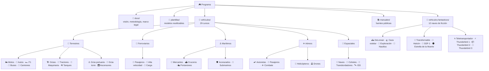
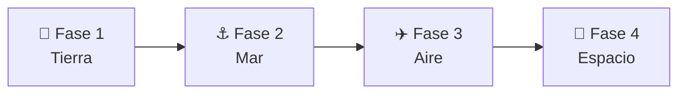

<div align="center">

# 🎮 Programa de Operación y Simulación de Máquinas

**Una biblioteca de cursos técnicos para pilotar, conducir y navegar cualquier máquina.**

[](https://github.com/vladimiracunadev-create/machine-operator-program/actions/workflows/validar-documentacion.yml)
[](https://github.com/vladimiracunadev-create/machine-operator-program/actions/workflows/enlaces.yml)
[](LICENSE)


</div>

---

Cada tipo de máquina se documenta como un **curso completo e interconectado**:
historia, características funcionales, mecánica en profundidad, mandos,
principios físicos, entornos de trabajo, reglamentos (con foco en la ley chilena)
y diseño de simulación. La meta no es todavía crear juegos, sino ordenar el
conocimiento para que cada vehículo pueda convertirse en una simulación
coherente, educativa y segura.

ℹ️ **Aquí todavía no hay ningún simulador que puedas ejecutar.** Esto es la base
documental que cualquiera de ellos necesitaría antes de existir. El proyecto se
llamó "Multisimulador" durante su arranque, pero ese nombre prometía software
funcionando, así que se renombró mientras el código no exista. El módulo 9 de
cada curso especifica el simulador; construirlo es el paso siguiente.

> 🎓 **Empieza por el curso de referencia:** [🏍️ Motocicletas](vehiculos/motos/README.md)
> · o revisa la [guía de estilo y estructura de curso](docs/08-guia-de-estilo-y-curso.md).

---

## 🗺️ Mapa del repositorio



---

## 📚 Catálogo de cursos

Cada vehículo es un curso con 11 módulos, del primero al de ejercicios (ver
[guía de curso](docs/08-guia-de-estilo-y-curso.md)).

### 🛞 Terrestres

| Curso | Descripción | Licencia (Chile) |
| --- | --- | --- |
| [🏍️ Motocicletas](vehiculos/motos/README.md) | Equilibrio, transmisión y dinámica de dos ruedas. | Clase C |
| [🚗 Automóviles](vehiculos/automoviles/README.md) | Dirección, motor, seguridad y tránsito. | Clase B |
| [🏎️ Fórmula 1](vehiculos/formula-1/README.md) | Monoplaza de competición: aerodinámica y rendimiento. | Reglamento FIA |
| [🚌 Buses](vehiculos/buses/README.md) | Transporte de pasajeros y operación profesional. | Clase A-3 |
| [🚛 Camiones](vehiculos/camiones/README.md) | Transporte de carga, simples y articulados. | Clase A-4 / A-5 |
| [🪖 Tanques](vehiculos/tanques/README.md) | Vehículo militar oruga (marco público e histórico). | Ejército (Ley 18.948) |
| [🏗️ Grúas](vehiculos/gruas/README.md) | Maquinaria automotriz móvil, izaje y estabilidad. | Clase D |
| [🚜 Tractores](vehiculos/tractores/README.md) | Maquinaria agrícola, toma de fuerza y aperos. | Clase D |
| [🚧 Maquinaria de construcción](vehiculos/maquinaria-construccion/README.md) | Excavadoras, cargadores, bulldozers y movimiento de tierra. | Clase D |
| [⚓ Grúa portuaria](vehiculos/grua-portuaria/README.md) | Grúa fija de puerto para contenedores y carga. | Operador certificado |
| [🗼 Grúa torre](vehiculos/grua-torre/README.md) | Grúa fija de edificio para construcción en altura. | Operador certificado |
| [🛗 Ascensores](vehiculos/ascensores/README.md) | Transporte vertical en edificios: seguridad y mantención. | Ley 20.296 |

### 🚆 Ferroviarios

| Curso | Descripción | Marco |
| --- | --- | --- |
| [🚆 Tren de pasajeros](vehiculos/tren-pasajeros/README.md) | Transporte ferroviario de personas, urbano e interurbano. | Ferroviario (Chile) |
| [🚄 Tren de alta velocidad](vehiculos/tren-alta-velocidad/README.md) | Trenes rápidos, aerodinámica y vía dedicada. | Ferroviario |
| [🚂 Tren de carga](vehiculos/tren-carga/README.md) | Transporte pesado de mercancías por ferrocarril. | Ferroviario |

### ⚓ Marítimos

| Curso | Descripción | Marco |
| --- | --- | --- |
| [🚢 Barcos mercantes](vehiculos/barcos-mercantes/README.md) | Propulsión naval, gobierno y navegación. | DIRECTEMAR / OMI |
| [⛴️ Cruceros](vehiculos/cruceros/README.md) | Buque de pasajeros, servicios y seguridad. | DIRECTEMAR / SOLAS |
| [🛡️ Acorazados](vehiculos/acorazados/README.md) | Historia y principios (marco público). | Armada / CONVEMAR |
| [🛳️ Portaviones](vehiculos/portaviones/README.md) | Aviación naval e historia (marco público). | Armada / CONVEMAR |
| [🌊 Submarinos](vehiculos/submarinos/README.md) | Flotabilidad e inmersión (marco público). | Armada / CONVEMAR |

### ✈️ Aéreos y 🚀 espaciales

| Curso | Descripción | Marco |
| --- | --- | --- |
| [🛩️ Aviones pequeños](vehiculos/aviones-pequenos/README.md) | Sustentación, instrumentos y navegación aérea. | DGAC / OACI |
| [🛫 Aviones de pasajeros](vehiculos/aviones-pasajeros/README.md) | Aviación comercial, sistemas y operación de línea. | DGAC / ATP |
| [🚁 Helicópteros](vehiculos/helicopteros/README.md) | Vuelo de ala rotatoria, rotor y maniobra. | DGAC / DAN 61 |
| [🕹️ Drones](vehiculos/drones/README.md) | Aeronaves pilotadas a distancia (RPAS), multirotor y ala fija. | DGAC / DAN 151 |
| [✈️ Aviones de combate](vehiculos/aviones-combate/README.md) | Física del vuelo e historia (marco público). | FACH |
| [🚀 Naves espaciales](vehiculos/naves-espaciales/README.md) | Órbitas, propulsión y soporte vital. | Tratados UNOOSA |
| [🚀 Cohetes](vehiculos/cohetes/README.md) | Lanzadores actuales: etapas, empuje y ascenso. | Estado de lanzamiento |
| [🛬 Transbordadores](vehiculos/transbordadores/README.md) | Vehículo espacial reutilizable con reentrada alada. | Estado de lanzamiento |
| [🛰️ Estación espacial (ISS)](vehiculos/estacion-espacial/README.md) | Laboratorio orbital: módulos, soporte vital y microgravedad. | Acuerdo internacional |

---

### 🌌 Naves de ficción (sección educativa)

Una sección aparte y **claramente separada de los vehículos reales** para explorar
la ingeniería imaginaria de la ciencia ficción: que principios físicos reales
evocan, cuales rompen y cómo se simularían. Son obras de ficción de sus
respectivos autores; ver el aviso en el
[catálogo de naves de ficción](vehiculos-fantasticos/README.md).

| Nave | Inspiración | Idea central |
| --- | --- | --- |
| [🕰️ DeLorean temporal](vehiculos-fantasticos/delorean/README.md) | "Volver al Futuro" | Viaje en el tiempo y energía. |
| [🛸 Caza estelar](vehiculos-fantasticos/caza-estelar/README.md) | Estilo "Star Wars" | Combate espacial y maniobra. |
| [🌌 Nave de exploración](vehiculos-fantasticos/nave-exploracion/README.md) | Estilo "Star Trek" | Viaje interestelar y ciencia. |
| [🐙 Nautilus](vehiculos-fantasticos/nautilus/README.md) | Julio Verne (dominio público) | Submarino visionario del siglo XIX. |
| [🤖 Caza transformable](vehiculos-fantasticos/caza-transformable/README.md) | Estilo "Robotech" | Aeronave que se transforma. |
| [🦅 Halcón Milenario](vehiculos-fantasticos/halcon-milenario/README.md) | Estilo "Star Wars" | Carguero rápido: empuje, masa y maniobra. |
| [🏯 SDF-1](vehiculos-fantasticos/sdf-1/README.md) | Estilo "Robotech" | Nave-fortaleza gigante: escala y estructura. |
| [🌑 Estrella de la Muerte](vehiculos-fantasticos/estrella-de-la-muerte/README.md) | Estilo "Star Wars" | Estación del tamaño de una luna: gravedad y energía. |
| [🌀 Teletransportador](vehiculos-fantasticos/teletransportador/README.md) | Ciencia ficción | Teletransportación: información, energía y límites físicos. |
| [⚡ Thunderbird 1](vehiculos-fantasticos/thunderbird-1/README.md) | Estilo "Thunderbirds" | Vehículo rápido de respuesta: VTOL y velocidad. |
| [📦 Thunderbird 2](vehiculos-fantasticos/thunderbird-2/README.md) | Estilo "Thunderbirds" | Transporte pesado modular: capacidad de carga. |
| [🚀 Thunderbird 3](vehiculos-fantasticos/thunderbird-3/README.md) | Estilo "Thunderbirds" | Cohete de rescate espacial: ascenso a órbita. |

---

## 🧭 Ruta de aprendizaje sugerida



De lo cotidiano a lo complejo. Detalle en
[`docs/06-plan-vehiculos.md`](docs/06-plan-vehiculos.md).

---

## 📖 Documentación general

| Documento | Contenido |
| --- | --- |
| [📌 Índice maestro](docs/00-indice-maestro.md) | Mapa de todo el repositorio. |
| [🎯 Visión del proyecto](docs/01-vision-del-proyecto.md) | Alcance y filosofía. |
| [🔬 Metodología documental](docs/02-metodologia-documental.md) | Como investigar y redactar. |
| [🎚️ Niveles de realismo](docs/03-niveles-de-realismo.md) | De arcade educativo a simulación técnica. |
| [🦺 Seguridad y límites](docs/04-seguridad-y-limites.md) | Reglas de contenido responsable. |
| [📖 Glosario general](docs/05-glosario-general.md) | Vocabulario común. |
| [🗓️ Plan de vehículos](docs/06-plan-vehiculos.md) | Orden recomendado. |
| [⚖️ Marco legal (Chile)](docs/07-marco-legal-chile.md) | Normativa por tipo de vehículo. |
| [🎓 Guía de estilo y curso](docs/08-guia-de-estilo-y-curso.md) | Iconografía, módulos y navegación. |

---

## 🦺 Principio de seguridad

Documentación orientada a **simulación, formación general e investigación
histórica**. No sustituye entrenamiento certificado, licencias ni manuales
oficiales vigentes. Para máquinas militares o de alto riesgo, el repositorio se
limita a información pública, principios generales, historia e interfaz de
simulación. Ver [`docs/04-seguridad-y-limites.md`](docs/04-seguridad-y-limites.md).

---

## ✅ Validación y calidad

Cada cambio se valida en CI (estructura, enlaces internos, estilo Markdown y
seguridad de los workflows). Para validar en local:

```bash
# Estructura del repositorio y enlaces internos
python scripts/validar_estructura.py

# Estilo de Markdown (requiere Node)
npx markdownlint-cli2 "**/*.md"
```

---

## 🤝 Cómo contribuir

Lee la [guía de contribución](CONTRIBUTING.md) y el
[código de conducta](CODE_OF_CONDUCT.md). El historial está en
[`CHANGELOG.md`](CHANGELOG.md); la seguridad, en [`SECURITY.md`](SECURITY.md). El
proyecto se distribuye bajo licencia [MIT](LICENSE).

## 📊 Estado del proyecto

- ✅ Base documental, marco legal y CI en verde.
- ✅ **Los 41 cursos están completos**: cada uno cumple la
  [checklist de curso profesional](docs/08-guia-de-estilo-y-curso.md) con sus 11
  módulos, diagramas, glosario, ejercicios y navegación.
- 🎓 [🏍️ Motos](vehiculos/motos/README.md) sigue siendo el curso de referencia:
  es el modelo a imitar al abrir uno nuevo.
- 📚 Las carpetas `manuales/` de cada curso están vacías a propósito: son el
  depósito de PDF públicos que se vayan incorporando, y cada uno debe quedar
  anotado en el [registro de fuentes](manuales/fuentes.md), que sí está poblado
  con la normativa y los manuales oficiales que sostienen los cursos.
