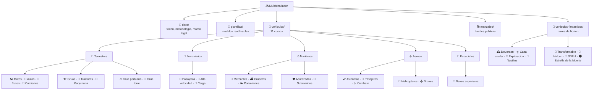
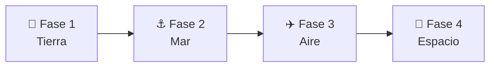

<div align="center">

# 🎮 Multisimulador de Mandos y Navegacion

**Una biblioteca de cursos tecnicos para pilotar, conducir y navegar cualquier maquina.**

[](https://github.com/vladimiracunadev-create/multi-piloto-navegacion/actions/workflows/validar-documentacion.yml)
[](https://github.com/vladimiracunadev-create/multi-piloto-navegacion/actions/workflows/enlaces.yml)
[](LICENSE)


</div>

---

Cada tipo de maquina se documenta como un **curso completo e interconectado**:
historia, caracteristicas funcionales, mecanica en profundidad, mandos,
principios fisicos, entornos de trabajo, reglamentos (con foco en la ley chilena)
y diseno de simulacion. La meta no es todavia crear juegos, sino ordenar el
conocimiento para que cada vehiculo pueda convertirse en una simulacion
coherente, educativa y segura.

> 🎓 **Empieza por el curso de referencia:** [🏍️ Motocicletas](vehiculos/motos/README.md)
> · o revisa la [guia de estilo y estructura de curso](docs/08-guia-de-estilo-y-curso.md).

---

## 🗺️ Mapa del repositorio



---

## 📚 Catalogo de cursos

Cada vehiculo es un curso con 9 modulos (ver
[guia de curso](docs/08-guia-de-estilo-y-curso.md)).

### 🛞 Terrestres

| Curso | Descripcion | Licencia (Chile) |
| --- | --- | --- |
| [🏍️ Motocicletas](vehiculos/motos/README.md) | Equilibrio, transmision y dinamica de dos ruedas. | Clase C |
| [🚗 Automoviles](vehiculos/automoviles/README.md) | Direccion, motor, seguridad y transito. | Clase B |
| [🚌 Buses](vehiculos/buses/README.md) | Transporte de pasajeros y operacion profesional. | Clase A-3 |
| [🚛 Camiones](vehiculos/camiones/README.md) | Transporte de carga, simples y articulados. | Clase A-4 / A-5 |
| [🏗️ Gruas](vehiculos/gruas/README.md) | Maquinaria automotriz movil, izaje y estabilidad. | Clase D |
| [🚜 Tractores](vehiculos/tractores/README.md) | Maquinaria agricola, toma de fuerza y aperos. | Clase D |
| [🚧 Maquinaria de construccion](vehiculos/maquinaria-construccion/README.md) | Excavadoras, cargadores, bulldozers y movimiento de tierra. | Clase D |
| [⚓ Grua portuaria](vehiculos/grua-portuaria/README.md) | Grua fija de puerto para contenedores y carga. | Operador certificado |
| [🗼 Grua torre](vehiculos/grua-torre/README.md) | Grua fija de edificio para construccion en altura. | Operador certificado |

### 🚆 Ferroviarios

| Curso | Descripcion | Marco |
| --- | --- | --- |
| [🚆 Tren de pasajeros](vehiculos/tren-pasajeros/README.md) | Transporte ferroviario de personas, urbano e interurbano. | Ferroviario (Chile) |
| [🚄 Tren de alta velocidad](vehiculos/tren-alta-velocidad/README.md) | Trenes rapidos, aerodinamica y via dedicada. | Ferroviario |
| [🚂 Tren de carga](vehiculos/tren-carga/README.md) | Transporte pesado de mercancias por ferrocarril. | Ferroviario |

### ⚓ Maritimos

| Curso | Descripcion | Marco |
| --- | --- | --- |
| [🚢 Barcos mercantes](vehiculos/barcos-mercantes/README.md) | Propulsion naval, gobierno y navegacion. | DIRECTEMAR / OMI |
| [⛴️ Cruceros](vehiculos/cruceros/README.md) | Buque de pasajeros, servicios y seguridad. | DIRECTEMAR / SOLAS |
| [🛡️ Acorazados](vehiculos/acorazados/README.md) | Historia y principios (marco publico). | Armada / CONVEMAR |
| [🛳️ Portaviones](vehiculos/portaviones/README.md) | Aviacion naval e historia (marco publico). | Armada / CONVEMAR |
| [🌊 Submarinos](vehiculos/submarinos/README.md) | Flotabilidad e inmersion (marco publico). | Armada / CONVEMAR |

### ✈️ Aereos y 🚀 espaciales

| Curso | Descripcion | Marco |
| --- | --- | --- |
| [🛩️ Aviones pequenos](vehiculos/aviones-pequenos/README.md) | Sustentacion, instrumentos y navegacion aerea. | DGAC / OACI |
| [🛫 Aviones de pasajeros](vehiculos/aviones-pasajeros/README.md) | Aviacion comercial, sistemas y operacion de linea. | DGAC / ATP |
| [🚁 Helicopteros](vehiculos/helicopteros/README.md) | Vuelo de ala rotatoria, rotor y maniobra. | DGAC / DAN 61 |
| [🕹️ Drones](vehiculos/drones/README.md) | Aeronaves pilotadas a distancia (RPAS), multirotor y ala fija. | DGAC / DAN 151 |
| [✈️ Aviones de combate](vehiculos/aviones-combate/README.md) | Fisica del vuelo e historia (marco publico). | FACH |
| [🚀 Naves espaciales](vehiculos/naves-espaciales/README.md) | Orbitas, propulsion y soporte vital. | Tratados UNOOSA |

---

### 🌌 Naves de ficcion (seccion educativa)

Una seccion aparte y **claramente separada de los vehiculos reales** para explorar
la ingenieria imaginaria de la ciencia ficcion: que principios fisicos reales
evocan, cuales rompen y como se simularian. Son obras de ficcion de sus
respectivos autores; ver el aviso en el
[catalogo de naves de ficcion](vehiculos-fantasticos/README.md).

| Nave | Inspiracion | Idea central |
| --- | --- | --- |
| [🕰️ DeLorean temporal](vehiculos-fantasticos/delorean/README.md) | "Volver al Futuro" | Viaje en el tiempo y energia. |
| [🛸 Caza estelar](vehiculos-fantasticos/caza-estelar/README.md) | Estilo "Star Wars" | Combate espacial y maniobra. |
| [🌌 Nave de exploracion](vehiculos-fantasticos/nave-exploracion/README.md) | Estilo "Star Trek" | Viaje interestelar y ciencia. |
| [🐙 Nautilus](vehiculos-fantasticos/nautilus/README.md) | Julio Verne (dominio publico) | Submarino visionario del siglo XIX. |
| [🤖 Caza transformable](vehiculos-fantasticos/caza-transformable/README.md) | Estilo "Robotech" | Aeronave que se transforma. |
| [🦅 Halcon Milenario](vehiculos-fantasticos/halcon-milenario/README.md) | Estilo "Star Wars" | Carguero rapido: empuje, masa y maniobra. |
| [🏯 SDF-1](vehiculos-fantasticos/sdf-1/README.md) | Estilo "Robotech" | Nave-fortaleza gigante: escala y estructura. |
| [🌑 Estrella de la Muerte](vehiculos-fantasticos/estrella-de-la-muerte/README.md) | Estilo "Star Wars" | Estacion del tamano de una luna: gravedad y energia. |

---

## 🧭 Ruta de aprendizaje sugerida



De lo cotidiano a lo complejo. Detalle en
[`docs/06-plan-vehiculos.md`](docs/06-plan-vehiculos.md).

---

## 📖 Documentacion general

| Documento | Contenido |
| --- | --- |
| [📌 Indice maestro](docs/00-indice-maestro.md) | Mapa de todo el repositorio. |
| [🎯 Vision del proyecto](docs/01-vision-del-proyecto.md) | Alcance y filosofia. |
| [🔬 Metodologia documental](docs/02-metodologia-documental.md) | Como investigar y redactar. |
| [🎚️ Niveles de realismo](docs/03-niveles-de-realismo.md) | De arcade educativo a simulacion tecnica. |
| [🦺 Seguridad y limites](docs/04-seguridad-y-limites.md) | Reglas de contenido responsable. |
| [📖 Glosario general](docs/05-glosario-general.md) | Vocabulario comun. |
| [🗓️ Plan de vehiculos](docs/06-plan-vehiculos.md) | Orden recomendado. |
| [⚖️ Marco legal (Chile)](docs/07-marco-legal-chile.md) | Normativa por tipo de vehiculo. |
| [🎓 Guia de estilo y curso](docs/08-guia-de-estilo-y-curso.md) | Iconografia, modulos y navegacion. |

---

## 🦺 Principio de seguridad

Documentacion orientada a **simulacion, formacion general e investigacion
historica**. No sustituye entrenamiento certificado, licencias ni manuales
oficiales vigentes. Para maquinas militares o de alto riesgo, el repositorio se
limita a informacion publica, principios generales, historia e interfaz de
simulacion. Ver [`docs/04-seguridad-y-limites.md`](docs/04-seguridad-y-limites.md).

---

## ✅ Validacion y calidad

Cada cambio se valida en CI (estructura, enlaces internos, estilo Markdown y
seguridad de los workflows). Para validar en local:

```bash
# Estructura del repositorio y enlaces internos
python scripts/validar_estructura.py

# Estilo de Markdown (requiere Node)
npx markdownlint-cli2 "**/*.md"
```

---

## 🤝 Como contribuir

Lee la [guia de contribucion](CONTRIBUTING.md) y el
[codigo de conducta](CODE_OF_CONDUCT.md). El historial esta en
[`CHANGELOG.md`](CHANGELOG.md); la seguridad, en [`SECURITY.md`](SECURITY.md). El
proyecto se distribuye bajo licencia [MIT](LICENSE).

## 📊 Estado del proyecto

- ✅ Base documental, marco legal y CI en verde.
- ✅ [🏍️ Motos](vehiculos/motos/README.md): **curso completo** de referencia (9 modulos con diagramas).
- 🚧 Resto de vehiculos: portada de curso, reglamentos y modulos base; en ampliacion progresiva.
