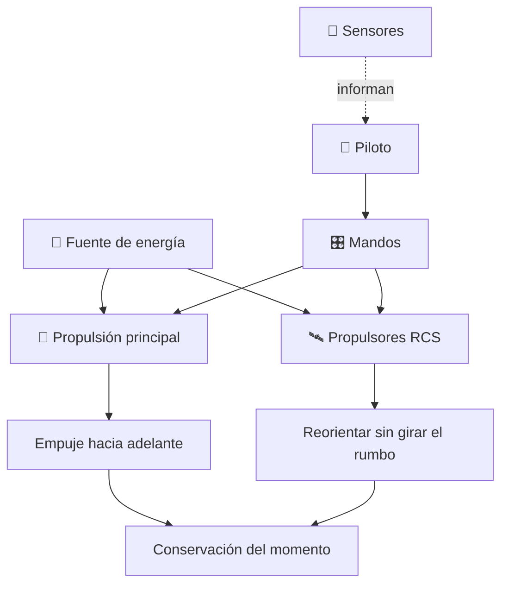

# 🛸 Curso: Caza estelar

[🏠 Inicio](../../README.md) · [🌌 Naves de ficción](../README.md) · [🎓 Guía de curso](../../docs/08-guia-de-estilo-y-curso.md)

> ⚖️ Material educativo original; los derechos de las obras pertenecen a sus titulares.

---

> Curso de análisis educativo de ciencia ficción inspirado en el estilo
> "Star Wars". Estudiamos un caza estelar genérico para entender la física
> real del movimiento en el vacío: por qué el combate espacial de las
> películas es dramático pero no físico, y cómo sería de verdad.

---

## 🎯 Objetivos de aprendizaje

Al terminar este curso deberías poder:

- Explicar las leyes de Newton aplicadas al vacío, sin aire ni rozamiento.
- Entender por qué no hay alas útiles ni virajes bancados fuera de una atmósfera.
- Describir los propulsores de control de reacción (RCS) y la reorientación.
- Razonar sobre conservación del momento, delta-v y presupuesto de maniobra.
- Distinguir que evoca la ficción que sería real y que rompe la física.
- Traducir todo lo anterior a variables de un simulador educativo.

---

## 🗺️ Mapa del vehículo

---

## 📚 Módulos del curso

| # | Módulo | Contenido | Enlace |
| :-: | --- | --- | --- |
| 1 | 📜 Historia | Contexto de la nave de ficción y su idea de vuelo. | [Abrir](historia/historia-caza-estelar.md) |
| 2 | 📋 Características | Que es un caza estelar genérico y para que sirve. | [Abrir](operacion/caracteristicas-caza-estelar.md) |
| 3 | 🔧 Sistemas mecánicos | Tecnología imaginaria frente a la física real. | [Abrir](operacion/sistemas-mecanicos-caza-estelar.md) |
| 4 | 🎛️ Mandos e instrumentos | Puesto de mando conceptual y controles. | [Abrir](mandos/manual-mandos-caza-estelar.md) |
| 5 | 🧪 Principios y operación | Newton en el vacío: que si, que no y por qué. | [Abrir](operacion/principios-caza-estelar.md) |
| 6 | 🌍 Entornos | El vacío, órbitas y campos de escombros. | [Abrir](operacion/entornos-caza-estelar.md) |
| 7 | ⚖️ Reglas del universo | Las leyes internas de la ficción frente a la física. | [Abrir](reglamentos/reglas-universo-caza-estelar.md) |
| 8 | 🎮 Diseño de simulación | Variables, ciclo y modo ciencia o ficción. | [Abrir](simulacion/diseno-simulador-caza-estelar.md) |
| 9 | 🧰 Recursos | Glosario, enlaces y diagramas. | [Abrir](recursos/recursos-caza-estelar.md) |

---

## 🧩 Requisitos previos

Ninguno formal. Ayuda tener nociones básicas de las leyes de Newton, pero el
curso las explica desde cero. La idea central es simple y potente: en el vacío
no hay aire ni rozamiento, así que casi todo lo que muestran las películas de
cazas espaciales se comportaría de otra forma.

---

[➡️ Empezar por el Módulo 1: Historia](historia/historia-caza-estelar.md)
