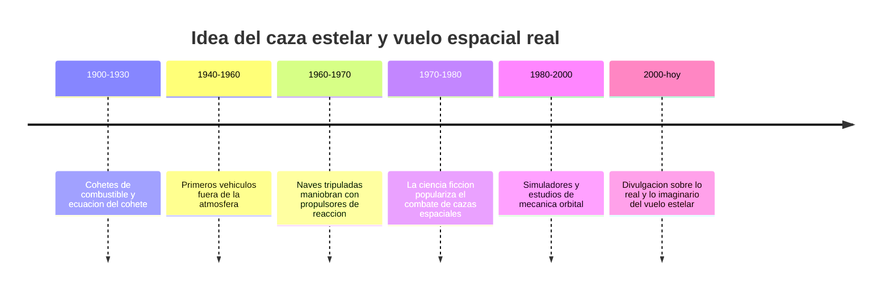

# 📜 Historia del caza estelar

[🏠 Inicio](../../../README.md) · [🛸 Curso: Caza estelar](../README.md) · 📜 Historia

> ⚖️ Material educativo original; los derechos de las obras pertenecen a sus titulares.

Este módulo situa la idea del caza estelar dentro de la ciencia ficción y la
compara con la historia real del vuelo espacial. No describe una nave oficial:
analiza el concepto genérico de "caza estelar" que popularizo el estilo
"Star Wars" y lo contrasta con lo que la ingeniería sabe hacer de verdad.

## De donde viene la idea

El caza estelar de la ficción toma prestada la estética del combate aéreo de
las guerras del siglo XX: naves ágiles que giran, persiguen y disparan en
duelos cerrados. Es una imagen emocionante porque nuestro cerebro entiende
muy bien como se mueve un avión en el aire. El problema es que el espacio no
es aire, y ahí empieza lo interesante de este curso.

## Lo real frente a lo imaginado

La historia real del vuelo espacial siguió otro camino. Las naves que salieron
de la atmósfera no volaron como aviones: se movieron encendiendo motores en
direcciones concretas y dejando que la inercia hiciera el resto. No hay alas
que sirvan donde no hay aire, y no hay freno automático al soltar el acelerador.

| Periodo | Hito de referencia | Importancia para el curso |
| --- | --- | --- |
| 1900-1930 | Formulación de la ecuación del cohete | Explica el límite de maniobra (delta-v). |
| 1940-1960 | Vehículos que superan la atmósfera | Confirma que sin aire cambian las reglas. |
| 1960-1970 | Naves que se reorientan con propulsores | Base real de los propulsores de control. |
| 1970-1980 | Auge del caza estelar en el cine | Fija la imagen popular del combate espacial. |
| 1980-2000 | Estudio de mecánica orbital aplicada | Muestra cómo se maniobra de verdad. |
| 2000-hoy | Divulgación de física del espacio | Separa el espectáculo de la realidad. |

## Por qué la ficción eligió el dogfight

Contar una historia con duelos cerrados es fácil de seguir: hay persecución,
tensión y giros dramáticos. Un combate espacial realista ocurriría a enormes
distancias, con maniobras lentas y sin ruido, lo que resulta menos vistoso en
pantalla. La ficción prioriza la emoción sobre la física, y eso es una
decisión artística legítima que este curso respeta y analiza.

## Que aprenderemos de todo esto

- Que conceptos de física real evoca la nave aunque los exagere.
- Que licencias creativas rompen las leyes de Newton y por qué.
- Cómo sería un caza estelar si tuviera que obedecer la física de verdad.

## Fuentes

- Registrar aquí las fuentes públicas de divulgación consultadas.
- Enlazar cada fuente también en [`manuales/fuentes.md`](../../../manuales/fuentes.md).

---

[🎓 Portada del curso](../README.md) · [➡️ Siguiente: Características](../operacion/caracteristicas-caza-estelar.md)
