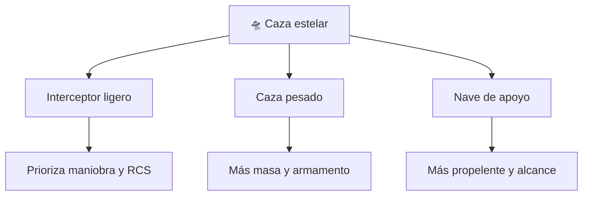

# 📋 Características del caza estelar

[🏠 Inicio](../../../README.md) · [🛸 Curso: Caza estelar](../README.md) · 📋 Características

> ⚖️ Material educativo original; los derechos de las obras pertenecen a sus titulares.

Que es un caza estelar genérico, que rasgos lo definen en la ficción y cuales
tendrían sentido físico real. Este módulo da el contexto antes de abrir la
tecnología por dentro en el Módulo 3.

---

## 🧭 Definición

Un caza estelar, en la ficción estilo "Star Wars", es una nave pequeña y
maniobrable pensada para el combate en el espacio. La imaginamos veloz, ágil y
capaz de girar como un avión de caza. En este curso la usamos como excusa para
estudiar cómo se movería de verdad un vehículo así en el vacío.

---

## 🧬 Características clave

| Característica | Como la muestra la ficción | Lectura física real |
| --- | --- | --- |
| Tamaño compacto | Nave para uno o pocos tripulantes | Razonable: menos masa, menos energía para maniobrar. |
| Agilidad | Giros cerrados tipo avión | En el vacío no hay aire que permita virar así. |
| Velocidad "de crucero" | Se frena al soltar el acelerador | Falso: sin rozamiento la nave sigue igual. |
| Alas o aletas | Grandes superficies visibles | Inutiles sin atmósfera; solo estética o radiadores. |
| Armamento | Disparos con estela luminosa | La luz viajaría recta y no se vería el haz en el vacío. |
| Propulsión | Un chorro brillante constante | Real solo mientras se gasta propelente. |

---

## 🗂️ Tipos conceptuales de caza estelar

| Tipo | Idea de diseño | Compromiso físico |
| --- | --- | --- |
| Interceptor ligero | Poca masa, muchos propulsores de control | Reorienta rápido pero lleva poco propelente. |
| Caza pesado | Más blindaje y armamento | Más masa exige más empuje para el mismo cambio. |
| Nave de apoyo | Gran depósito de propelente | Mayor autonomía de maniobra, menos agilidad. |

---

## 🎯 Para qué sirve en el relato

- Dar espectáculo con duelos rápidos y visuales.
- Representar al piloto hábil como héroe individual.
- Simplificar el combate espacial a algo parecido al aéreo.

En cambio, para este curso sirve como laboratorio: cada rasgo llamativo nos
deja preguntar si sería posible y por qué.

---

[⬅️ Anterior: Historia](../historia/historia-caza-estelar.md) · [➡️ Siguiente: Sistemas mecánicos](sistemas-mecanicos-caza-estelar.md)
