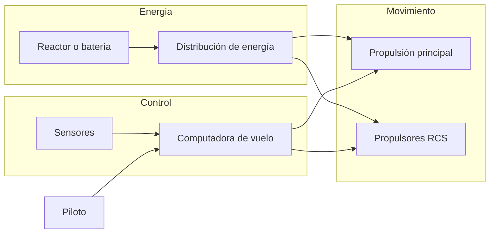
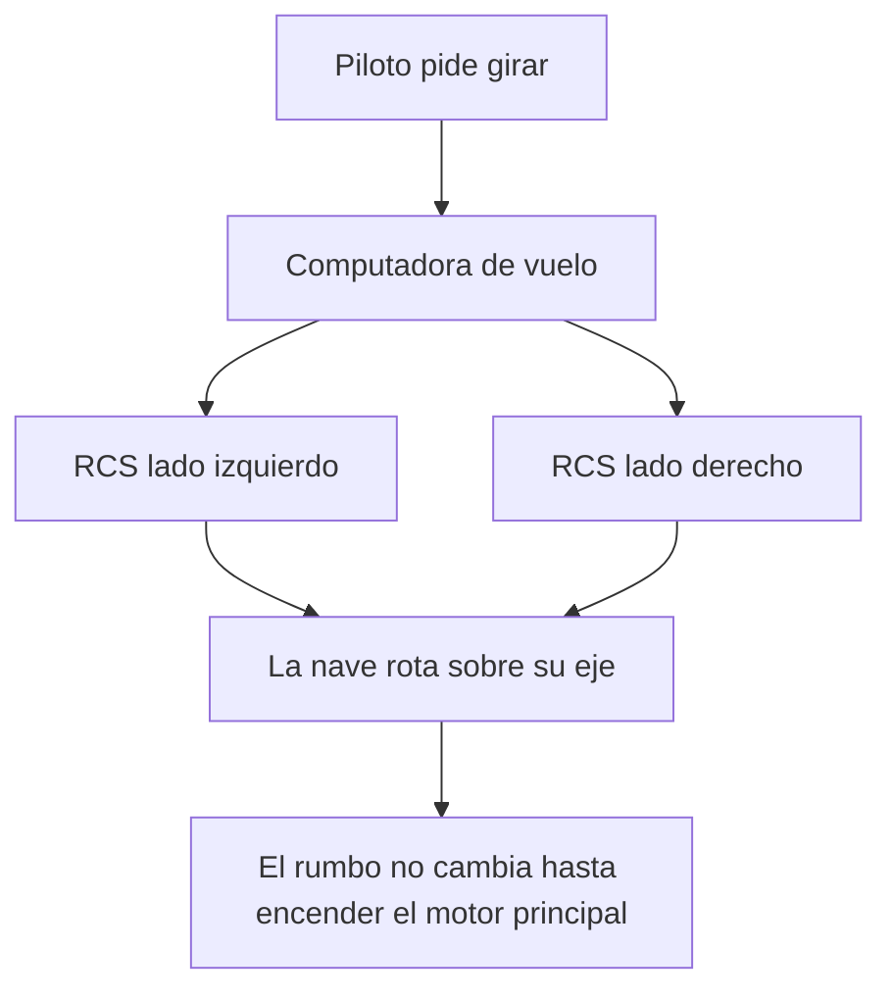

# 🔧 Sistemas mecánicos del caza estelar

[🏠 Inicio](../../../README.md) · [🛸 Curso: Caza estelar](../README.md) · 🔧 Sistemas mecánicos

> ⚖️ Material educativo original; los derechos de las obras pertenecen a sus titulares.

Este módulo abre el caza estelar por dentro. Compara la tecnología imaginaria
de la ficción con la física real que la haría funcionar (o que la desmiente).
La regla del curso es clara: describimos conceptos con nuestras palabras, sin
copiar planos ni especificaciones oficiales.

---

## 1. 🔋 Fuente de energía

En la ficción, un reactor compacto entrega energía casi ilimitada. En la
realidad, la energía no es el único límite: aunque tuvieras un reactor potente,
mover la nave exige expulsar masa (propelente) hacia atrás. Sin masa que
expulsar, no hay empuje, por mucha energía que sobre.

| Concepto de ficción | Física real que evoca | Veredicto |
| --- | --- | --- |
| Reactor de energía infinita | Fuentes de energía densas | Plausible como idea, no como "infinita". |
| Motor que no gasta nada | Motor de cohete que gasta propelente | No físico: siempre se gasta masa. |
| Recarga instantánea | Almacenamiento de energía | Parcial: la energía si, el propelente no. |

---

## 2. 🚀 Propulsión principal

El chorro brillante de la parte trasera representa un motor de reacción:
expulsa masa a gran velocidad y, por la tercera ley de Newton, la nave recibe
un empuje en sentido contrario. Esto si es real. Lo que no es real es que el
chorro se vea como una llama sostenida: sin oxígeno del aire no hay fuego con
llamas como en la Tierra, y en el vacío el brillo sería muy distinto.

| Idea de la ficción | Que dice la física real |
| --- | --- |
| Llama naranja constante | Sin aire no hay combustión con llama sostenida. |
| La nave frena al apagar el motor | Sin rozamiento sigue a velocidad constante. |
| Aceleración instantánea a tope | La aceleración depende de empuje y masa. |
| Propelente que nunca se acaba | El propelente es finito y define el delta-v. |

---

## 3. 🛰️ Propulsores de control de reacción (RCS)

Aquí está la clave física del curso. Para apuntar la nave hacia otro lado no
sirve un volante: en el vacío no hay contra que "apoyarse". Se usan pequeños
propulsores repartidos por el casco, los RCS, que lanzan chorros cortos para
rotar la nave o desplazarla de lado. Reorientar la nariz no cambia por si solo
la dirección en que la nave se mueve: el momento se conserva.

- **Rotación**: pares de RCS opuestos hacen girar la nave sin moverla de sitio.
- **Traslación lateral**: un RCS empuja la nave completa hacia un costado.
- **Frenado de giro**: para dejar de rotar hay que aplicar un impulso contrario;
  no se detiene sola.

---

## 4. 🖥️ Computadora de vuelo y sensores

En la ficción el piloto lo hace todo con instinto. En la realidad, coordinar
decenas de propulsores para lograr una maniobra limpia exige una computadora
que traduzca "quiero apuntar allí" en encendidos precisos de cada RCS. Los
sensores no verían al enemigo por la ventana, sino a enormes distancias con
instrumentos.

| Sistema | En la ficción | En la realidad |
| --- | --- | --- |
| Puntería | El piloto mira y dispara de cerca | Combate a gran distancia con sensores. |
| Giro | Palanca tipo avión | Computadora dosifica los RCS. |
| Detección | Vista directa | Sensores de calor, radar y radio. |

---

## 5. 🪽 Alas, aletas y radiadores

Las alas grandes son casi puro estilo: sin atmósfera no generan sustentación ni
permiten virar. Si tuvieran una función real, sería disipar calor: en el vacío
el calor no se va por el aire, así que una nave necesita radiadores amplios
para no recalentarse.

| Elemento visible | Función en la ficción | Función útil real |
| --- | --- | --- |
| Alas | Maniobrar como avión | Ninguna aerodinámica; posible soporte. |
| Aletas | Estabilidad en giros | Sin efecto sin aire. |
| Paneles amplios | Estética | Radiadores para expulsar calor. |

---

## 🔁 Cómo se conecta todo

1. La **energía** alimenta motores y sistemas.
2. La **propulsión principal** cambia la velocidad expulsando propelente.
3. Los **RCS** cambian la orientación y hacen ajustes finos.
4. La **computadora** coordina todo respetando la conservación del momento.
5. Los **sensores** informan a gran distancia, no por la ventanilla.

Con esto claro, el [Módulo 4: Mandos](../mandos/manual-mandos-caza-estelar.md)
muestra como el piloto operaría cada sistema.

---

[⬅️ Anterior: Características](caracteristicas-caza-estelar.md) · [➡️ Siguiente: Mandos e instrumentos](../mandos/manual-mandos-caza-estelar.md)
