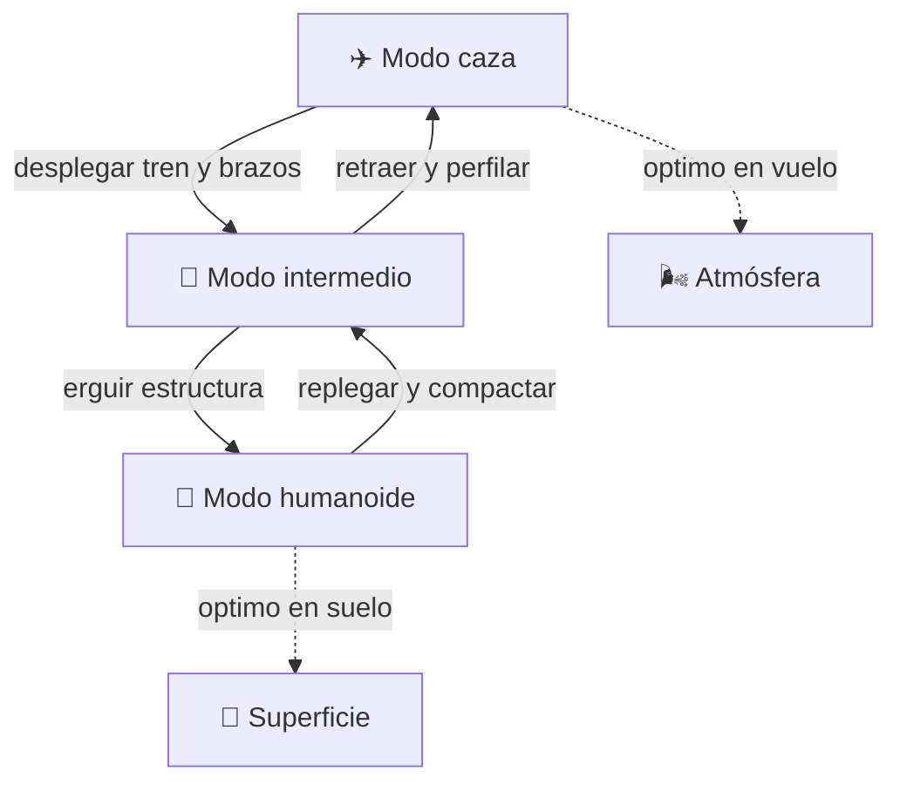

# 🤖 Curso: Caza transformable

[🏠 Inicio](../../README.md) · [🌌 Naves de ficción](../README.md) · [🎓 Guía de curso](../../docs/08-guia-de-estilo-y-curso.md)

> ⚖️ Material educativo original; los derechos de las obras pertenecen a sus titulares.

---

> Curso de una nave de ficción inspirada en el estilo "Robotech": un caza
> que cambia entre tres formas. Aquí estudiamos la física y la ingeniería
> que evoca (aerodinámica, mecanismos, centro de masa), separando con
> claridad lo que sería realizable de lo que pertenece a la fantasía.

---

## 🎯 Objetivos de aprendizaje

Al terminar este curso deberías poder:

- Explicar la aerodinámica básica de un caza: empuje, sustentación y estabilidad.
- Razonar por qué un cuerpo humanoide es aerodinamicamente pésimo en vuelo.
- Analizar cómo se desplaza el centro de masa al cambiar de forma.
- Describir mecanismos, actuadores y grados de libertad de una transformación.
- Comprender las cargas estructurales y el problema de la masa y las juntas.
- Distinguir que partes serían realizables hoy y cuales no, y por qué.
- Traducir todo lo anterior en variables de un simulador educativo.

---

## 🗺️ Mapa conceptual

---

## 📚 Módulos del curso

| # | Módulo | Contenido | Enlace |
| :-: | --- | --- | --- |
| 1 | 📜 Historia | Origen del concepto de caza transformable en la ficción. | [Abrir](historia/historia-caza-transformable.md) |
| 2 | 📋 Características | Que es, los tres modos y para que sirve cada uno. | [Abrir](operacion/caracteristicas-caza-transformable.md) |
| 3 | 🔧 Sistemas mecánicos | Mecanismos de transformación frente a la física real. | [Abrir](operacion/sistemas-mecanicos-caza-transformable.md) |
| 4 | 🎛️ Mandos | Puesto de mando, controles y cambio de modo. | [Abrir](mandos/manual-mandos-caza-transformable.md) |
| 5 | 🧪 Principios | Que si, que no y por qué; ficción frente a realidad. | [Abrir](operacion/principios-caza-transformable.md) |
| 6 | 🌍 Entornos | Aire, suelo y espacio; como cambia la operación. | [Abrir](operacion/entornos-caza-transformable.md) |
| 7 | ⚖️ Reglas del universo | Las leyes internas de la ficción, no ley real. | [Abrir](reglamentos/reglas-universo-caza-transformable.md) |
| 8 | 🎮 Simulación | Estados, transiciones y variables del simulador. | [Abrir](simulacion/diseno-simulador-caza-transformable.md) |
| 9 | 🧰 Recursos | Glosario, enlaces y diagramas. | [Abrir](recursos/recursos-caza-transformable.md) |

---

## 🧩 Requisitos previos

Ninguno estricto, aunque ayuda haber visto el curso de aeronaves o de motos
para tener nociones de fuerzas y equilibrio. Aquí todo se explica desde cero
con enfoque divulgativo.

---

[➡️ Empezar por el Módulo 1: Historia](historia/historia-caza-transformable.md)
