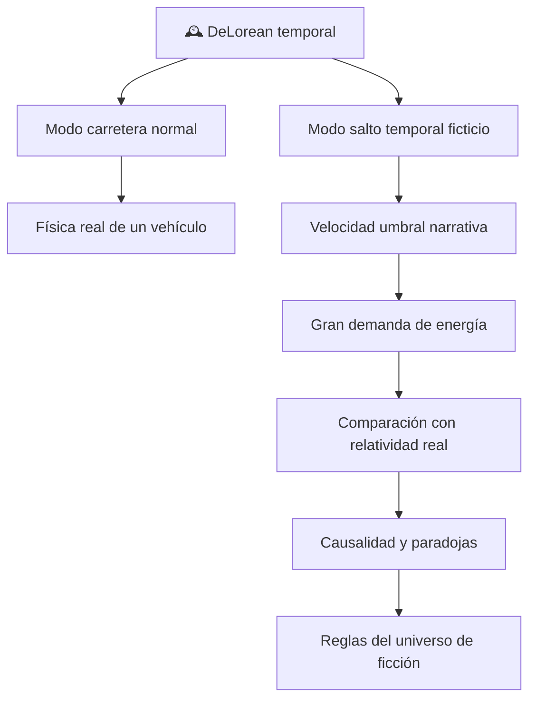

# 🕰️ Curso: DeLorean temporal

[🏠 Inicio](../../README.md) · [🌌 Naves de ficción](../README.md) · [🎓 Guía de curso](../../docs/08-guia-de-estilo-y-curso.md)

> ⚖️ Material educativo original; los derechos de las obras pertenecen a sus titulares.
>
> Curso de análisis de ciencia ficción sobre una nave inspirada en la saga
> "Volver al Futuro". Usamos ese vehículo imaginario como excusa para estudiar
> física real: energía, velocidad umbral, relatividad y las paradojas del viaje
> en el tiempo. Separamos siempre lo que la física actual permite de lo que solo
> ocurre en la ficción.

---

## 🎯 Objetivos de aprendizaje

Al terminar este curso deberías poder:

- Explicar que es la energía cinética y por qué alcanzar una velocidad umbral
  no basta para viajar en el tiempo en la física real.
- Distinguir potencia de energía y estimar por qué la escala requerida sería
  enorme.
- Describir la dilatación temporal de la relatividad y por qué no equivale a
  viajar al pasado.
- Reconocer las curvas temporales cerradas como una idea teórica exótica.
- Analizar la causalidad y las paradojas del viaje en el tiempo con tus
  palabras.
- Traducir todo lo anterior en variables de un simulador educativo.

---

## 🗺️ Mapa conceptual de la nave

---

## 📚 Módulos del curso

| # | Módulo | Contenido | Enlace |
| :-: | --- | --- | --- |
| 1 | 📜 Historia | Contexto divulgativo de la obra y su nave. | [Abrir](historia/historia-delorean.md) |
| 2 | 📋 Características | Que es la nave, sus modos y rasgos. | [Abrir](operacion/caracteristicas-delorean.md) |
| 3 | 🔧 Sistemas mecánicos | Tecnología imaginaria y física real que evoca o rompe. | [Abrir](operacion/sistemas-mecanicos-delorean.md) |
| 4 | 🎛️ Mandos e instrumentos | Puesto de mando conceptual y controles. | [Abrir](mandos/manual-mandos-delorean.md) |
| 5 | 🧪 Principios y operación | Que sería posible, que no y por qué. | [Abrir](operacion/principios-delorean.md) |
| 6 | 🌍 Entornos | Dónde opera y factores del entorno. | [Abrir](operacion/entornos-delorean.md) |
| 7 | ⚖️ Reglas del universo | Reglas internas de la ficción y aviso de que no es ley real. | [Abrir](reglamentos/reglas-universo-delorean.md) |
| 8 | 🎮 Diseño de simulación | Variables, ciclo y modo ciencia/ficción. | [Abrir](simulacion/diseno-simulador-delorean.md) |
| 9 | 🧰 Recursos | Glosario, enlaces y diagramas. | [Abrir](recursos/recursos-delorean.md) |

---

## 🧩 Requisitos previos

Ninguno estricto. Ayuda tener nociones básicas de velocidad y energía, pero cada
concepto se explica desde cero. El enfoque es de divulgación: primero la
intuición, luego el detalle. Marco de niveles de realismo en
[📏 docs/03-niveles-de-realismo.md](../../docs/03-niveles-de-realismo.md).

---

[➡️ Empezar por el Módulo 1: Historia](historia/historia-delorean.md)
