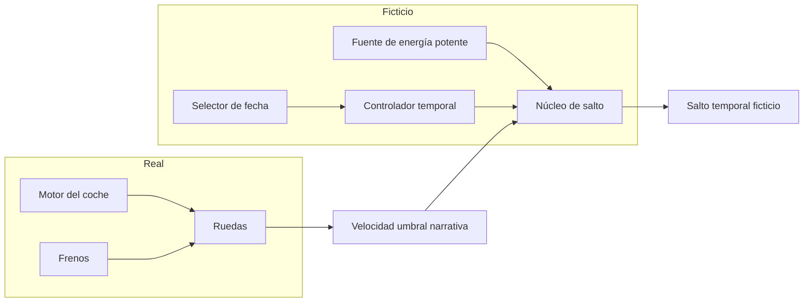
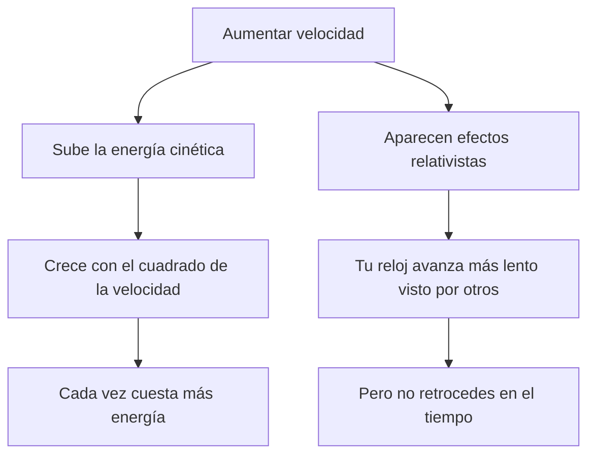

# 🔧 Sistemas mecánicos de la DeLorean temporal

[🏠 Inicio](../../../README.md) · [🕰️ Curso: DeLorean temporal](../README.md) · 🔧 Sistemas mecánicos

> ⚖️ Material educativo original; los derechos de las obras pertenecen a sus titulares.

Este módulo abre la nave por dentro, pero con una advertencia: la mayoría de sus
sistemas de salto temporal son imaginarios. Lo interesante es usar cada pieza
ficticia como puerta de entrada a la física real que evoca o que rompe. Todo el
contenido es original y con fines educativos.

---

## 🗺️ Vista general de subsistemas

En el modo carretera, solo actua la parte real. En el modo salto se activa la
parte ficticia, que no corresponde a ninguna tecnología conocida.

---

## 1. ⚡ Energía y potencia

La historia asocia el salto a una fuente muy potente. Aquí conviene separar dos
ideas que se confunden a menudo.

- **Energía**: la cantidad total de "capacidad de hacer algo" almacenada o
  entregada. Se puede medir en joules.
- **Potencia**: la rapidez con la que se entrega esa energía. Se mide en watts,
  es decir joules por segundo.

Un pulso muy potente durante un instante puede entregar poca energía total; y una
fuente modesta durante mucho tiempo puede entregar mucha energía. La ficción
suele pedir ambas cosas a la vez: muchisima energía entregada en un instante.

### Energía cinética y velocidad umbral

La energía cinética de un cuerpo crece con el cuadrado de su velocidad: si
duplicas la velocidad, la energía de movimiento se multiplica por cuatro. Esto
explica por qué ir más rápido cuesta cada vez más energía.

El punto clave educativo es este: en la física real, alcanzar cierta velocidad
umbral solo te da más energía de movimiento y efectos relativistas, pero **no**
abre ninguna puerta al pasado. La "velocidad mágica" es un recurso de guion, no
un mecanismo físico.

---

## 2. 🕳️ El núcleo de salto imaginario

En la ficción, el núcleo toma la energía y "dobla" el tiempo. No existe una
tecnología real equivalente. Para estudiarlo lo comparamos con ideas teóricas
exóticas de la física, dejando claro que son especulativas.

| Pieza ficticia | Idea real que evoca | Estado en la física actual |
| --- | --- | --- |
| Núcleo de salto | Curvas temporales cerradas | Solución teórica exótica, sin evidencia ni receta práctica. |
| Fuente potente | Densidades de energía enormes | Muy por encima de lo que sabemos manejar. |
| Selector de fecha | Control preciso del tiempo | No existe mecanismo conocido para elegir una fecha. |
| Umbral de velocidad | Regímenes relativistas | Reales, pero no producen viaje al pasado. |

---

## 3. 🧪 Ficción frente a realidad

Esta tabla resume el corazón del módulo: que muestra la nave y que dice la
física que hoy conocemos.

| Afirmación de la ficción | Que dice la física real |
| --- | --- |
| Al pasar la velocidad umbral, se viaja en el tiempo | La velocidad no abre viajes al pasado; solo cambia energía y ritmo del reloj. |
| Basta energía suficiente para saltar de fecha | No hay mecanismo conocido que convierta energía en un salto al pasado. |
| El pasado se puede visitar y modificar | La física actual no permite retroceder ni reescribir eventos ya ocurridos. |
| Moverse rápido te lleva a otra época | Moverse rápido produce dilatación temporal, que solo desfasa relojes hacia el futuro relativo. |

---

## 4. ⏱️ Dilatación temporal real

La relatividad describe un efecto genuino: cuando algo se mueve muy rápido
respecto a ti, su reloj avanza más lento comparado con el tuyo. También ocurre
algo similar cerca de una gran masa. Esto está comprobado con relojes muy
precisos y con partículas que "viven" más tiempo cuando van muy rápido.

Pero cuidado con la interpretación: la dilatación temporal es siempre un
desfase hacia el futuro relativo. Nunca hace que un reloj marche hacia atrás.
Puedes envejecer un poco menos que quien se queda quieto, lo que se parece a un
viaje al futuro, pero jamás al pasado.

---

## 5. 🧩 Cómo se conecta todo

1. En **modo carretera**, la nave es un coche normal y solo importa la física
   real de motor, frenos y ruedas.
2. En **modo salto**, la ficción pide una **velocidad umbral** y una **fuente de
   energía** enorme.
3. Ese umbral, en la realidad, solo produce más **energía cinética** y efectos
   relativistas, no un salto al pasado.
4. El **núcleo** imaginario se inspira lejanamente en ideas teóricas exóticas
   como las curvas temporales cerradas, que no tienen receta práctica.
5. La **dilatación temporal** real existe, pero apunta al futuro relativo, no al
   pasado.

Con esto claro, el [Módulo 4: Mandos](../mandos/manual-mandos-delorean.md) muestra
como el usuario operaría estos sistemas en un tablero conceptual.

---

[⬅️ Anterior: Características](caracteristicas-delorean.md) · [➡️ Siguiente: Mandos e instrumentos](../mandos/manual-mandos-delorean.md)
