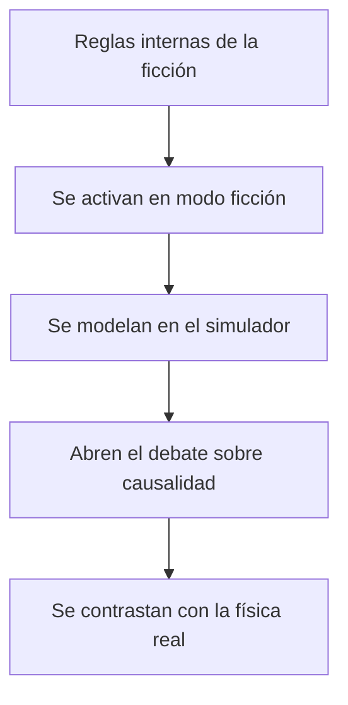

# ⚖️ Reglas del universo de la DeLorean temporal

[🏠 Inicio](../../../README.md) · [🕰️ Curso: DeLorean temporal](../README.md) · ⚖️ Reglas del universo

> ⚖️ Material educativo original; los derechos de las obras pertenecen a sus titulares.

En vez de un reglamento legal, este módulo describe con nuestras palabras las
"reglas internas" que una historia de viaje en el tiempo suele adoptar para ser
coherente. No citamos ni reproducimos la obra: resumimos convenciones generales
del género. Al final aclaramos que nada de esto es ley real y que la física dice
otra cosa.

---

## 📜 Reglas internas típicas del género

- **Regla del disparador**: el salto ocurre solo si se cumple una condición
  precisa, como alcanzar una velocidad umbral con energía suficiente.
- **Regla del destino elegido**: el viajero fija una fecha objetivo antes de
  saltar.
- **Regla de la consecuencia**: cambiar algo en el pasado altera el presente o
  el futuro del relato.
- **Regla de la fragilidad personal**: el viajero puede poner en riesgo su
  propia existencia si interfiere con eventos que lo hicieron posible.
- **Regla de la coherencia**: la historia intenta que los sucesos encajen sin
  contradicciones imposibles.

---

## 🔀 Dos formas de resolver las paradojas en la ficción

| Enfoque narrativo | Idea central | Ejemplo de conflicto |
| --- | --- | --- |
| Línea que se puede cambiar | El pasado se altera y el futuro se reescribe | La paradoja del abuelo amenaza al viajero. |
| Línea autoconsistente | Todo lo que pasa ya era parte de la historia | El viajero no puede cambiar lo que ya ocurrio. |

La **paradoja del abuelo** es el clásico dilema: si alguien impidiera su propio
origen, tampoco existiría para impedirlo, lo que genera una contradicción. El
enfoque **autoconsistente** la evita afirmando que ninguna acción del viajero
puede contradecir la historia que ya sucedio.

---

## 🧭 Cómo usamos estas reglas en el curso

---

## ⚠️ Aclaración importante: esto no es ley real

Las reglas anteriores son convenciones de historias, no leyes de la naturaleza.
La física que hoy conocemos indica algo muy distinto:

| Regla del universo de ficción | Que dice la física real |
| --- | --- |
| Una velocidad umbral dispara el viaje temporal | La velocidad no permite viajar al pasado. |
| El pasado se puede visitar y cambiar | No hay mecanismo conocido para retroceder en el tiempo. |
| Las paradojas se resuelven con una regla narrativa | Las paradojas indican por qué el viaje al pasado es problemático. |
| La energía suficiente basta para saltar de fecha | La energía no ofrece un camino conocido al pasado. |

Estas convenciones son útiles para contar historias y para pensar, no para
describir el mundo. Para el contexto de derechos y uso educativo de esta
sección, consulta el
[aviso de derechos del catálogo](../../README.md).

---

[⬅️ Anterior: Entornos](../operacion/entornos-delorean.md) · [➡️ Siguiente: Diseño de simulación](../simulacion/diseno-simulador-delorean.md)
