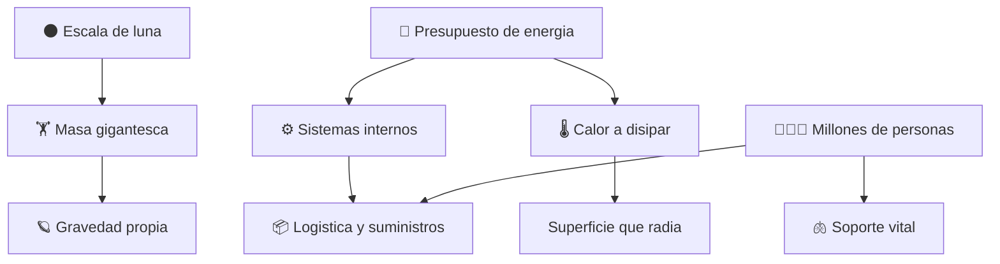

# 🌑 Curso: Estrella de la Muerte

[🏠 Inicio](../../README.md) · [🌌 Naves de ficcion](../README.md) · [🎓 Guia de curso](../../docs/08-guia-de-estilo-y-curso.md)

> ⚖️ Material educativo original; los derechos de las obras pertenecen a sus titulares.

---

> Curso de analisis educativo de ciencia ficcion inspirado en el estilo
> "Star Wars". Estudiamos una estacion espacial del tamano de una luna, generica,
> para entender la fisica real de la escala extrema: gravedad propia, presupuesto
> de energia, disipacion de calor y la logistica de una ciudad-mundo.

---

## 🎯 Objetivos de aprendizaje

Al terminar este curso deberias poder:

- Explicar por que un cuerpo del tamano de una luna tendria gravedad propia.
- Entender que es un presupuesto de energia y por que limita lo que se puede hacer.
- Describir por que disipar calor en el vacio es un reto a gran escala.
- Razonar sobre la logistica de sostener a millones de personas en una estacion.
- Distinguir que evoca la ficcion que seria real y que rompe la fisica.
- Traducir todo lo anterior a variables de un simulador educativo.

---

## 🗺️ Mapa del vehiculo

---

## 📚 Modulos del curso

| # | Modulo | Contenido | Enlace |
| :-: | --- | --- | --- |
| 1 | 📜 Historia | Contexto de la estacion-luna de ficcion y su idea. | [Abrir](historia/historia-estrella-de-la-muerte.md) |
| 2 | 📋 Caracteristicas | Que es una estacion del tamano de una luna. | [Abrir](operacion/caracteristicas-estrella-de-la-muerte.md) |
| 3 | 🔧 Sistemas mecanicos | Tecnologia imaginaria frente a la fisica real. | [Abrir](operacion/sistemas-mecanicos-estrella-de-la-muerte.md) |
| 4 | 🎛️ Mandos e instrumentos | Centro de control conceptual y consolas. | [Abrir](mandos/manual-mandos-estrella-de-la-muerte.md) |
| 5 | 🧪 Principios y operacion | Gravedad, energia y calor: que si, que no y por que. | [Abrir](operacion/principios-estrella-de-la-muerte.md) |
| 6 | 🌍 Entornos | El vacio, orbitas y el entorno de un sistema estelar. | [Abrir](operacion/entornos-estrella-de-la-muerte.md) |
| 7 | ⚖️ Reglas del universo | Las leyes internas de la ficcion frente a la fisica. | [Abrir](reglamentos/reglas-universo-estrella-de-la-muerte.md) |
| 8 | 🎮 Diseno de simulacion | Variables, ciclo y modo ciencia o ficcion. | [Abrir](simulacion/diseno-simulador-estrella-de-la-muerte.md) |
| 9 | 🧰 Recursos | Glosario, enlaces y diagramas. | [Abrir](recursos/recursos-estrella-de-la-muerte.md) |

---

## 🧩 Requisitos previos

Ninguno formal. Ayuda tener nociones basicas de gravedad y energia, pero el curso
las explica desde cero. La idea central es simple y potente: cuando algo alcanza
el tamano de una luna deja de comportarse como una nave y empieza a comportarse
como un mundo, con su propia gravedad, su enorme apetito de energia y un serio
problema para deshacerse del calor.

---

[➡️ Empezar por el Modulo 1: Historia](historia/historia-estrella-de-la-muerte.md)
