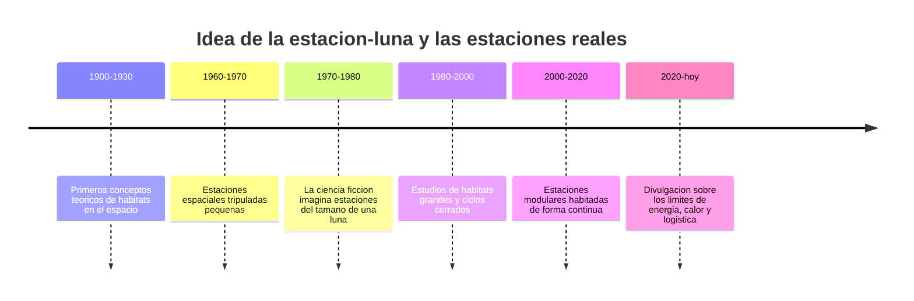

# 📜 Historia de la Estrella de la Muerte

[🏠 Inicio](../../../README.md) · [🌑 Curso: Estrella de la Muerte](../README.md) · 📜 Historia

> ⚖️ Material educativo original; los derechos de las obras pertenecen a sus titulares.

Este modulo situa la idea de la estacion del tamano de una luna dentro de la
ciencia ficcion y la compara con la historia real de las estaciones espaciales.
No describe una nave oficial: analiza el concepto generico de "estacion-mundo"
que popularizo el estilo "Star Wars" y lo contrasta con lo que la ingenieria sabe
hacer de verdad.

## De donde viene la idea

La estacion-luna de la ficcion nace del deseo de imaginar una construccion tan
grande que se confunda con un cuerpo celeste: una base del tamano de una luna,
capaz de albergar a millones de personas y de concentrar un poder inmenso. Es una
imagen sobrecogedora. El problema es que, a ese tamano, la estructura deja de
comportarse como una nave y empieza a comportarse como un mundo, con sus propias
reglas fisicas, y ahi empieza lo interesante de este curso.

## Lo real frente a lo imaginado

La historia real de las estaciones espaciales siguio otro camino. Las estaciones
que se han habitado son pequenas comparadas con una luna y dependen por completo
de suministros y de una gestion muy cuidadosa de energia, aire y calor. No existe
la estacion-mundo gratis: alcanzar el tamano de una luna trae consigo gravedad
propia, un apetito de energia colosal y un problema serio para deshacerse del
calor.

| Periodo | Hito de referencia | Importancia para el curso |
| --- | --- | --- |
| 1900-1930 | Conceptos teoricos de habitats espaciales | Primeras ideas de vivir en el espacio. |
| 1960-1970 | Estaciones tripuladas pequenas | Muestra la dependencia de suministros. |
| 1970-1980 | Auge de la estacion-mundo en la ficcion | Fija la imagen popular de la base gigante. |
| 1980-2000 | Estudios de ciclos cerrados | Explica el reto de la autonomia. |
| 2000-2020 | Habitacion continua en el espacio | Confirma la exigencia de energia y calor. |
| 2020-hoy | Divulgacion de limites fisicos | Separa el espectaculo de la realidad. |

## Por que la ficcion eligio la estacion gigante

Una estacion del tamano de una luna es un simbolo perfecto: transmite un poder
que parece imposible de resistir y sirve de escenario colosal. La ficcion
prioriza ese impacto sobre la viabilidad tecnica, y eso es una decision artistica
legitima que este curso respeta y analiza.

## Que aprenderemos de todo esto

- Que conceptos de fisica real evoca la estacion aunque los exagere.
- Por que a esa escala aparecen gravedad propia, apetito de energia y calor.
- Como seria una estacion-mundo si tuviera que respetar la fisica real.

## Fuentes

- Registrar aqui las fuentes publicas de divulgacion consultadas.
- Enlazar cada fuente tambien en [`manuales/fuentes.md`](../../../manuales/fuentes.md).

---

[🎓 Portada del curso](../README.md) · [➡️ Siguiente: Caracteristicas](../operacion/caracteristicas-estrella-de-la-muerte.md)
