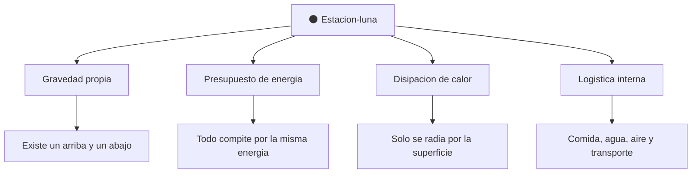

# 📋 Caracteristicas de la Estrella de la Muerte

[🏠 Inicio](../../../README.md) · [🌑 Curso: Estrella de la Muerte](../README.md) · 📋 Caracteristicas

> ⚖️ Material educativo original; los derechos de las obras pertenecen a sus titulares.

Que es una estacion del tamano de una luna generica, que rasgos la definen en la
ficcion y cuales tendrian sentido fisico real. Este modulo da el contexto antes
de abrir la tecnologia por dentro en el Modulo 3.

---

## 🧭 Definicion

Una estacion-mundo, en la ficcion estilo "Star Wars", es una construccion
esferica del tamano de una luna pequena, con millones de habitantes, hangares,
ciudades interiores y una enorme concentracion de energia. La imaginamos como una
base capaz de moverse por el espacio. En este curso la usamos como excusa para
estudiar que le pasa a la fisica cuando algo alcanza el tamano de un cuerpo
celeste.

---

## 🧬 Caracteristicas clave

| Caracteristica | Como la muestra la ficcion | Lectura fisica real |
| --- | --- | --- |
| Tamano de luna | Esfera de decenas de kilometros | A esa masa aparece gravedad propia. |
| Forma esferica | Superficie enorme y regular | Coherente: una masa grande tiende a la esfera. |
| Poblacion inmensa | Millones de tripulantes | Exige soporte vital y logistica colosales. |
| Energia concentrada | Potencia casi ilimitada | Habria un presupuesto de energia con limites. |
| Movilidad | Se desplaza por el espacio | Mover esa masa exige un empuje descomunal. |
| Autonomia | Se abastece a si misma | Muy exigente; depende de ciclos y suministros. |

---

## 🗂️ Aspectos conceptuales de la estacion

| Aspecto | Idea en la ficcion | Compromiso fisico |
| --- | --- | --- |
| Gravedad propia | Se camina como en un planeta | A esa masa la gravedad seria real y notable. |
| Energia | Fuente casi infinita | En la realidad habria un presupuesto limitado. |
| Calor | No se menciona | Disiparlo seria un reto enorme por la escala. |
| Logistica | Todo funciona sin mas | Sostener millones de personas es colosal. |

---

## 🎯 Para que sirve en el relato

- Representar una amenaza abrumadora y un simbolo de poder.
- Ofrecer un escenario colosal para las escenas de la historia.
- Concentrar en un solo lugar una fuerza que parece invencible.

En cambio, para este curso sirve como laboratorio: cada rasgo colosal nos deja
preguntar si seria posible y por que.

---

[⬅️ Anterior: Historia](../historia/historia-estrella-de-la-muerte.md) · [➡️ Siguiente: Sistemas mecanicos](sistemas-mecanicos-estrella-de-la-muerte.md)
