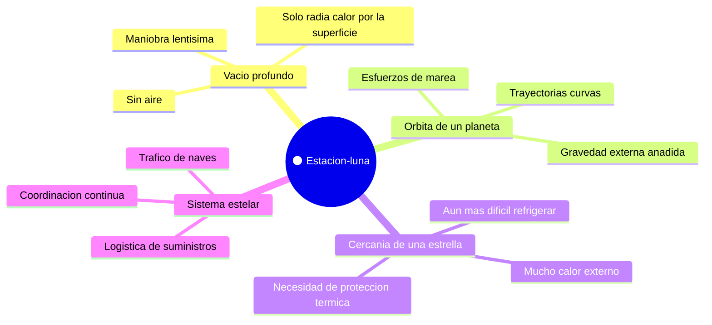

# 🌍 Entornos de la Estrella de la Muerte

[🏠 Inicio](../../../README.md) · [🌑 Curso: Estrella de la Muerte](../README.md) · 🌍 Entornos

> ⚖️ Material educativo original; los derechos de las obras pertenecen a sus titulares.

Donde opera una estacion del tamano de una luna y como cambia su comportamiento
segun el entorno. Cada escenario implica reglas fisicas distintas, y en
simulacion se traduce en condiciones diferentes de gravedad, energia y calor.

---

## 🗺️ Entornos principales

| Entorno | Caracteristicas | Riesgos tipicos | Ajuste de operacion |
| --- | --- | --- | --- |
| Vacio profundo | Sin aire; solo radia calor. | Acumular calor, gastar energia. | Reparto cuidadoso de energia y calor. |
| Orbita de un planeta | Gravedad externa y esfuerzos de marea. | Deformacion, caida o escape. | Respetar mecanica orbital, cuidar la estructura. |
| Cercania de una estrella | Calor externo elevado. | Sobrecalentamiento. | Reforzar la disipacion y la proteccion termica. |
| Sistema estelar | Trafico y suministros. | Fallos de logistica. | Coordinar transporte y abastecimiento. |

---

## 🌡️ Factores del entorno

- **Gravedad**: la estacion tiene la suya propia, y cerca de un planeta se suma la
  externa, que anade esfuerzos a su estructura.
- **Calor externo**: cerca de una estrella recibe calor de fuera, lo que dificulta
  aun mas expulsar el que genera por dentro.
- **Energia**: el entorno no cambia el presupuesto, pero si las prioridades; en un
  entorno hostil, mas energia va a proteccion y disipacion.
- **Logistica**: en un sistema estelar la estacion depende del trafico de naves
  para abastecerse, y eso condiciona su autonomia real.

---

## 🎮 Traduccion a simulacion

Cada entorno es un escenario con su gravedad, su calor externo y su exigencia
logistica. Acercarse a una estrella o a un planeta cambia por completo el
equilibrio de energia y calor, y es una gran leccion sobre los limites de una
estructura de escala planetaria. Ver como se modela en el
[Modulo 8: Diseno de simulacion](../simulacion/diseno-simulador-estrella-de-la-muerte.md).

---

[⬅️ Anterior: Principios y operacion](principios-estrella-de-la-muerte.md) · [➡️ Siguiente: Reglas del universo](../reglamentos/reglas-universo-estrella-de-la-muerte.md)
