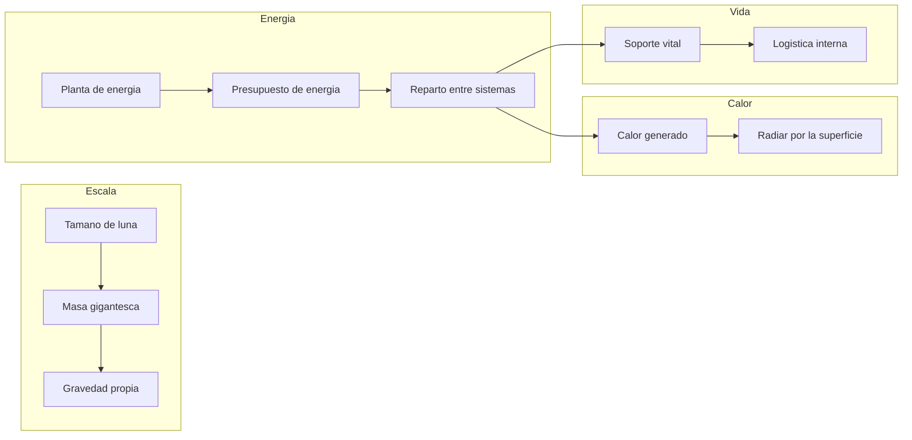

# 🔧 Sistemas mecanicos de la Estrella de la Muerte

[🏠 Inicio](../../../README.md) · [🌑 Curso: Estrella de la Muerte](../README.md) · 🔧 Sistemas mecanicos

> ⚖️ Material educativo original; los derechos de las obras pertenecen a sus titulares.

Este modulo abre la estacion-mundo por dentro. Compara la tecnologia imaginaria
de la ficcion con la fisica real que la haria funcionar (o que la desmiente). La
regla del curso es clara: describimos conceptos con nuestras palabras, sin copiar
planos ni especificaciones oficiales.

---

## 1. 🪐 Gravedad propia

Aqui hay un rasgo que la ficcion casi acierta. Cualquier masa atrae a lo que la
rodea; cuanto mayor es la masa, mayor es su gravedad. Una estacion del tamano de
una luna tendria tanta masa que generaria su propia gravedad apreciable: existiria
un "abajo" hacia su centro. Eso hace innecesarios muchos trucos, pero tambien
significa que la estructura tendria que soportar su propio peso, como un pequeno
planeta.

| Concepto de ficcion | Fisica real que evoca | Veredicto |
| --- | --- | --- |
| Se camina como en un planeta | Gravedad por masa propia | Plausible: a esa masa habria gravedad real. |
| Un unico "abajo" claro | Gravedad hacia el centro | Coherente con una esfera masiva. |
| La estructura no sufre por su peso | Resistencia de materiales | Dudoso: su propio peso seria enorme. |

---

## 2. 🔋 Presupuesto de energia

Este es el corazon del curso. Toda estacion tiene un presupuesto de energia: una
cantidad que produce por unidad de tiempo y que debe repartir entre todos sus
sistemas. Soporte vital, propulsion, sensores y cualquier arma compiten por la
misma energia. En la ficcion la potencia parece infinita; en la realidad, cada
gran consumo obliga a recortar en otro lado. No se puede alimentar todo a la vez
sin limite.

| Idea de la ficcion | Que dice la fisica real |
| --- | --- |
| Energia ilimitada para todo | Hay un presupuesto; todo compite por el. |
| Un gran disparo sin consecuencias | Concentrar tanta energia dejaria sin margen a lo demas. |
| Recarga instantanea | Acumular y liberar energia lleva tiempo. |
| El calor del proceso desaparece | Toda esa energia acaba en calor que hay que expulsar. |

---

## 3. 🌡️ Disipacion de calor

Casi toda la energia que usa la estacion termina convertida en calor. Y en el
vacio el calor solo se puede expulsar por radiacion, a traves de la superficie
externa. Una estacion-mundo generaria una cantidad inmensa de calor por dentro,
pero su superficie, aunque grande, es limitada. Refrigerar semejante mole sin
cocerse por dentro seria uno de sus mayores desafios, y la ficcion casi nunca lo
menciona.

- **Origen del calor**: motores, energia y la propia poblacion.
- **Unica via**: radiacion por la superficie; no hay aire que se lo lleve.
- **Reto de escala**: mucho calor dentro, superficie que no crece igual de rapido.

---

## 4. 🚀 Propulsion de una masa colosal

Mover algo del tamano de una luna exige un empuje inimaginable. Como la
aceleracion es el empuje dividido por la masa, la estacion se desplazaria muy
despacio y cambiar su rumbo llevaria muchisimo tiempo. En la ficcion se mueve casi
como una nave; en la realidad, seria mas parecido a mover un cuerpo celeste.

| Sistema | En la ficcion | En la realidad |
| --- | --- | --- |
| Desplazamiento | Se mueve con relativa soltura | Aceleracion minima por su masa. |
| Cambio de rumbo | Gira cuando conviene | Reorientar tanta masa lleva mucho tiempo. |
| Propelente | No se menciona | Mover esa masa gastaria cantidades inmensas. |

---

## 5. 📦 Logistica y soporte vital

Una poblacion de millones de personas necesita aire, agua, comida, energia,
transporte interno y gestion de residuos, de forma continua. En la ficcion todo
funciona sin explicacion. En la realidad, esta logistica es un sistema tan grande
y critico como cualquier otro: si falla, la estacion deja de ser habitable, por
mucha potencia que tenga.

| Sistema | En la ficcion | En la realidad |
| --- | --- | --- |
| Aire y agua | Siempre disponibles | Ciclos cerrados enormes y delicados. |
| Comida | Aparece sin mas | Produccion o suministro constante. |
| Transporte interno | Instantaneo | Red enorme para una ciudad-mundo. |

---

## 🔁 Como se conecta todo

1. La **escala** da a la estacion masa suficiente para tener gravedad propia.
2. El **presupuesto de energia** obliga a repartir potencia entre sistemas.
3. La **disipacion de calor** limita cuanta energia se puede usar sin cocerse.
4. La **propulsion** lucha contra una masa de dimensiones planetarias.
5. La **logistica y el soporte vital** mantienen viva a la poblacion.

Con esto claro, el
[Modulo 4: Mandos](../mandos/manual-mandos-estrella-de-la-muerte.md) muestra como
se operaria una estacion de este tamano.

---

[⬅️ Anterior: Caracteristicas](caracteristicas-estrella-de-la-muerte.md) · [➡️ Siguiente: Mandos e instrumentos](../mandos/manual-mandos-estrella-de-la-muerte.md)
