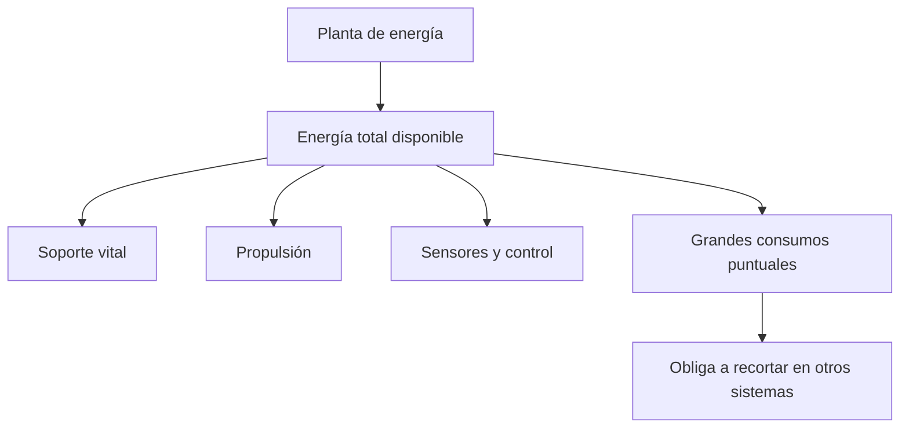
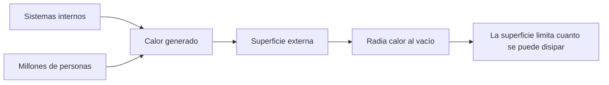

# 🔧 Sistemas mecánicos de la Estrella de la Muerte

[🏠 Inicio](../../../README.md) · [🌑 Curso: Estrella de la Muerte](../README.md) · 🔧 Sistemas mecánicos

> ⚖️ Material educativo original; los derechos de las obras pertenecen a sus titulares.

Este módulo abre la estacion-mundo por dentro. Compara la tecnología imaginaria
de la ficción con la física real que la haría funcionar (o que la desmiente). La
regla del curso es clara: describimos conceptos con nuestras palabras, sin copiar
planos ni especificaciones oficiales.

---

## 1. 🪐 Gravedad propia

Aquí hay un rasgo que la ficción casi acierta. Cualquier masa atrae a lo que la
rodea; cuanto mayor es la masa, mayor es su gravedad. Una estación del tamaño de
una luna tendría tanta masa que generaría su propia gravedad apreciable: existiría
un "abajo" hacia su centro. Eso hace innecesarios muchos trucos, pero también
significa que la estructura tendría que soportar su propio peso, como un pequeño
planeta.

| Concepto de ficción | Física real que evoca | Veredicto |
| --- | --- | --- |
| Se camina como en un planeta | Gravedad por masa propia | Plausible: a esa masa habría gravedad real. |
| Un único "abajo" claro | Gravedad hacia el centro | Coherente con una esfera masiva. |
| La estructura no sufre por su peso | Resistencia de materiales | Dudoso: su propio peso sería enorme. |

---

## 2. 🔋 Presupuesto de energía

Este es el corazón del curso. Toda estación tiene un presupuesto de energía: una
cantidad que produce por unidad de tiempo y que debe repartir entre todos sus
sistemas. Soporte vital, propulsión, sensores y cualquier arma compiten por la
misma energía. En la ficción la potencia parece infinita; en la realidad, cada
gran consumo obliga a recortar en otro lado. No se puede alimentar todo a la vez
sin límite.

| Idea de la ficción | Que dice la física real |
| --- | --- |
| Energía ilimitada para todo | Hay un presupuesto; todo compite por el. |
| Un gran disparo sin consecuencias | Concentrar tanta energía dejaría sin margen a lo demás. |
| Recarga instantánea | Acumular y liberar energía lleva tiempo. |
| El calor del proceso desaparece | Toda esa energía acaba en calor que hay que expulsar. |

---

## 3. 🌡️ Disipación de calor

Casi toda la energía que usa la estación termina convertida en calor. Y en el
vacío el calor solo se puede expulsar por radiación, a través de la superficie
externa. Una estacion-mundo generaría una cantidad inmensa de calor por dentro,
pero su superficie, aunque grande, es limitada. Refrigerar semejante mole sin
cocerse por dentro sería uno de sus mayores desafíos, y la ficción casi nunca lo
menciona.

- **Origen del calor**: motores, energía y la propia población.
- **Única vía**: radiación por la superficie; no hay aire que se lo lleve.
- **Reto de escala**: mucho calor dentro, superficie que no crece igual de rápido.

---

## 4. 🚀 Propulsión de una masa colosal

Mover algo del tamaño de una luna exige un empuje inimaginable. Como la
aceleración es el empuje dividido por la masa, la estación se desplazaría muy
despacio y cambiar su rumbo llevaría muchisimo tiempo. En la ficción se mueve casi
como una nave; en la realidad, sería más parecido a mover un cuerpo celeste.

| Sistema | En la ficción | En la realidad |
| --- | --- | --- |
| Desplazamiento | Se mueve con relativa soltura | Aceleración mínima por su masa. |
| Cambio de rumbo | Gira cuando conviene | Reorientar tanta masa lleva mucho tiempo. |
| Propelente | No se menciona | Mover esa masa gastaría cantidades inmensas. |

---

## 5. 📦 Logística y soporte vital

Una población de millones de personas necesita aire, agua, comida, energía,
transporte interno y gestión de residuos, de forma continua. En la ficción todo
funciona sin explicación. En la realidad, esta logística es un sistema tan grande
y crítico como cualquier otro: si falla, la estación deja de ser habitable, por
mucha potencia que tenga.

| Sistema | En la ficción | En la realidad |
| --- | --- | --- |
| Aire y agua | Siempre disponibles | Ciclos cerrados enormes y delicados. |
| Comida | Aparece sin más | Producción o suministro constante. |
| Transporte interno | Instantáneo | Red enorme para una ciudad-mundo. |

---

## 🔁 Cómo se conecta todo

1. La **escala** da a la estación masa suficiente para tener gravedad propia.
2. El **presupuesto de energía** obliga a repartir potencia entre sistemas.
3. La **disipación de calor** limita cuanta energía se puede usar sin cocerse.
4. La **propulsión** lucha contra una masa de dimensiones planetarias.
5. La **logística y el soporte vital** mantienen viva a la población.

Con esto claro, el
[Módulo 4: Mandos](../mandos/manual-mandos-estrella-de-la-muerte.md) muestra como
se operaría una estación de este tamaño.

---

[⬅️ Anterior: Características](caracteristicas-estrella-de-la-muerte.md) · [➡️ Siguiente: Mandos e instrumentos](../mandos/manual-mandos-estrella-de-la-muerte.md)
