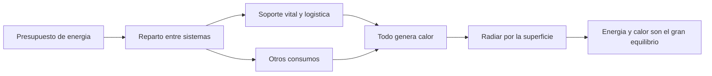

# 🧰 Recursos de la Estrella de la Muerte

[🏠 Inicio](../../../README.md) · [🌑 Curso: Estrella de la Muerte](../README.md) · 🧰 Recursos

> ⚖️ Material educativo original; los derechos de las obras pertenecen a sus titulares.

Glosario especifico, enlaces y diagramas de apoyo del curso de la estacion-mundo.
Amplia el [glosario general](../../../docs/05-glosario-general.md).

---

## 📖 Glosario especifico

| Termino | Definicion |
| --- | --- |
| Gravedad propia | Atraccion que genera un cuerpo por su propia masa. |
| Masa total | Cantidad de materia de la estacion; a escala lunar es gigantesca. |
| Presupuesto de energia | Energia disponible por unidad de tiempo, a repartir entre sistemas. |
| Reparto de energia | Decision de cuanta potencia recibe cada sistema. |
| Conservacion de la energia | La energia no se pierde; se transforma, a menudo en calor. |
| Disipacion de calor | Expulsion de calor; en el vacio, solo por radiacion. |
| Radiacion | Unica via de expulsar calor sin aire, a traves de la superficie. |
| Soporte vital | Sistemas que mantienen aire, agua y temperatura habitables. |
| Logistica | Gestion de suministros y transporte para la poblacion. |
| Escala | Tamano relativo; a escala de luna cambian las reglas fisicas. |

---

## 🗺️ Diagrama: energia, calor y vida

---

## 🔗 Enlaces y fuentes

- Portada del curso: [🌑 Curso: Estrella de la Muerte](../README.md)
- Catalogo de naves de ficcion: [🌌 Naves de ficcion](../../README.md)
- Glosario general: [📖 docs/05-glosario-general.md](../../../docs/05-glosario-general.md)
- Niveles de realismo: [🎚️ docs/03-niveles-de-realismo.md](../../../docs/03-niveles-de-realismo.md)
- Registro de fuentes: [📚 manuales/fuentes.md](../../../manuales/fuentes.md)

Registrar cada recurso nuevo con su origen y licencia, respetando el aviso de
derechos del catalogo de naves de ficcion.

---

[🎓 Portada del curso](../README.md) · [⬅️ Anterior: Diseno de simulacion](../simulacion/diseno-simulador-estrella-de-la-muerte.md)
