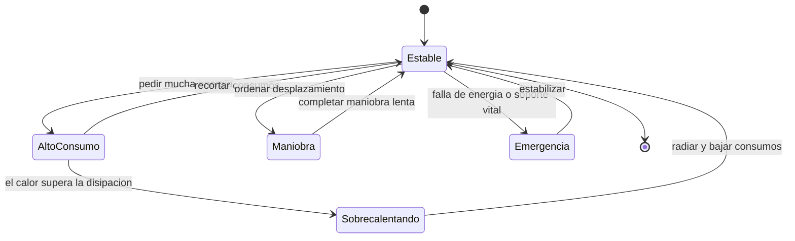

# 🎮 Diseno de simulacion de la Estrella de la Muerte

[🏠 Inicio](../../../README.md) · [🌑 Curso: Estrella de la Muerte](../README.md) · 🎮 Simulacion

> ⚖️ Material educativo original; los derechos de las obras pertenecen a sus titulares.

Como modelar de forma educativa y divertida una estacion del tamano de una luna.
La idea central es poder alternar entre la version espectacular de la ficcion y
la version fiel a la fisica, para que el usuario compare ambas con la misma
estacion, y sobre todo para que sienta el equilibrio entre energia, calor y
logistica.

## Objetivo de la simulacion

Que el usuario comprenda, jugando, que a la escala de una luna aparecen gravedad
propia, un presupuesto de energia que hay que repartir y un calor dificil de
expulsar. El modo ficcion sirve para engancharse; el modo ciencia, para aprender.

## Modo ciencia o ficcion

La variable mas importante del simulador es el **modo**:

- **Modo ficcion**: energia casi infinita, el calor no molesta y la estacion
  maniobra con soltura. Es divertido y espectacular.
- **Modo ciencia**: se aplican la gravedad por masa, el presupuesto de energia,
  la conservacion de la energia y el limite de disipacion de calor. Todo hay que
  repartirlo y planificarlo.

Al cambiar de modo, la interfaz avisa que reglas se activan o desactivan, para
que la comparacion sea explicita y educativa.

## Variables principales

| Variable | Tipo | Rango | Afecta a | Comentarios |
| --- | --- | --- | --- | --- |
| Modo | discreta | ciencia / ficcion | Todas las reglas | Interruptor central del aprendizaje. |
| Presupuesto de energia | numerica | 0-100% | Todos los sistemas | Se reparte; no alcanza para todo a la vez. |
| Reparto de energia | numerica | por sistema | Prioridades | Soporte vital, propulsion, calor. |
| Calor acumulado | numerica | 0-100% | Riesgo termico | Se radia lento por la superficie. |
| Gravedad propia | numerica | segun masa | Interior habitable | Define el arriba y el abajo. |
| Masa total | numerica | de escala lunar | Aceleracion | La hace lentisima de mover. |
| Estado logistico | numerica | 0-100% | Habitabilidad | Comida, agua, aire y transporte. |
| Calor externo | numerica | 0-alto | Disipacion | Cerca de una estrella dificulta refrigerar. |

## Ciclo basico

1. Leer entrada del usuario (reparto de energia, maniobra, logistica).
2. Comprobar el modo activo (ciencia o ficcion).
3. En modo ciencia, restar del presupuesto de energia cada consumo.
4. Convertir la energia usada en calor generado.
5. Radiar calor segun la superficie y el calor externo del entorno.
6. Actualizar soporte vital y logistica con la energia asignada.
7. Aplicar maniobra: aceleracion minima por la enorme masa.
8. Refrescar instrumentos (energia, calor, soporte vital, logistica).

## Modos de juego futuros

- Tutorial de energia: repartir el presupuesto sin dejar sin aire a la poblacion.
- Reto termico: mantener el calor bajo control al subir los consumos.
- Comparador lado a lado: misma situacion en modo ciencia y en modo ficcion.
- Gestion logistica: sostener a la poblacion con suministros limitados.
- Escenario cerca de una estrella con mayor exigencia de disipacion.

## Elementos fuera de alcance

- Presentar la energia infinita de la ficcion como si fuera fisica real.
- Detalles de armamento presentados como datos tecnicos reales.
- Cualquier contenido que confunda espectaculo con ciencia sin distinguirlos.

## Pendientes

- [ ] Definir el reparto por defecto del presupuesto de energia.
- [ ] Prototipar el ciclo energia-calor con conservacion de la energia.
- [ ] Ajustar el modelo de disipacion segun la superficie y el calor externo.
- [ ] Agregar fuentes de divulgacion a [`manuales/fuentes.md`](../../../manuales/fuentes.md).

---

[⬅️ Anterior: Reglas del universo](../reglamentos/reglas-universo-estrella-de-la-muerte.md) · [➡️ Siguiente: Recursos](../recursos/recursos-estrella-de-la-muerte.md)
