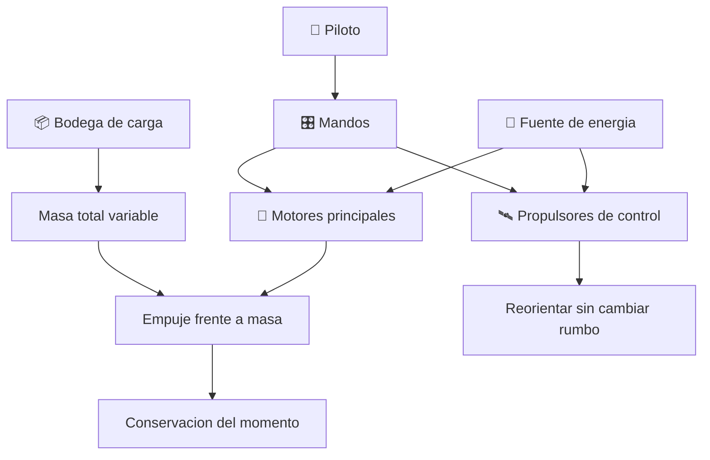

# 🦅 Curso: Halcon Milenario

[🏠 Inicio](../../README.md) · [🌌 Naves de ficcion](../README.md) · [🎓 Guia de curso](../../docs/08-guia-de-estilo-y-curso.md)

> ⚖️ Material educativo original; los derechos de las obras pertenecen a sus titulares.

---

> Curso de analisis educativo de ciencia ficcion inspirado en el estilo
> "Star Wars". Estudiamos un carguero rapido generico para entender la fisica
> real de la relacion empuje/masa, la maniobra en el vacio y por que el "salto
> al hiperespacio" rompe la fisica que conocemos hoy.

---

## 🎯 Objetivos de aprendizaje

Al terminar este curso deberias poder:

- Explicar la relacion empuje/masa y por que decide la aceleracion de una nave.
- Entender que un carguero cargado acelera menos que uno vacio, y por que.
- Describir como se maniobra en el vacio con propulsion y propulsores de control.
- Razonar sobre delta-v y el presupuesto de maniobra de un carguero.
- Distinguir por que un "salto" instantaneo entre estrellas rompe la fisica real.
- Traducir todo lo anterior a variables de un simulador educativo.

---

## 🗺️ Mapa del vehiculo

---

## 📚 Modulos del curso

| # | Modulo | Contenido | Enlace |
| :-: | --- | --- | --- |
| 1 | 📜 Historia | Contexto del carguero rapido de ficcion y su idea de vuelo. | [Abrir](historia/historia-halcon-milenario.md) |
| 2 | 📋 Caracteristicas | Que es un carguero rapido generico y para que sirve. | [Abrir](operacion/caracteristicas-halcon-milenario.md) |
| 3 | 🔧 Sistemas mecanicos | Tecnologia imaginaria frente a la fisica real. | [Abrir](operacion/sistemas-mecanicos-halcon-milenario.md) |
| 4 | 🎛️ Mandos e instrumentos | Puesto de mando conceptual y controles. | [Abrir](mandos/manual-mandos-halcon-milenario.md) |
| 5 | 🧪 Principios y operacion | Empuje, masa y maniobra: que si, que no y por que. | [Abrir](operacion/principios-halcon-milenario.md) |
| 6 | 🌍 Entornos | El vacio, orbitas, atmosferas y hangares. | [Abrir](operacion/entornos-halcon-milenario.md) |
| 7 | ⚖️ Reglas del universo | Las leyes internas de la ficcion frente a la fisica. | [Abrir](reglamentos/reglas-universo-halcon-milenario.md) |
| 8 | 🎮 Diseno de simulacion | Variables, ciclo y modo ciencia o ficcion. | [Abrir](simulacion/diseno-simulador-halcon-milenario.md) |
| 9 | 🧰 Recursos | Glosario, enlaces y diagramas. | [Abrir](recursos/recursos-halcon-milenario.md) |

---

## 🧩 Requisitos previos

Ninguno formal. Ayuda tener nociones basicas de las leyes de Newton, pero el
curso las explica desde cero. La idea central es simple y potente: la
aceleracion de un carguero depende de cuanto empuje tienen sus motores frente a
cuanta masa arrastra, y ninguna carga viaja gratis.

---

[➡️ Empezar por el Modulo 1: Historia](historia/historia-halcon-milenario.md)
