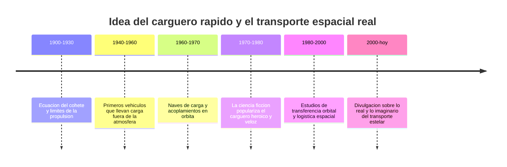

# 📜 Historia del Halcon Milenario

[🏠 Inicio](../../../README.md) · [🦅 Curso: Halcon Milenario](../README.md) · 📜 Historia

> ⚖️ Material educativo original; los derechos de las obras pertenecen a sus titulares.

Este modulo situa la idea del carguero rapido dentro de la ciencia ficcion y la
compara con la historia real del transporte espacial. No describe una nave
oficial: analiza el concepto generico de "carguero veloz" que popularizo el
estilo "Star Wars" y lo contrasta con lo que la ingenieria sabe hacer de verdad.

## De donde viene la idea

El carguero rapido de la ficcion mezcla dos imagenes queridas: el barco
mercante veterano y el coche deportivo trucado. Se lo imagina viejo por fuera
pero sorprendentemente veloz, capaz de escapar de perseguidores y de cruzar la
galaxia en poco tiempo. Es una fantasia atractiva porque une la libertad del
viajero con la emocion de la velocidad. El problema es que mover masa por el
espacio tiene un coste fisico que la ficcion suele ignorar, y ahi empieza lo
interesante de este curso.

## Lo real frente a lo imaginado

La historia real del transporte espacial siguio otro camino. Las naves que
llevaron carga fuera de la atmosfera no corrian como coches: planificaban
maniobras, gastaban con cuidado su propelente y tardaban dias o meses en llegar
a su destino. No hay atajos gratis: cada kilo de carga extra exige mas empuje o
mas tiempo para alcanzar la misma velocidad.

| Periodo | Hito de referencia | Importancia para el curso |
| --- | --- | --- |
| 1900-1930 | Formulacion de la ecuacion del cohete | Explica el limite de maniobra (delta-v). |
| 1940-1960 | Vehiculos que suben carga al espacio | Muestra el coste de mover masa. |
| 1960-1970 | Acoplamientos y naves de carga | Base real de la logistica orbital. |
| 1970-1980 | Auge del carguero veloz en el cine | Fija la imagen popular del transporte rapido. |
| 1980-2000 | Estudio de transferencias orbitales | Muestra como se viaja de verdad. |
| 2000-hoy | Divulgacion de fisica del espacio | Separa el espectaculo de la realidad. |

## Por que la ficcion eligio el carguero veloz

Un carguero destartalado pero rapido es un gran vehiculo para contar historias:
tiene personalidad, siempre parece a punto de fallar y permite fugas de ultimo
momento. La idea de "saltar" a la velocidad de la luz resuelve un problema
narrativo: cruzar distancias enormes sin aburrir al espectador. La ficcion
prioriza el ritmo sobre la fisica, y eso es una decision artistica legitima que
este curso respeta y analiza.

## Que aprenderemos de todo esto

- Que conceptos de fisica real evoca la nave aunque los exagere.
- Por que la relacion empuje/masa decide de verdad la aceleracion.
- Por que un "salto" instantaneo entre estrellas rompe las leyes conocidas.

## Fuentes

- Registrar aqui las fuentes publicas de divulgacion consultadas.
- Enlazar cada fuente tambien en [`manuales/fuentes.md`](../../../manuales/fuentes.md).

---

[🎓 Portada del curso](../README.md) · [➡️ Siguiente: Caracteristicas](../operacion/caracteristicas-halcon-milenario.md)
