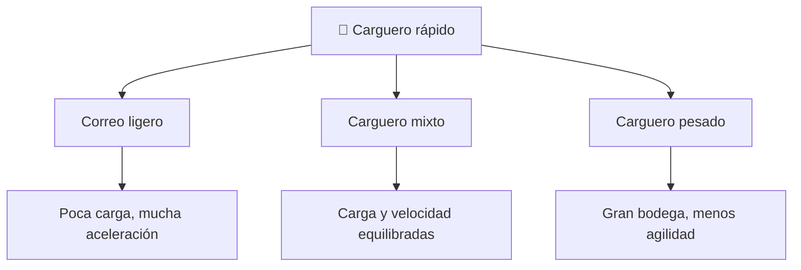

# 📋 Características del Halcón Milenario

[🏠 Inicio](../../../README.md) · [🦅 Curso: Halcón Milenario](../README.md) · 📋 Características

> ⚖️ Material educativo original; los derechos de las obras pertenecen a sus titulares.

Que es un carguero rápido genérico, que rasgos lo definen en la ficción y cuales
tendrían sentido físico real. Este módulo da el contexto antes de abrir la
tecnología por dentro en el Módulo 3.

---

## 🧭 Definición

Un carguero rápido, en la ficción estilo "Star Wars", es una nave mediana
pensada para transportar carga y tripulación, pero modificada para correr y
maniobrar mucho más de lo normal. La imaginamos vieja, remendada y llena de
sorpresas bajo el capo. En este curso la usamos como excusa para estudiar como
se movería de verdad una nave así cuando arrastra masa por el vacío.

---

## 🧬 Características clave

| Característica | Como la muestra la ficción | Lectura física real |
| --- | --- | --- |
| Tamaño mediano | Bodega amplia y tripulación reducida | Razonable: más volumen exige más estructura y masa. |
| Velocidad excepcional | Corre más que naves militares | En el vacío la clave es empuje frente a masa, no la forma. |
| Motores sobredimensionados | Potencia enorme para su tamaño | Plausible: más empuje mejora la aceleración. |
| Carga variable | A veces vacía, a veces repleta | Real: cargada acelera menos, gasta más propelente. |
| Salto a la luz | Cruza la galaxia casi al instante | No físico: rompe el límite de velocidad conocido. |
| Aspecto remendado | Piezas de distintos origenes | Coherente con una nave veterana muy reparada. |

---

## 🗂️ Tipos conceptuales de carguero

| Tipo | Idea de diseño | Compromiso físico |
| --- | --- | --- |
| Correo ligero | Poca masa, motores grandes | Acelera muy rápido pero lleva poca carga. |
| Carguero mixto | Bodega media y motores potentes | Equilibrio entre carga útil y maniobra. |
| Carguero pesado | Bodega enorme | Mucha carga, pero menor aceleración y más propelente. |

---

## 🎯 Para qué sirve en el relato

- Dar libertad al héroe: una nave propia para ir a cualquier parte.
- Permitir fugas de último momento gracias a su velocidad.
- Representar el ingenio de reparar y mejorar una máquina veterana.

En cambio, para este curso sirve como laboratorio: cada rasgo llamativo nos deja
preguntar si sería posible y por qué.

---

[⬅️ Anterior: Historia](../historia/historia-halcon-milenario.md) · [➡️ Siguiente: Sistemas mecánicos](sistemas-mecanicos-halcon-milenario.md)
