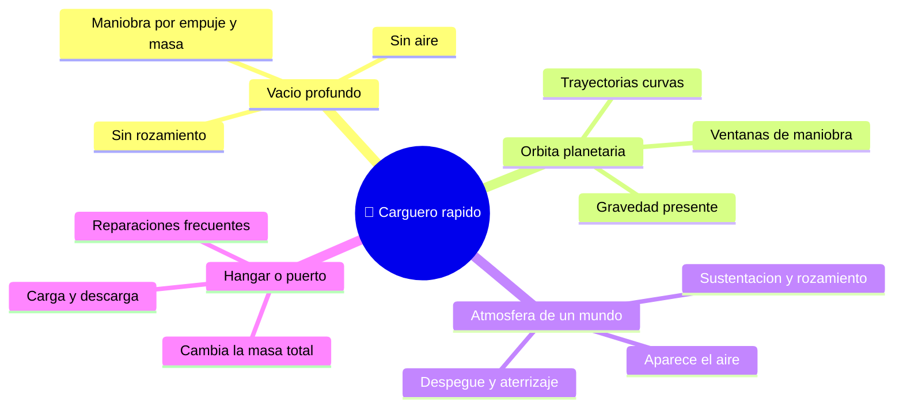

# 🌍 Entornos del Halcon Milenario

[🏠 Inicio](../../../README.md) · [🦅 Curso: Halcon Milenario](../README.md) · 🌍 Entornos

> ⚖️ Material educativo original; los derechos de las obras pertenecen a sus titulares.

Donde opera un carguero rapido y como cambia su comportamiento segun el entorno.
Cada escenario implica reglas fisicas distintas, y en simulacion se traduce en
condiciones diferentes de gravedad, atmosfera y obstaculos.

---

## 🗺️ Entornos principales

| Entorno | Caracteristicas | Riesgos tipicos | Ajuste de maniobra |
| --- | --- | --- | --- |
| Vacio profundo | Sin aire ni rozamiento. | Perder orientacion, gastar delta-v. | Maniobras planificadas, ahorrar propelente. |
| Orbita planetaria | Gravedad que curva la trayectoria. | Caer o escapar sin control. | Respetar mecanica orbital, encender en el momento justo. |
| Atmosfera de un mundo | Aparece aire, sustentacion y calor. | Recalentamiento, esfuerzo estructural. | Usar superficies aerodinamicas, controlar la velocidad. |
| Hangar o puerto | Se carga y descarga la bodega. | Sujecion de carga, exceso de masa. | Recalcular masa y delta-v tras cada operacion. |

---

## 🌡️ Factores del entorno

- **Gravedad**: cerca de un planeta la trayectoria se curva; hay que tenerla en
  cuenta para no caer ni salir disparado.
- **Atmosfera**: solo al entrar en una hay aire; ahi aparecen sustentacion,
  rozamiento y calor por friccion, y las superficies del casco por fin sirven.
- **Carga**: en un puerto cambia la masa total, y con ella la aceleracion y el
  delta-v disponibles para el resto del viaje.
- **Calor**: en el vacio el calor no se va por el aire; se acumula y se disipa
  lentamente por radiadores.

---

## 🎮 Traduccion a simulacion

Cada entorno es un escenario con su gravedad, presencia o ausencia de aire y
estado de la bodega. Cargar o descargar entre misiones cambia por completo como
responde la nave, y es una gran leccion sobre la relacion empuje/masa. Ver como
se modela en el
[Modulo 8: Diseno de simulacion](../simulacion/diseno-simulador-halcon-milenario.md).

---

[⬅️ Anterior: Principios y operacion](principios-halcon-milenario.md) · [➡️ Siguiente: Reglas del universo](../reglamentos/reglas-universo-halcon-milenario.md)
