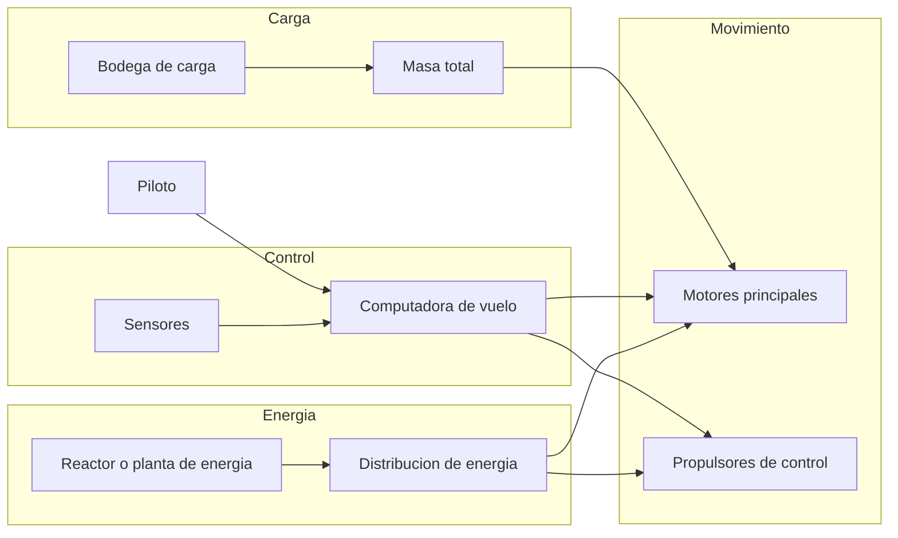
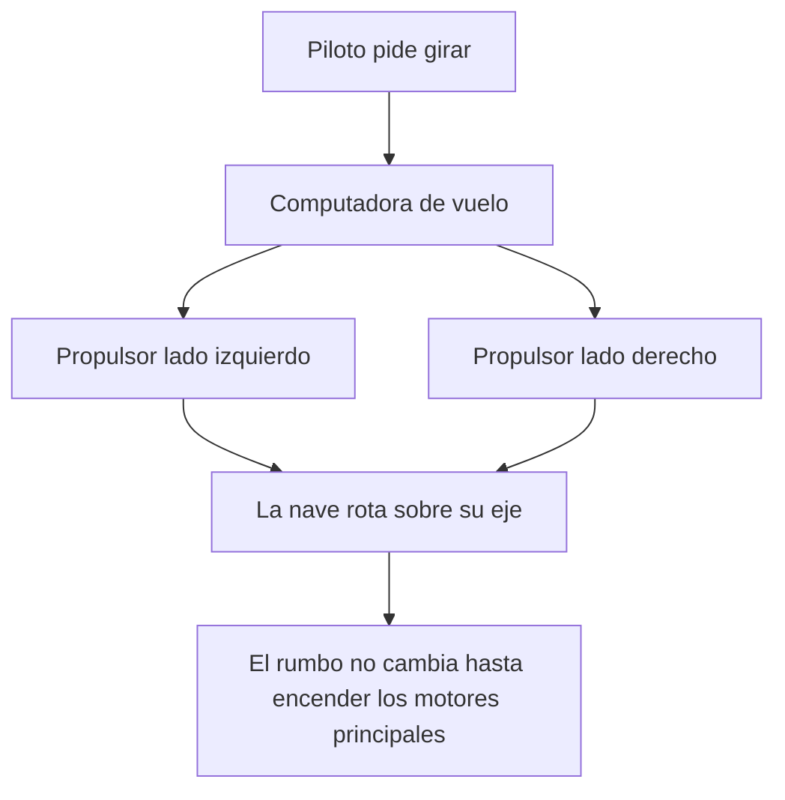

# 🔧 Sistemas mecanicos del Halcon Milenario

[🏠 Inicio](../../../README.md) · [🦅 Curso: Halcon Milenario](../README.md) · 🔧 Sistemas mecanicos

> ⚖️ Material educativo original; los derechos de las obras pertenecen a sus titulares.

Este modulo abre el carguero rapido por dentro. Compara la tecnologia imaginaria
de la ficcion con la fisica real que la haria funcionar (o que la desmiente). La
regla del curso es clara: describimos conceptos con nuestras palabras, sin
copiar planos ni especificaciones oficiales.

---

## 1. 🔋 Fuente de energia

En la ficcion, una planta de energia compacta entrega potencia casi ilimitada.
En la realidad, la energia no es el unico limite: aunque tuvieras un reactor
potente, mover la nave exige expulsar masa (propelente) hacia atras. Sin masa
que expulsar, no hay empuje, por mucha energia que sobre.

| Concepto de ficcion | Fisica real que evoca | Veredicto |
| --- | --- | --- |
| Planta de energia casi infinita | Fuentes de energia densas | Plausible como idea, no como "infinita". |
| Motores que apenas gastan | Motor de cohete que gasta propelente | No fisico: siempre se gasta masa. |
| Encendido y potencia instantaneos | Almacenamiento y entrega de energia | Parcial: la energia si, el propelente no. |

---

## 2. 🚀 Motores principales y empuje frente a masa

Aqui esta la clave del curso. Los motores empujan la nave expulsando masa a gran
velocidad; por la tercera ley de Newton, la nave recibe un empuje en sentido
contrario. Lo importante es que la aceleracion que consigue no depende solo del
empuje, sino de la masa total que arrastra. Un carguero vacio salta hacia
adelante; el mismo carguero repleto de carga acelera mucho menos con los mismos
motores.

| Idea de la ficcion | Que dice la fisica real |
| --- | --- |
| Corre igual de rapido lleno o vacio | Cargado acelera menos con el mismo empuje. |
| Aceleracion instantanea a tope | La aceleracion depende de empuje dividido por masa. |
| Frena solo al soltar el acelerador | Sin rozamiento sigue a velocidad constante. |
| Motores que nunca se quedan sin nada | El propelente es finito y define el delta-v. |

---

## 3. 🛰️ Propulsores de control de reaccion

Para apuntar la nave hacia otro lado no sirve un volante: en el vacio no hay
contra que apoyarse. Se usan pequenos propulsores repartidos por el casco que
lanzan chorros cortos para rotar la nave o desplazarla de lado. Reorientar el
morro no cambia por si solo la direccion en que la nave se mueve: el momento se
conserva.

- **Rotacion**: pares de propulsores opuestos hacen girar la nave sin moverla de sitio.
- **Traslacion lateral**: un propulsor empuja la nave completa hacia un costado.
- **Efecto de la masa**: con la bodega llena, girar y frenar el giro cuesta mas.

---

## 4. 🌀 El "hiperimpulso": la gran licencia creativa

El salto a la velocidad de la luz es el sistema mas famoso y el menos fisico. En
la ficcion, un dispositivo permite cruzar la galaxia casi al instante. En la
fisica que conocemos hoy, ningun objeto con masa puede alcanzar la velocidad de
la luz: acercarse exige cantidades de energia que crecen sin limite. Un "salto"
instantaneo entre estrellas no tiene base en la fisica conocida; es un recurso
narrativo para que la historia avance.

| Sistema | En la ficcion | En la realidad |
| --- | --- | --- |
| Viaje entre estrellas | Salto casi instantaneo | Distancias enormes; anos incluso a gran velocidad. |
| Alcanzar la velocidad de la luz | Se activa un dispositivo | Imposible para un objeto con masa. |
| Energia del salto | Apenas se menciona | Exigiria cantidades de energia desmedidas. |

---

## 5. 🖥️ Computadora de vuelo y sensores

En la ficcion el piloto lo hace todo con instinto. En la realidad, coordinar
motores y decenas de propulsores para lograr una maniobra limpia exige una
computadora que traduzca "quiero ir alli" en encendidos precisos. Los sensores
no verian a los perseguidores por la ventana, sino a enormes distancias con
instrumentos.

| Sistema | En la ficcion | En la realidad |
| --- | --- | --- |
| Navegacion | El piloto improvisa la ruta | Calculo cuidadoso de trayectoria y delta-v. |
| Giro | Palanca tipo avion | Computadora dosifica los propulsores. |
| Deteccion | Vista directa por la cabina | Sensores de calor, radar y radio. |

---

## 🔁 Como se conecta todo

1. La **energia** alimenta motores y sistemas.
2. Los **motores principales** cambian la velocidad segun el empuje y la masa.
3. Los **propulsores de control** cambian la orientacion y hacen ajustes finos.
4. La **computadora** coordina todo respetando la conservacion del momento.
5. El **hiperimpulso** es la licencia creativa que rompe la fisica conocida.

Con esto claro, el [Modulo 4: Mandos](../mandos/manual-mandos-halcon-milenario.md)
muestra como el piloto operaria cada sistema.

---

[⬅️ Anterior: Caracteristicas](caracteristicas-halcon-milenario.md) · [➡️ Siguiente: Mandos e instrumentos](../mandos/manual-mandos-halcon-milenario.md)
