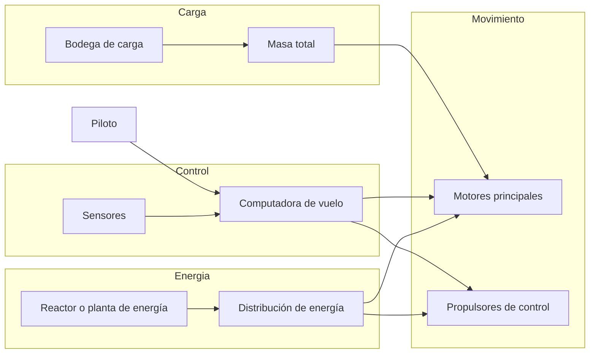
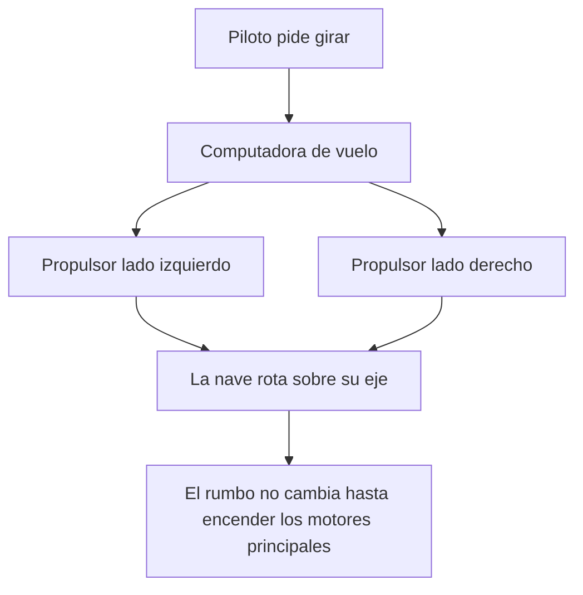

# 🔧 Sistemas mecánicos del Halcón Milenario

[🏠 Inicio](../../../README.md) · [🦅 Curso: Halcón Milenario](../README.md) · 🔧 Sistemas mecánicos

> ⚖️ Material educativo original; los derechos de las obras pertenecen a sus titulares.

Este módulo abre el carguero rápido por dentro. Compara la tecnología imaginaria
de la ficción con la física real que la haría funcionar (o que la desmiente). La
regla del curso es clara: describimos conceptos con nuestras palabras, sin
copiar planos ni especificaciones oficiales.

---

## 1. 🔋 Fuente de energía

En la ficción, una planta de energía compacta entrega potencia casi ilimitada.
En la realidad, la energía no es el único límite: aunque tuvieras un reactor
potente, mover la nave exige expulsar masa (propelente) hacia atrás. Sin masa
que expulsar, no hay empuje, por mucha energía que sobre.

| Concepto de ficción | Física real que evoca | Veredicto |
| --- | --- | --- |
| Planta de energía casi infinita | Fuentes de energía densas | Plausible como idea, no como "infinita". |
| Motores que apenas gastan | Motor de cohete que gasta propelente | No físico: siempre se gasta masa. |
| Encendido y potencia instantáneos | Almacenamiento y entrega de energía | Parcial: la energía si, el propelente no. |

---

## 2. 🚀 Motores principales y empuje frente a masa

Aquí está la clave del curso. Los motores empujan la nave expulsando masa a gran
velocidad; por la tercera ley de Newton, la nave recibe un empuje en sentido
contrario. Lo importante es que la aceleración que consigue no depende solo del
empuje, sino de la masa total que arrastra. Un carguero vacío salta hacia
adelante; el mismo carguero repleto de carga acelera mucho menos con los mismos
motores.

| Idea de la ficción | Que dice la física real |
| --- | --- |
| Corre igual de rápido lleno o vacío | Cargado acelera menos con el mismo empuje. |
| Aceleración instantánea a tope | La aceleración depende de empuje dividido por masa. |
| Frena solo al soltar el acelerador | Sin rozamiento sigue a velocidad constante. |
| Motores que nunca se quedan sin nada | El propelente es finito y define el delta-v. |

---

## 3. 🛰️ Propulsores de control de reacción

Para apuntar la nave hacia otro lado no sirve un volante: en el vacío no hay
contra que apoyarse. Se usan pequeños propulsores repartidos por el casco que
lanzan chorros cortos para rotar la nave o desplazarla de lado. Reorientar el
morro no cambia por si solo la dirección en que la nave se mueve: el momento se
conserva.

- **Rotación**: pares de propulsores opuestos hacen girar la nave sin moverla de sitio.
- **Traslación lateral**: un propulsor empuja la nave completa hacia un costado.
- **Efecto de la masa**: con la bodega llena, girar y frenar el giro cuesta más.

---

## 4. 🌀 El "hiperimpulso": la gran licencia creativa

El salto a la velocidad de la luz es el sistema más famoso y el menos físico. En
la ficción, un dispositivo permite cruzar la galaxia casi al instante. En la
física que conocemos hoy, ningún objeto con masa puede alcanzar la velocidad de
la luz: acercarse exige cantidades de energía que crecen sin límite. Un "salto"
instantáneo entre estrellas no tiene base en la física conocida; es un recurso
narrativo para que la historia avance.

| Sistema | En la ficción | En la realidad |
| --- | --- | --- |
| Viaje entre estrellas | Salto casi instantáneo | Distancias enormes; años incluso a gran velocidad. |
| Alcanzar la velocidad de la luz | Se activa un dispositivo | Imposible para un objeto con masa. |
| Energía del salto | Apenas se menciona | Exigiría cantidades de energía desmedidas. |

---

## 5. 🖥️ Computadora de vuelo y sensores

En la ficción el piloto lo hace todo con instinto. En la realidad, coordinar
motores y decenas de propulsores para lograr una maniobra limpia exige una
computadora que traduzca "quiero ir allí" en encendidos precisos. Los sensores
no verían a los perseguidores por la ventana, sino a enormes distancias con
instrumentos.

| Sistema | En la ficción | En la realidad |
| --- | --- | --- |
| Navegación | El piloto improvisa la ruta | Cálculo cuidadoso de trayectoria y delta-v. |
| Giro | Palanca tipo avión | Computadora dosifica los propulsores. |
| Detección | Vista directa por la cabina | Sensores de calor, radar y radio. |

---

## 🔁 Cómo se conecta todo

1. La **energía** alimenta motores y sistemas.
2. Los **motores principales** cambian la velocidad según el empuje y la masa.
3. Los **propulsores de control** cambian la orientación y hacen ajustes finos.
4. La **computadora** coordina todo respetando la conservación del momento.
5. El **hiperimpulso** es la licencia creativa que rompe la física conocida.

Con esto claro, el [Módulo 4: Mandos](../mandos/manual-mandos-halcon-milenario.md)
muestra como el piloto operaría cada sistema.

---

[⬅️ Anterior: Características](caracteristicas-halcon-milenario.md) · [➡️ Siguiente: Mandos e instrumentos](../mandos/manual-mandos-halcon-milenario.md)
