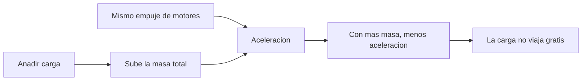

# 🧰 Recursos del Halcon Milenario

[🏠 Inicio](../../../README.md) · [🦅 Curso: Halcon Milenario](../README.md) · 🧰 Recursos

> ⚖️ Material educativo original; los derechos de las obras pertenecen a sus titulares.

Glosario especifico, enlaces y diagramas de apoyo del curso del carguero rapido.
Amplia el [glosario general](../../../docs/05-glosario-general.md).

---

## 📖 Glosario especifico

| Termino | Definicion |
| --- | --- |
| Empuje | Fuerza que impulsa la nave, resultado de expulsar masa. |
| Masa total | Suma de la nave y su carga; decide cuanto acelera. |
| Relacion empuje/masa | Cociente que indica lo agil o pesada que se siente la nave. |
| Aceleracion | Cambio de velocidad; igual al empuje dividido por la masa. |
| Delta-v | Cambio total de velocidad que la nave puede lograr con su propelente. |
| Propelente | Masa que el motor expulsa para generar empuje por reaccion. |
| Momento | Producto de masa por velocidad; se conserva sin fuerzas externas. |
| Hiperimpulso | Salto de ficcion a la velocidad de la luz; sin base en la fisica actual. |
| Carga util | Masa transportada en la bodega; recorta agilidad y delta-v. |
| Reentrada | Entrada a una atmosfera, donde aparecen aire, calor y rozamiento. |

---

## 🗺️ Diagrama: por que la carga pesa

---

## 🔗 Enlaces y fuentes

- Portada del curso: [🦅 Curso: Halcon Milenario](../README.md)
- Catalogo de naves de ficcion: [🌌 Naves de ficcion](../../README.md)
- Glosario general: [📖 docs/05-glosario-general.md](../../../docs/05-glosario-general.md)
- Niveles de realismo: [🎚️ docs/03-niveles-de-realismo.md](../../../docs/03-niveles-de-realismo.md)
- Registro de fuentes: [📚 manuales/fuentes.md](../../../manuales/fuentes.md)

Registrar cada recurso nuevo con su origen y licencia, respetando el aviso de
derechos del catalogo de naves de ficcion.

---

[🎓 Portada del curso](../README.md) · [⬅️ Anterior: Diseno de simulacion](../simulacion/diseno-simulador-halcon-milenario.md)
