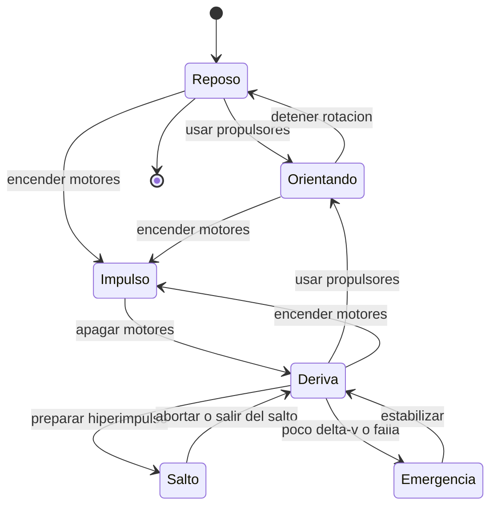

# 🎮 Diseno de simulacion del Halcon Milenario

[🏠 Inicio](../../../README.md) · [🦅 Curso: Halcon Milenario](../README.md) · 🎮 Simulacion

> ⚖️ Material educativo original; los derechos de las obras pertenecen a sus titulares.

Como modelar de forma educativa y divertida un carguero rapido. La idea central
es poder alternar entre la version espectacular de la ficcion y la version fiel
a la fisica, para que el usuario compare ambas con la misma nave, y sobre todo
para que sienta como la carga cambia la maniobra.

## Objetivo de la simulacion

Que el usuario comprenda, jugando, que en el vacio la nave no frena sola, que la
aceleracion depende de la relacion empuje/masa, y que cada tonelada de carga
recorta el delta-v. El modo ficcion sirve para engancharse; el modo ciencia,
para aprender.

## Modo ciencia o ficcion

La variable mas importante del simulador es el **modo**:

- **Modo ficcion**: la nave corre igual llena o vacia, frena al soltar el
  acelerador y puede "saltar" a la luz. Es divertido y familiar.
- **Modo ciencia**: se aplican las leyes de Newton, la relacion empuje/masa, la
  conservacion del momento y el limite de delta-v. La carga pesa de verdad y el
  salto se marca como recurso de ficcion.

Al cambiar de modo, la interfaz avisa que reglas se activan o desactivan, para
que la comparacion sea explicita y educativa.

## Variables principales

| Variable | Tipo | Rango | Afecta a | Comentarios |
| --- | --- | --- | --- | --- |
| Modo | discreta | ciencia / ficcion | Todas las reglas | Interruptor central del aprendizaje. |
| Empuje de motores | numerica | 0-100% | Cambio de velocidad | No fija velocidad, la cambia. |
| Masa de carga | numerica | 0-maxima bodega | Aceleracion y delta-v | Mas carga, menos agilidad. |
| Vector de velocidad | numerica | 0-varios km/s | Movimiento | En modo ciencia se conserva sin motor. |
| Orientacion | numerica | 0-360 grados por eje | Apuntado | Independiente del rumbo. |
| Delta-v restante | numerica | 0-100% | Autonomia de maniobra | La carga lo recorta. |
| Calor acumulado | numerica | 0-100% | Riesgo termico | Se disipa lento por radiadores. |
| Gravedad del entorno | numerica | 0-alta | Trayectoria | Curva el rumbo cerca de un planeta. |

## Ciclo basico

1. Leer entrada del usuario (empuje, rotacion, traslacion, carga).
2. Comprobar el modo activo (ciencia o ficcion).
3. Calcular la masa total sumando nave mas carga.
4. Calcular la aceleracion como empuje dividido por masa.
5. Aplicar reglas del modo: en ciencia, conservar momento y descontar delta-v.
6. Aplicar el entorno: gravedad, aire si lo hay, obstaculos.
7. Actualizar velocidad, posicion y orientacion.
8. Refrescar instrumentos (velocidad, masa, delta-v, calor, sensores).

## Modos de juego futuros

- Tutorial de carga: comparar la misma maniobra con la bodega vacia y llena.
- Reto de acoplamiento suave usando solo propulsores de control.
- Comparador lado a lado: misma maniobra en modo ciencia y en modo ficcion.
- Gestion de delta-v en una ruta con propelente limitado y mucha carga.
- Escenario de reentrada donde por fin las superficies aerodinamicas sirven.

## Elementos fuera de alcance

- Presentar el "salto a la luz" como si fuera fisica real sin avisarlo.
- Detalles de armamento presentados como datos tecnicos reales.
- Cualquier contenido que confunda espectaculo con ciencia sin distinguirlos.

## Pendientes

- [ ] Definir valores por defecto de empuje y masa por tipo de carguero.
- [ ] Prototipar el ciclo basico con relacion empuje/masa.
- [ ] Ajustar el descuento de delta-v por carga anadida.
- [ ] Agregar fuentes de divulgacion a [`manuales/fuentes.md`](../../../manuales/fuentes.md).

---

[⬅️ Anterior: Reglas del universo](../reglamentos/reglas-universo-halcon-milenario.md) · [➡️ Siguiente: Recursos](../recursos/recursos-halcon-milenario.md)
