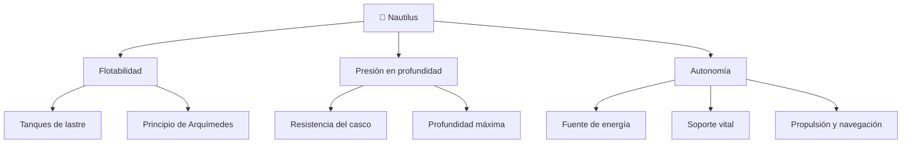

# 🐙 Curso: Nautilus

[🏠 Inicio](../../README.md) · [🌌 Naves de ficción](../README.md) · [🎓 Guía de curso](../../docs/08-guia-de-estilo-y-curso.md)

> ⚖️ Material educativo original; el Nautilus de Julio Verne (1870) es de dominio público; otros derechos pertenecen a sus titulares.

---

> Curso de ficción dedicado al **Nautilus**, el submarino que Julio Verne
> imaginó en 1870. Usamos esta nave visionaria para aprender física real:
> flotabilidad, presión en profundidad, autonomía y soporte vital. Comparamos
> lo que la novela acerto con la ingeniería submarina moderna.

---

## 🎯 Objetivos de aprendizaje

Al terminar este curso deberías poder:

- Explicar el principio de Arquímedes y por qué un casco de acero puede flotar.
- Describir como los tanques de lastre permiten sumergir y emerger la nave.
- Entender por qué la presión crece con la profundidad y como afecta al casco.
- Razonar sobre autonomía: energía, aire respirable y agua a bordo.
- Distinguir que imagino Verne que hoy es real y que sigue siendo ficción.
- Traducir la flotabilidad y la presión en variables de un simulador educativo.

---

## 🗺️ Mapa conceptual

---

## 📚 Módulos del curso

| # | Módulo | Contenido | Enlace |
| :-: | --- | --- | --- |
| 1 | 📜 Historia | La novela de Verne, su contexto y la nave imaginada. | [Abrir](historia/historia-nautilus.md) |
| 2 | 📋 Características | Que es el Nautilus, forma, tamaño y capacidades. | [Abrir](operacion/caracteristicas-nautilus.md) |
| 3 | 🔧 Sistemas mecánicos | Tecnología imaginada por Verne frente a la física real. | [Abrir](operacion/sistemas-mecanicos-nautilus.md) |
| 4 | 🎛️ Mandos e instrumentos | Puesto de mando, controles e instrumentos de a bordo. | [Abrir](mandos/manual-mandos-nautilus.md) |
| 5 | 🧪 Principios y operación | Que si, que no y por qué, según la física. | [Abrir](operacion/principios-nautilus.md) |
| 6 | 🌍 Entornos | Superficie, aguas medias y grandes fondos oceánicos. | [Abrir](operacion/entornos-nautilus.md) |
| 7 | ⚖️ Reglas del universo | Las leyes internas de la novela, no ley real. | [Abrir](reglamentos/reglas-universo-nautilus.md) |
| 8 | 🎮 Diseño de simulación | Variables, ciclo, estados y modo ciencia/ficción. | [Abrir](simulacion/diseno-simulador-nautilus.md) |
| 9 | 🧰 Recursos | Glosario, enlaces y diagramas de apoyo. | [Abrir](recursos/recursos-nautilus.md) |

---

## 🧩 Requisitos previos

Ninguno. El Nautilus es un excelente caso para estudiar física de fluidos
porque combina un concepto simple, la flotabilidad, con un desafío extremo, la
presión de las profundidades. Conviene tener a mano el
[🎓 nivel de realismo](../../docs/03-niveles-de-realismo.md) para graduar el
detalle.

---

[➡️ Empezar por el Módulo 1: Historia](historia/historia-nautilus.md)
