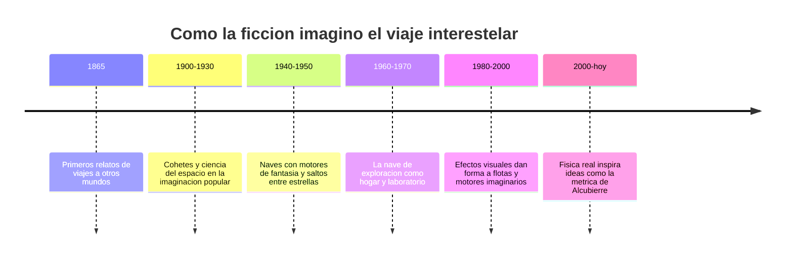

# 📜 Historia de la nave de exploración

[🏠 Inicio](../../../README.md) · [🌌 Curso: Nave de exploración](../README.md) · 📜 Historia

> ⚖️ Material educativo original; los derechos de las obras pertenecen a sus titulares.

Este módulo repasa, con nuestras palabras, como la ciencia ficción imagino el
viaje entre estrellas. No contamos guiones ni tramas concretas: seguimos la
idea general de una nave de exploración que recorre la galaxia, al estilo
"Star Trek", y la usamos para entender que ideas nacieron antes en la ciencia
y cuales son pura invención narrativa.

## Origen de la idea

Mucho antes de que existieran cohetes reales, los escritores ya sonaban con
llegar a la Luna y a otros planetas. Al principio imaginaban canones enormes o
máquinas fantasticas. Con el tiempo, a medida que la astronomía revelaba lo
inmensas que son las distancias, la ficción necesito inventar motores capaces
de acortar viajes que, en la realidad, tomarían miles de años.

## Línea de tiempo

| Periodo | Hito imaginado | Importancia narrativa |
| --- | --- | --- |
| 1865 | Viajes a la Luna en la literatura | Nace la aventura espacial popular. |
| 1900-1930 | Cohetes y mundos lejanos en revistas | Se populariza el espacio como destino. |
| 1940-1950 | Motores de fantasía entre estrellas | Aparece el viaje interestelar rápido. |
| 1960-1970 | Nave de exploración con tripulación estable | El espacio se vuelve hogar y trabajo. |
| 1980-2000 | Efectos visuales de flotas y motores | La imagen del viaje se hace icono. |
| 2000-hoy | Diálogo con la física teórica | La ciencia real inspira nuevas ideas. |

## De la ciencia a la ficción y de vuelta

Lo interesante es el ida y vuelta. La ficción tomo prestada la idea real de que
la luz tiene una velocidad finita y que las estrellas están lejísimos. Para no
aburrir al público con viajes eternos, invento un "impulso" capaz de superar la
luz. Decadas después, algunos físicos jugaron con las ecuaciones de la
relatividad general y propusieron ideas teóricas, como deformar el propio
espacio, que suenan a ficción pero nacen de matematicas serias.

## Que aporto cada época

- **Escala**: entender que un vecino estelar está a años luz, no a un viaje corto.
- **Tripulación**: la nave como comunidad que vive, trabaja e investiga a bordo.
- **Motores imaginarios**: la excusa narrativa para saltar entre sistemas.
- **Exploración pacífica**: el foco en descubrir, mapear y estudiar mundos.
- **Diálogo con la ciencia**: ideas de ficción que empujan preguntas reales.

## Por qué sigue fascinando

La nave de exploración representa un deseo humano muy antiguo: mirar el cielo y
querer ir más allá. Aunque la física pone límites duros, imaginar esos viajes
nos ayuda a entender mejor el universo real y a valorar lo difícil, y lo
hermoso, que sería cruzar el vacío entre estrellas.

## Fuentes

- Registrar aquí las fuentes públicas y divulgativas consultadas.
- Enlazar cada fuente también en [`manuales/fuentes.md`](../../../manuales/fuentes.md).

---

[🎓 Portada del curso](../README.md) · [➡️ Siguiente: Características](../operacion/caracteristicas-nave-exploracion.md)
