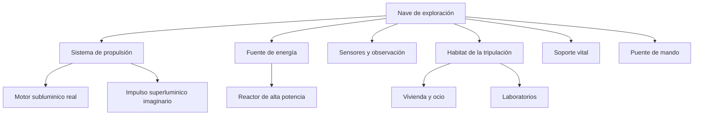

# 📋 Características de la nave de exploración

[🏠 Inicio](../../../README.md) · [🌌 Curso: Nave de exploración](../README.md) · 📋 Características

> ⚖️ Material educativo original; los derechos de las obras pertenecen a sus titulares.

Aquí describimos, con nuestras palabras, que sería una nave de exploración
interestelar imaginaria: para que sirve, que partes tiene y que la diferencia
de una nave de guerra o de carga. Todo es concepto genérico inspirado en el
estilo "Star Trek", sin planos ni especificaciones oficiales.

## Que es y para que sirve

Una nave de exploración es una comunidad móvil pensada para viajar lejos,
estudiar lo que encuentra y sostener a su tripulación durante mucho tiempo.
No busca conquistar: busca observar, medir, mapear y aprender. Por eso combina
laboratorios, sensores, vivienda y motores de largo alcance.

## 🧩 Partes conceptuales

## Perfil general

| Rasgo | Descripción conceptual | Base real o inventada |
| --- | --- | --- |
| Misión | Explorar, estudiar y mapear | Inspirada en sondas reales, ampliada. |
| Autonomía | Muy larga, casi autosuficiente | Inventada a esa escala. |
| Propulsión lenta | Motor de reacción subluminico | Física real. |
| Propulsión rápida | Impulso más veloz que la luz | Inventado, sin base práctica. |
| Tripulación | Comunidad estable a bordo | Inspirada en estaciones espaciales. |
| Sensores | Detectan mundos y fenómenos lejanos | Real en concepto, exagerado en alcance. |

## Tipos imaginarios de misión

| Tipo | Objetivo | Que enseña de física real |
| --- | --- | --- |
| Cartografía estelar | Mapear estrellas y rutas | Distancias en años luz. |
| Estudio planetario | Analizar mundos nuevos | Órbitas, atmósferas, gravedad. |
| Primer contacto | Observar señales o vida | Escalas de tiempo y distancia. |
| Rescate lejano | Ayudar a una nave varada | Límites de velocidad y energía. |
| Investigación pura | Medir fenómenos raros | Relatividad y energía. |

## Que la hace especial

- **Autosuficiencia**: debe producir energía, aire, agua y comida por su cuenta.
- **Escala del viaje**: piensa en distancias que en la realidad tomarían siglos.
- **Doble propulsión**: una parte creíble y lenta, otra imaginaria y rápida.
- **Foco científico**: más laboratorio que arma.
- **Vida a bordo**: es también un hogar, no solo una máquina.

## Puente hacia los sistemas

Con esta visión general, el siguiente módulo abre la nave por dentro y separa
con cuidado la tecnología imaginaria de la física que si conocemos.

---

[⬅️ Anterior: Historia](../historia/historia-nave-exploracion.md) · [➡️ Siguiente: Sistemas mecánicos](sistemas-mecanicos-nave-exploracion.md)
