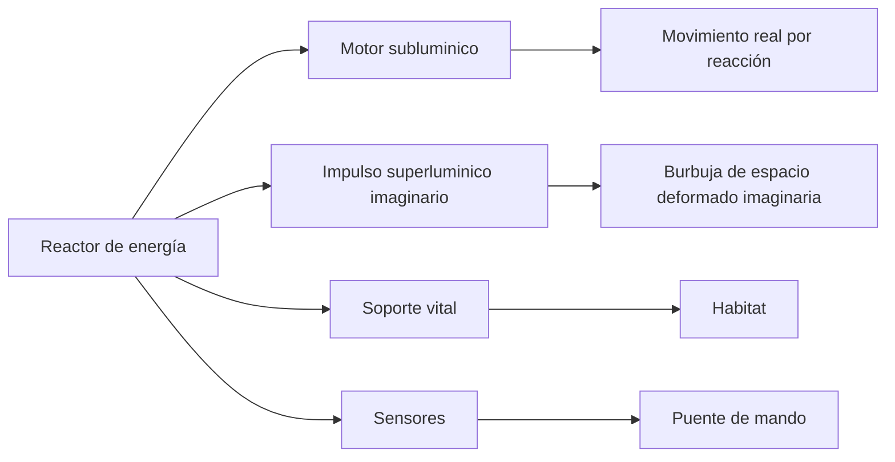

# 🔧 Sistemas mecánicos de la nave de exploración

[🏠 Inicio](../../../README.md) · [🌌 Curso: Nave de exploración](../README.md) · 🔧 Sistemas mecánicos

> ⚖️ Material educativo original; los derechos de las obras pertenecen a sus titulares.

Este módulo abre la nave por dentro. Por cada sistema imaginario explicamos que
física real evoca, que respeta y que rompe. La regla es sencilla: describimos
conceptos genéricos, sin planos ni datos oficiales, y comparamos siempre la
ficción con lo que sabemos de verdad.

---

## 1. ⚡ Fuente de energía

Todo empieza en la energía. Una nave que quiera moverse rápido o mantener a su
tripulación necesita una fuente enorme y estable.

- **En la ficción**: un reactor casi mágico entrega energía sin límite práctico.
- **En la realidad**: incluso las mejores fuentes (fisión, fusión, antimateria)
  tienen límites de masa, calor y eficiencia. Nada es gratis ni infinito.

| Concepto | Ficción | Física real |
| --- | --- | --- |
| Cantidad de energía | Prácticamente ilimitada | Siempre finita y costosa. |
| Antimateria | Combustible común y estable | Existe, pero se produce en cantidades minusculas. |
| Calor sobrante | Se ignora | Enorme; disiparlo en el vacío es difícil. |
| Encendido rápido | Instantáneo | Requiere sistemas complejos y tiempo. |

## 2. 🚀 Motor subluminico

Es la parte creíble. Para moverse por debajo de la velocidad de la luz, una
nave real expulsa masa o partículas hacia atrás y avanza por reacción, igual
que un cohete.

- **Que respeta**: la ley de acción y reacción; nada aquí rompe la física.
- **El problema**: acelerar una nave grande a una fracción de la luz exige
  cantidades de energía y combustible descomunales, y llevaría muchisimo tiempo.
- **Enseñanza**: lo lento y pesado es justo lo realista.

## 3. 🌌 Impulso superluminico imaginario

Aquí la ficción inventa. Para cruzar la galaxia en episodios cortos, la nave usa
un "impulso" más rápido que la luz. La versión más seria de esta idea en la
física teórica es la métrica de Alcubierre.

- **La idea teórica**: en vez de mover la nave por el espacio más rápido que la
  luz (imposible), se deforma el propio espacio, contrayendolo delante y
  expandiendolo detrás, y la nave viaja dentro de una "burbuja".
- **El obstáculo enorme**: esa deformación exigiría una forma de energía
  negativa o exótica que no sabemos como obtener ni concentrar. En la práctica,
  hoy es solo un ejercicio matemático, no una tecnología.

| Aspecto | Versión de ficción | Idea teórica sería (Alcubierre) |
| --- | --- | --- |
| Que se mueve | La nave, más rápido que la luz | El espacio alrededor de la nave. |
| Energía necesaria | Trivial, siempre disponible | Energía negativa o exótica desconocida. |
| Viable hoy | Se presenta como rutina | No; solo existe en las ecuaciones. |
| Rompe la luz local | Si, sin consecuencias | Evita el límite local, pero abre otros problemas. |

## 4. 🛰️ Sensores y observación

- **En la ficción**: detectan cualquier cosa al instante y a distancias enormes.
- **En la realidad**: la información tampoco viaja más rápido que la luz. Ver
  algo lejano es ver su pasado; una estrella a cien años luz se observa como
  era hace un siglo.

## 5. 🌬️ Soporte vital

Mantener viva a la tripulación es tan importante como moverse. El sistema debe
reciclar aire y agua, controlar temperatura y proteger de la radiación.

- **Real y difícil**: el reciclaje casi total es un reto enorme de ingeniería.
- **Ficción cómoda**: suele mostrarse como algo que "simplemente funciona".

## 🔁 Cómo se conecta todo

1. El **reactor** entrega energía a toda la nave.
2. El **motor subluminico** la mueve de forma realista pero lenta.
3. El **impulso imaginario** justifica los viajes rápidos de la trama.
4. Los **sensores** informan al puente sobre el entorno.
5. El **soporte vital** mantiene el habitat en condiciones.

El [Módulo 4: Mandos](../mandos/manual-mandos-nave-exploracion.md) muestra como
la tripulación opera todos estos sistemas desde el puente.

---

[⬅️ Anterior: Características](caracteristicas-nave-exploracion.md) · [➡️ Siguiente: Mandos e instrumentos](../mandos/manual-mandos-nave-exploracion.md)
