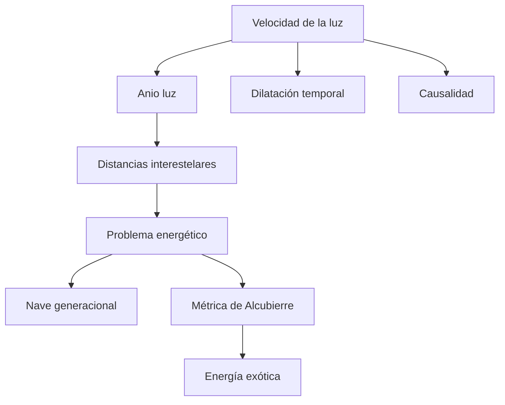

# 🧰 Recursos de la nave de exploración

[🏠 Inicio](../../../README.md) · [🌌 Curso: Nave de exploración](../README.md) · 🧰 Recursos

> ⚖️ Material educativo original; los derechos de las obras pertenecen a sus titulares.

Cierre del curso: un glosario de los conceptos clave, un mapa de cómo se
relacionan y enlaces útiles para seguir aprendiendo. Todo con nuestras palabras
y con foco en la física real detrás de la ficción.

## 🗺️ Mapa de conceptos

## 📖 Glosario

| Término | Definición breve |
| --- | --- |
| Velocidad de la luz | Límite máximo para mover materia e información; unos 300000 km/s. |
| Anio luz | Distancia que la luz recorre en un anio; sirve para medir el espacio. |
| Distancia interestelar | Separación enorme entre estrellas, medida en años luz. |
| Dilatación temporal | Efecto real por el que el tiempo pasa más lento a gran velocidad. |
| Problema energético | Energía gigantesca que exige acelerar y frenar una nave grande. |
| Nave generacional | Nave lenta donde varias generaciones viven durante el viaje. |
| Impulso superluminico | Idea de ficción para viajar más rápido que la luz. |
| Métrica de Alcubierre | Idea teórica de deformar el espacio; exigiría energía exótica. |
| Energía exótica | Energía negativa o rara que hoy no sabemos obtener. |
| Causalidad | Orden de causa y efecto que superar la luz pondria en riesgo. |

## 🔗 Enlaces del repositorio

- [Glosario general](../../../docs/05-glosario-general.md)
- [Portada del curso: Nave de exploración](../README.md)
- [Catálogo de naves de ficción](../../README.md)

## 🧭 Cómo seguir

- Repasar el [Módulo 5: Principios](../operacion/principios-nave-exploracion.md)
  para afianzar la física.
- Probar mentalmente el modo ciencia del
  [Módulo 8: Simulación](../simulacion/diseno-simulador-nave-exploracion.md).
- Comparar esta nave con las demás del catálogo para ver que física evoca cada una.

---

[🎓 Portada del curso](../README.md) · [⬅️ Anterior: Diseño de simulación](../simulacion/diseno-simulador-nave-exploracion.md)
