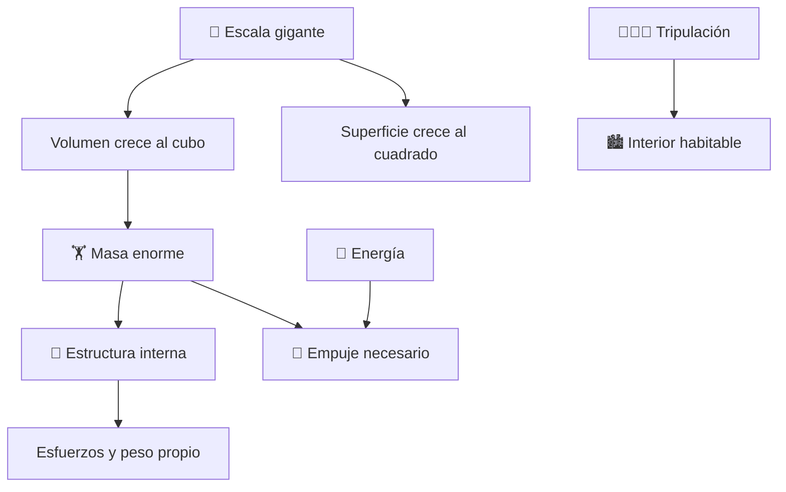

# 🏯 Curso: SDF-1

[🏠 Inicio](../../README.md) · [🌌 Naves de ficción](../README.md) · [🎓 Guía de curso](../../docs/08-guia-de-estilo-y-curso.md)

> ⚖️ Material educativo original; los derechos de las obras pertenecen a sus titulares.

---

> Curso de análisis educativo de ciencia ficción inspirado en el estilo
> "Robotech". Estudiamos una nave-fortaleza gigante genérica para entender la
> física real de la escala: la ley del cubo-cuadrado, la estructura, la masa y
> por qué las naves enormes son un problema serio de ingeniería.

---

## 🎯 Objetivos de aprendizaje

Al terminar este curso deberías poder:

- Explicar la ley del cubo-cuadrado y por qué la escala cambia todo.
- Entender por qué la masa crece mucho más rápido que la superficie al agrandar.
- Describir los retos estructurales de una nave del tamaño de una ciudad.
- Razonar sobre la energía y el empuje necesarios para mover tanta masa.
- Distinguir que evoca la ficción que sería real y que rompe la ingeniería.
- Traducir todo lo anterior a variables de un simulador educativo.

---

## 🗺️ Mapa del vehículo

---

## 📚 Módulos del curso

| # | Módulo | Contenido | Enlace |
| :-: | --- | --- | --- |
| 1 | 📜 Historia | Contexto de la nave-fortaleza de ficción y su idea. | [Abrir](historia/historia-sdf-1.md) |
| 2 | 📋 Características | Que es una nave-fortaleza gigante y para que sirve. | [Abrir](operacion/caracteristicas-sdf-1.md) |
| 3 | 🔧 Sistemas mecánicos | Tecnología imaginaria frente a la física real. | [Abrir](operacion/sistemas-mecanicos-sdf-1.md) |
| 4 | 🎛️ Mandos e instrumentos | Puente de mando conceptual y controles. | [Abrir](mandos/manual-mandos-sdf-1.md) |
| 5 | 🧪 Principios y operación | La ley del cubo-cuadrado: que si, que no y por qué. | [Abrir](operacion/principios-sdf-1.md) |
| 6 | 🌍 Entornos | El vacío, órbitas, atmósferas y astilleros. | [Abrir](operacion/entornos-sdf-1.md) |
| 7 | ⚖️ Reglas del universo | Las leyes internas de la ficción frente a la física. | [Abrir](reglamentos/reglas-universo-sdf-1.md) |
| 8 | 🎮 Diseño de simulación | Variables, ciclo y modo ciencia o ficción. | [Abrir](simulacion/diseno-simulador-sdf-1.md) |
| 9 | 🧰 Recursos | Glosario, enlaces y diagramas. | [Abrir](recursos/recursos-sdf-1.md) |

---

## 🧩 Requisitos previos

Ninguno formal. Ayuda tener nociones básicas de geometría y de las leyes de
Newton, pero el curso las explica desde cero. La idea central es simple y
potente: cuando agrandas un objeto, su volumen y su masa crecen mucho más
rápido que su superficie, y eso convierte a las naves gigantes en un desafío de
ingeniería enorme.

---

[➡️ Empezar por el Módulo 1: Historia](historia/historia-sdf-1.md)
