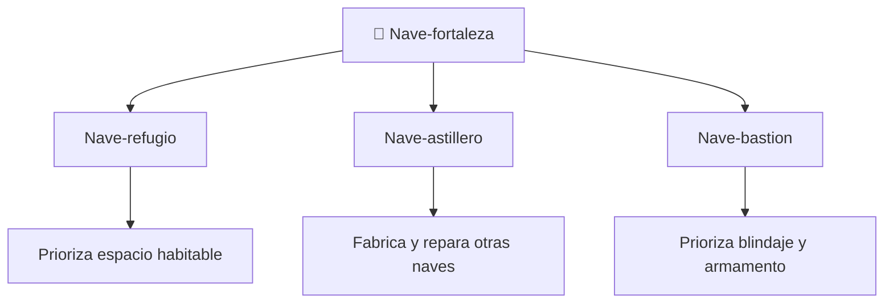

# 📋 Caracteristicas del SDF-1

[🏠 Inicio](../../../README.md) · [🏯 Curso: SDF-1](../README.md) · 📋 Caracteristicas

> ⚖️ Material educativo original; los derechos de las obras pertenecen a sus titulares.

Que es una nave-fortaleza gigante generica, que rasgos la definen en la ficcion
y cuales tendrian sentido fisico real. Este modulo da el contexto antes de abrir
la tecnologia por dentro en el Modulo 3.

---

## 🧭 Definicion

Una nave-fortaleza, en la ficcion estilo "Robotech", es una nave colosal que
funciona como ciudad, base y arma a la vez. La imaginamos del tamano de un barrio
entero, con hangares, calles interiores y miles de tripulantes. En este curso la
usamos como excusa para estudiar que le pasa a la fisica de un vehiculo cuando lo
agrandamos hasta ese extremo.

---

## 🧬 Caracteristicas clave

| Caracteristica | Como la muestra la ficcion | Lectura fisica real |
| --- | --- | --- |
| Tamano colosal | Del tamano de una ciudad | Al crecer, la masa sube al cubo: enorme desafio. |
| Interior habitable | Calles, hangares y viviendas | Plausible como concepto, exige mucha estructura. |
| Estructura aparente | Casco que se mueve como un bloque | Su propio peso genera esfuerzos gigantescos. |
| Movilidad | Maniobra pese a su tamano | Mover tanta masa exige empuje y energia enormes. |
| Autonomia total | Se abastece a si misma | Coherente con la idea de ciudad, muy exigente. |
| Transformacion | Cambia de forma en algunas obras | Fascinante, pero muy dificil a esa escala. |

---

## 🗂️ Tipos conceptuales de nave gigante

| Tipo | Idea de diseno | Compromiso fisico |
| --- | --- | --- |
| Nave-refugio | Mucho espacio interior | Gran volumen y masa; dificil de mover. |
| Nave-astillero | Hangares y talleres | Estructura compleja y muy pesada. |
| Nave-bastion | Blindaje y armamento | Aun mas masa; empuje casi inviable. |

---

## 🎯 Para que sirve en el relato

- Ofrecer un escenario enorme donde viven y luchan los personajes.
- Representar un simbolo de proteccion y de poder.
- Permitir historias dentro de la nave, como una ciudad en movimiento.

En cambio, para este curso sirve como laboratorio: cada rasgo colosal nos deja
preguntar si seria posible y por que.

---

[⬅️ Anterior: Historia](../historia/historia-sdf-1.md) · [➡️ Siguiente: Sistemas mecanicos](sistemas-mecanicos-sdf-1.md)
