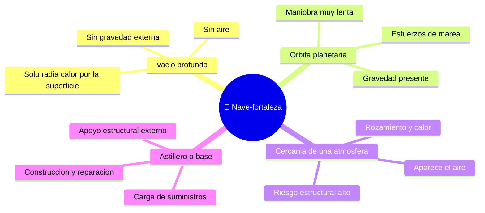

# 🌍 Entornos del SDF-1

[🏠 Inicio](../../../README.md) · [🏯 Curso: SDF-1](../README.md) · 🌍 Entornos

> ⚖️ Material educativo original; los derechos de las obras pertenecen a sus titulares.

Donde opera una nave-fortaleza gigante y como cambia su comportamiento segun el
entorno. Cada escenario implica reglas fisicas distintas, y en simulacion se
traduce en condiciones diferentes de gravedad, estructura y disipacion de calor.

---

## 🗺️ Entornos principales

| Entorno | Caracteristicas | Riesgos tipicos | Ajuste de maniobra |
| --- | --- | --- | --- |
| Vacio profundo | Sin aire ni gravedad externa. | Acumular calor, gastar delta-v. | Maniobras muy lentas y planificadas. |
| Orbita planetaria | Gravedad y posibles esfuerzos de marea. | Deformacion, caida o escape. | Respetar mecanica orbital, cuidar la estructura. |
| Cercania de una atmosfera | Aparece aire, rozamiento y calor. | Esfuerzo estructural grave. | Evitar entrar; la escala no lo favorece. |
| Astillero o base | Apoyo externo para construir o reparar. | Sobrecarga durante el atraque. | Operaciones lentas con soporte externo. |

---

## 🌡️ Factores del entorno

- **Gravedad**: cerca de un planeta la trayectoria se curva y aparecen esfuerzos
  que una mole tan grande sufre de forma desigual en sus extremos.
- **Atmosfera**: una nave de este tamano no esta pensada para volar en el aire;
  el rozamiento y el calor la castigarian, y su peso propio seria un problema
  serio bajo gravedad.
- **Calor**: en el vacio el calor solo sale por radiacion; una nave-ciudad
  genera tanto que su superficie apenas basta para disiparlo.
- **Estructura**: cualquier entorno que anada esfuerzos (gravedad, maniobra,
  atraque) pone a prueba el esqueleto interno de la nave.

---

## 🎮 Traduccion a simulacion

Cada entorno es un escenario con su gravedad, presencia o ausencia de aire y
nivel de esfuerzos sobre la estructura. Pasar del vacio tranquilo a la cercania
de un planeta multiplica los retos y es una gran leccion sobre escala e
ingenieria. Ver como se modela en el
[Modulo 8: Diseno de simulacion](../simulacion/diseno-simulador-sdf-1.md).

---

[⬅️ Anterior: Principios y operacion](principios-sdf-1.md) · [➡️ Siguiente: Reglas del universo](../reglamentos/reglas-universo-sdf-1.md)
