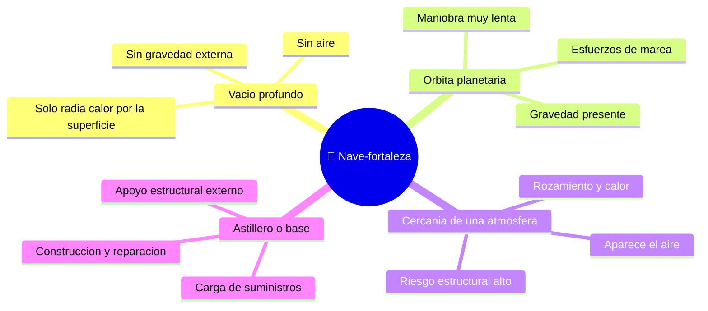

# 🌍 Entornos del SDF-1

[🏠 Inicio](../../../README.md) · [🏯 Curso: SDF-1](../README.md) · 🌍 Entornos

> ⚖️ Material educativo original; los derechos de las obras pertenecen a sus titulares.

Dónde opera una nave-fortaleza gigante y cómo cambia su comportamiento según el
entorno. Cada escenario implica reglas físicas distintas, y en simulación se
traduce en condiciones diferentes de gravedad, estructura y disipación de calor.

---

## 🗺️ Entornos principales

| Entorno | Características | Riesgos típicos | Ajuste de maniobra |
| --- | --- | --- | --- |
| Vacío profundo | Sin aire ni gravedad externa. | Acumular calor, gastar delta-v. | Maniobras muy lentas y planificadas. |
| Órbita planetaria | Gravedad y posibles esfuerzos de marea. | Deformación, caída o escape. | Respetar mecánica orbital, cuidar la estructura. |
| Cercanía de una atmósfera | Aparece aire, rozamiento y calor. | Esfuerzo estructural grave. | Evitar entrar; la escala no lo favorece. |
| Astillero o base | Apoyo externo para construir o reparar. | Sobrecarga durante el atraque. | Operaciones lentas con soporte externo. |

---

## 🌡️ Factores del entorno

- **Gravedad**: cerca de un planeta la trayectoria se curva y aparecen esfuerzos
  que una mole tan grande sufre de forma desigual en sus extremos.
- **Atmósfera**: una nave de este tamaño no está pensada para volar en el aire;
  el rozamiento y el calor la castigarían, y su peso propio sería un problema
  serio bajo gravedad.
- **Calor**: en el vacío el calor solo sale por radiación; una nave-ciudad
  genera tanto que su superficie apenas basta para disiparlo.
- **Estructura**: cualquier entorno que añada esfuerzos (gravedad, maniobra,
  atraque) pone a prueba el esqueleto interno de la nave.

---

## 🎮 Traducción a simulación

Cada entorno es un escenario con su gravedad, presencia o ausencia de aire y
nivel de esfuerzos sobre la estructura. Pasar del vacío tranquilo a la cercanía
de un planeta multiplica los retos y es una gran lección sobre escala e
ingeniería. Ver cómo se modela en el
[Módulo 8: Diseño de simulación](../simulacion/diseno-simulador-sdf-1.md).

---

[⬅️ Anterior: Principios y operación](principios-sdf-1.md) · [➡️ Siguiente: Reglas del universo](../reglamentos/reglas-universo-sdf-1.md)
