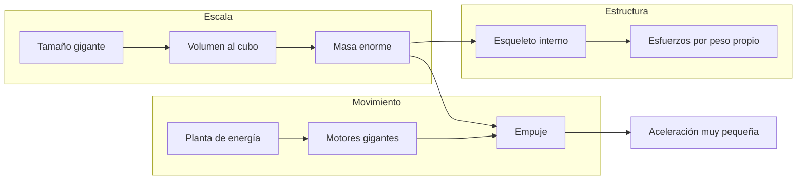
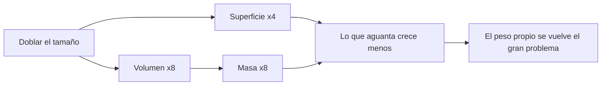
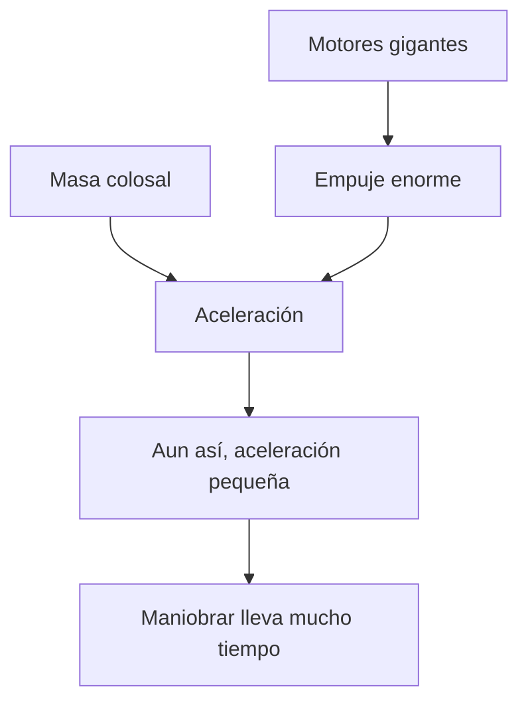

# 🔧 Sistemas mecánicos del SDF-1

[🏠 Inicio](../../../README.md) · [🏯 Curso: SDF-1](../README.md) · 🔧 Sistemas mecánicos

> ⚖️ Material educativo original; los derechos de las obras pertenecen a sus titulares.

Este módulo abre la nave-fortaleza por dentro. Compara la tecnología imaginaria
de la ficción con la física real que la haría funcionar (o que la desmiente). La
regla del curso es clara: describimos conceptos con nuestras palabras, sin
copiar planos ni especificaciones oficiales.

---

## 1. 📏 Escala: la ley del cubo-cuadrado

Aquí está la clave del curso. Cuando agrandas una nave manteniendo su forma, su
superficie crece con el cuadrado del tamaño, pero su volumen (y por tanto su
masa) crece con el cubo. Si duplicas cada dimensión, la superficie se multiplica
por cuatro, pero la masa por ocho. Por eso una nave gigante pesa muchisimo más de
lo que "parece" a simple vista, y toda su estructura tiene que soportar ese peso.

| Concepto de ficción | Física real que evoca | Veredicto |
| --- | --- | --- |
| "Es como una nave normal pero enorme" | Escalado geométrico | No: la masa crece al cubo, cambia todo. |
| Estructura que no se dobla | Resistencia de materiales | Muy exigente: el peso propio la castiga. |
| Se mueve como un bloque sólido | Rigidez estructural | A esa escala flexionaria y crujiría. |

---

## 2. 🧱 Estructura y esfuerzos

La superficie de las columnas y vigas es la que aguanta el peso, pero esa
superficie crece con el cuadrado mientras la masa crece con el cubo. Resultado:
cuanto más grande es la nave, más sobrecargada está su estructura por su propio
peso. En un planeta esto sería casi imposible; en el vacío no hay gravedad
externa que la aplaste, pero cualquier maniobra o empuje genera esfuerzos que la
estructura debe repartir sin romperse.

| Idea de la ficción | Que dice la física real |
| --- | --- |
| El casco se mueve rígido y perfecto | A gran escala la estructura flexiona y vibra. |
| Basta con hacer las paredes más gruesas | Más grosor añade más masa; el problema se agrava. |
| Aguanta cualquier maniobra brusca | Las aceleraciones bruscas generarían esfuerzos enormes. |
| El peso propio no importa en el espacio | Sin gravedad no aplasta, pero el empuje si genera cargas. |

---

## 3. 🚀 Propulsión a escala gigante

Mover una masa colosal exige un empuje colosal. Como la aceleración es el empuje
dividido por la masa, una nave gigantesca acelera muy despacio aunque tenga
motores enormes. En la ficción la fortaleza maniobra casi como una nave pequeña;
en la realidad, cambiar su velocidad o su rumbo llevaría mucho tiempo y un gasto
descomunal de propelente.

- **Empuje frente a masa**: por muy potentes que sean los motores, la masa manda.
- **Maniobra lenta**: girar o frenar una mole exige tiempo y planificación.
- **Propelente**: mover tanta masa consume cantidades enormes de propelente.

---

## 4. 🔋 Energía y habitabilidad

Una nave-ciudad necesita energía no solo para moverse, sino para mantener con
vida a miles de personas: aire, agua, temperatura, luz y reciclaje. En la ficción
todo funciona sin explicación. En la realidad, ese soporte vital a gran escala
es un sistema tan complejo como la propia propulsión, y cada parte añade más masa
que a su vez exige más estructura y más empuje.

| Sistema | En la ficción | En la realidad |
| --- | --- | --- |
| Energía | Fuente casi infinita | Planta enorme y con límites de calor. |
| Soporte vital | Funciona sin más | Aire, agua y temperatura para miles de personas. |
| Reciclaje | Invisible | Imprescindible para la autonomía real. |

---

## 5. 🌡️ Calor a gran escala

Cuanto más grande y poblada es la nave, más calor genera por dentro. Y en el
vacío el calor solo se puede expulsar por radiación, a través de la superficie.
Pero la superficie crece con el cuadrado y el volumen con el cubo: una nave
gigante genera mucho más calor del que su superficie puede disipar con facilidad.
Refrigerar un gigante es, otra vez, un problema de escala.

| Elemento | Función en la ficción | Función útil real |
| --- | --- | --- |
| Paneles del casco | Estética y blindaje | Radiadores para expulsar calor. |
| Interior gigante | Espacio habitable | Fuente de mucho calor que hay que evacuar. |
| Superficie externa | Aspecto imponente | Única vía de disipación en el vacío. |

---

## 🔁 Cómo se conecta todo

1. La **escala** dispara la masa según la ley del cubo-cuadrado.
2. La **estructura** debe soportar el peso propio y los esfuerzos de maniobra.
3. La **propulsión** lucha contra una masa colosal: acelera despacio.
4. La **energía y el soporte vital** mantienen viva a la nave-ciudad.
5. El **calor** interno cuesta cada vez más de disipar al crecer la nave.

Con esto claro, el [Módulo 4: Mandos](../mandos/manual-mandos-sdf-1.md)
muestra cómo se operaría una nave de este tamaño.

---

[⬅️ Anterior: Características](caracteristicas-sdf-1.md) · [➡️ Siguiente: Mandos e instrumentos](../mandos/manual-mandos-sdf-1.md)
