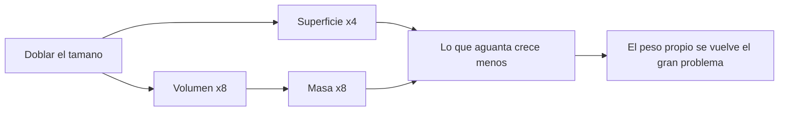

# 🔧 Sistemas mecanicos del SDF-1

[🏠 Inicio](../../../README.md) · [🏯 Curso: SDF-1](../README.md) · 🔧 Sistemas mecanicos

> ⚖️ Material educativo original; los derechos de las obras pertenecen a sus titulares.

Este modulo abre la nave-fortaleza por dentro. Compara la tecnologia imaginaria
de la ficcion con la fisica real que la haria funcionar (o que la desmiente). La
regla del curso es clara: describimos conceptos con nuestras palabras, sin
copiar planos ni especificaciones oficiales.

---

## 1. 📏 Escala: la ley del cubo-cuadrado

Aqui esta la clave del curso. Cuando agrandas una nave manteniendo su forma, su
superficie crece con el cuadrado del tamano, pero su volumen (y por tanto su
masa) crece con el cubo. Si duplicas cada dimension, la superficie se multiplica
por cuatro, pero la masa por ocho. Por eso una nave gigante pesa muchisimo mas de
lo que "parece" a simple vista, y toda su estructura tiene que soportar ese peso.

| Concepto de ficcion | Fisica real que evoca | Veredicto |
| --- | --- | --- |
| "Es como una nave normal pero enorme" | Escalado geometrico | No: la masa crece al cubo, cambia todo. |
| Estructura que no se dobla | Resistencia de materiales | Muy exigente: el peso propio la castiga. |
| Se mueve como un bloque solido | Rigidez estructural | A esa escala flexionaria y crujiria. |

---

## 2. 🧱 Estructura y esfuerzos

La superficie de las columnas y vigas es la que aguanta el peso, pero esa
superficie crece con el cuadrado mientras la masa crece con el cubo. Resultado:
cuanto mas grande es la nave, mas sobrecargada esta su estructura por su propio
peso. En un planeta esto seria casi imposible; en el vacio no hay gravedad
externa que la aplaste, pero cualquier maniobra o empuje genera esfuerzos que la
estructura debe repartir sin romperse.

| Idea de la ficcion | Que dice la fisica real |
| --- | --- |
| El casco se mueve rigido y perfecto | A gran escala la estructura flexiona y vibra. |
| Basta con hacer las paredes mas gruesas | Mas grosor anade mas masa; el problema se agrava. |
| Aguanta cualquier maniobra brusca | Las aceleraciones bruscas generarian esfuerzos enormes. |
| El peso propio no importa en el espacio | Sin gravedad no aplasta, pero el empuje si genera cargas. |

---

## 3. 🚀 Propulsion a escala gigante

Mover una masa colosal exige un empuje colosal. Como la aceleracion es el empuje
dividido por la masa, una nave gigantesca acelera muy despacio aunque tenga
motores enormes. En la ficcion la fortaleza maniobra casi como una nave pequena;
en la realidad, cambiar su velocidad o su rumbo llevaria mucho tiempo y un gasto
descomunal de propelente.

- **Empuje frente a masa**: por muy potentes que sean los motores, la masa manda.
- **Maniobra lenta**: girar o frenar una mole exige tiempo y planificacion.
- **Propelente**: mover tanta masa consume cantidades enormes de propelente.

---

## 4. 🔋 Energia y habitabilidad

Una nave-ciudad necesita energia no solo para moverse, sino para mantener con
vida a miles de personas: aire, agua, temperatura, luz y reciclaje. En la ficcion
todo funciona sin explicacion. En la realidad, ese soporte vital a gran escala
es un sistema tan complejo como la propia propulsion, y cada parte anade mas masa
que a su vez exige mas estructura y mas empuje.

| Sistema | En la ficcion | En la realidad |
| --- | --- | --- |
| Energia | Fuente casi infinita | Planta enorme y con limites de calor. |
| Soporte vital | Funciona sin mas | Aire, agua y temperatura para miles de personas. |
| Reciclaje | Invisible | Imprescindible para la autonomia real. |

---

## 5. 🌡️ Calor a gran escala

Cuanto mas grande y poblada es la nave, mas calor genera por dentro. Y en el
vacio el calor solo se puede expulsar por radiacion, a traves de la superficie.
Pero la superficie crece con el cuadrado y el volumen con el cubo: una nave
gigante genera mucho mas calor del que su superficie puede disipar con facilidad.
Refrigerar un gigante es, otra vez, un problema de escala.

| Elemento | Funcion en la ficcion | Funcion util real |
| --- | --- | --- |
| Paneles del casco | Estetica y blindaje | Radiadores para expulsar calor. |
| Interior gigante | Espacio habitable | Fuente de mucho calor que hay que evacuar. |
| Superficie externa | Aspecto imponente | Unica via de disipacion en el vacio. |

---

## 🔁 Como se conecta todo

1. La **escala** dispara la masa segun la ley del cubo-cuadrado.
2. La **estructura** debe soportar el peso propio y los esfuerzos de maniobra.
3. La **propulsion** lucha contra una masa colosal: acelera despacio.
4. La **energia y el soporte vital** mantienen viva a la nave-ciudad.
5. El **calor** interno cuesta cada vez mas de disipar al crecer la nave.

Con esto claro, el [Modulo 4: Mandos](../mandos/manual-mandos-sdf-1.md)
muestra como se operaria una nave de este tamano.

---

[⬅️ Anterior: Caracteristicas](caracteristicas-sdf-1.md) · [➡️ Siguiente: Mandos e instrumentos](../mandos/manual-mandos-sdf-1.md)
