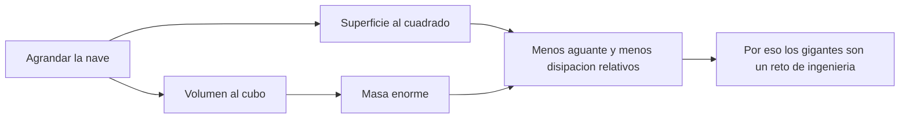

# 🧰 Recursos del SDF-1

[🏠 Inicio](../../../README.md) · [🏯 Curso: SDF-1](../README.md) · 🧰 Recursos

> ⚖️ Material educativo original; los derechos de las obras pertenecen a sus titulares.

Glosario especifico, enlaces y diagramas de apoyo del curso de la nave-fortaleza.
Amplia el [glosario general](../../../docs/05-glosario-general.md).

---

## 📖 Glosario especifico

| Termino | Definicion |
| --- | --- |
| Ley del cubo-cuadrado | Al agrandar, la superficie crece al cuadrado y el volumen al cubo. |
| Escala | Tamano relativo de la nave; decide como se comporta su fisica. |
| Volumen | Espacio que ocupa la nave; crece con el cubo del tamano. |
| Superficie | Area externa; crece con el cuadrado y limita la disipacion de calor. |
| Masa total | Cantidad de materia de la nave; crece con el volumen. |
| Peso propio | Carga que la estructura debe soportar por su propia masa. |
| Tension estructural | Esfuerzo interno del casco durante una maniobra. |
| Relacion empuje/masa | Cociente que decide lo lento o agil que responde la nave. |
| Radiacion de calor | Unica via de expulsar calor en el vacio, por la superficie. |
| Soporte vital | Sistemas que mantienen aire, agua y temperatura habitables. |

---

## 🗺️ Diagrama: la ley del cubo-cuadrado

---

## 🔗 Enlaces y fuentes

- Portada del curso: [🏯 Curso: SDF-1](../README.md)
- Catalogo de naves de ficcion: [🌌 Naves de ficcion](../../README.md)
- Glosario general: [📖 docs/05-glosario-general.md](../../../docs/05-glosario-general.md)
- Niveles de realismo: [🎚️ docs/03-niveles-de-realismo.md](../../../docs/03-niveles-de-realismo.md)
- Registro de fuentes: [📚 manuales/fuentes.md](../../../manuales/fuentes.md)

Registrar cada recurso nuevo con su origen y licencia, respetando el aviso de
derechos del catalogo de naves de ficcion.

---

[🎓 Portada del curso](../README.md) · [⬅️ Anterior: Diseno de simulacion](../simulacion/diseno-simulador-sdf-1.md)
