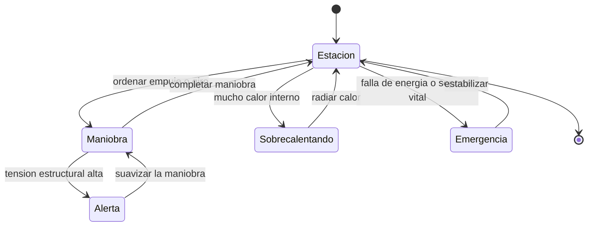

# 🎮 Diseno de simulacion del SDF-1

[🏠 Inicio](../../../README.md) · [🏯 Curso: SDF-1](../README.md) · 🎮 Simulacion

> ⚖️ Material educativo original; los derechos de las obras pertenecen a sus titulares.

Como modelar de forma educativa y divertida una nave-fortaleza gigante. La idea
central es poder alternar entre la version espectacular de la ficcion y la
version fiel a la fisica, para que el usuario compare ambas con la misma nave, y
sobre todo para que sienta como la escala vuelve lento y delicado cada
movimiento.

## Objetivo de la simulacion

Que el usuario comprenda, jugando, que agrandar una nave no es gratis: la ley del
cubo-cuadrado dispara la masa, la maniobra se vuelve lentisima, la estructura
sufre y el calor cuesta expulsarse. El modo ficcion sirve para engancharse; el
modo ciencia, para aprender.

## Modo ciencia o ficcion

La variable mas importante del simulador es el **modo**:

- **Modo ficcion**: la nave gigante maniobra con soltura, la estructura aguanta
  todo y el calor no molesta. Es divertido y espectacular.
- **Modo ciencia**: se aplican la ley del cubo-cuadrado, la relacion empuje/masa,
  la tension estructural y el limite de disipacion de calor. Todo se vuelve
  lento y delicado.

Al cambiar de modo, la interfaz avisa que reglas se activan o desactivan, para
que la comparacion sea explicita y educativa.

## Variables principales

| Variable | Tipo | Rango | Afecta a | Comentarios |
| --- | --- | --- | --- | --- |
| Modo | discreta | ciencia / ficcion | Todas las reglas | Interruptor central del aprendizaje. |
| Tamano de la nave | numerica | grande a colosal | Masa y estructura | Aplica la ley del cubo-cuadrado. |
| Masa total | numerica | enorme | Aceleracion y delta-v | Crece con el cubo del tamano. |
| Empuje de motores | numerica | 0-100% | Cambio de velocidad | Aun al maximo, acelera despacio. |
| Tension estructural | numerica | 0-100% | Integridad del casco | Limita la brusquedad de la maniobra. |
| Calor acumulado | numerica | 0-100% | Riesgo termico | Se disipa lento por la superficie. |
| Estado de soporte vital | numerica | 0-100% | Habitabilidad | Aire, agua y temperatura interior. |
| Gravedad del entorno | numerica | 0-alta | Trayectoria y esfuerzos | Anade cargas a la estructura. |

## Ciclo basico

1. Leer entrada del usuario (empuje, giro, reparto de energia).
2. Comprobar el modo activo (ciencia o ficcion).
3. Calcular la masa total segun el tamano (ley del cubo-cuadrado).
4. Calcular la aceleracion como empuje dividido por masa.
5. En modo ciencia, actualizar la tension estructural con cada maniobra.
6. Actualizar el calor: generado por dentro, radiado por la superficie.
7. Aplicar el entorno: gravedad y esfuerzos.
8. Refrescar instrumentos (velocidad, tension, calor, soporte vital).

## Modos de juego futuros

- Tutorial de escala: comparar la maniobra de una nave pequena y una colosal.
- Reto estructural: girar sin superar la tension del casco.
- Comparador lado a lado: misma maniobra en modo ciencia y en modo ficcion.
- Gestion termica: mantener el calor bajo control con la superficie disponible.
- Operacion de atraque en un astillero con apoyo estructural externo.

## Elementos fuera de alcance

- Presentar la maniobra agil de la nave gigante como si fuera fisica real.
- Detalles de armamento presentados como datos tecnicos reales.
- Cualquier contenido que confunda espectaculo con ciencia sin distinguirlos.

## Pendientes

- [ ] Definir la relacion entre tamano, masa y tension estructural.
- [ ] Prototipar el ciclo basico con la ley del cubo-cuadrado.
- [ ] Ajustar el modelo de calor por superficie disponible.
- [ ] Agregar fuentes de divulgacion a [`manuales/fuentes.md`](../../../manuales/fuentes.md).

---

[⬅️ Anterior: Reglas del universo](../reglamentos/reglas-universo-sdf-1.md) · [➡️ Siguiente: Recursos](../recursos/recursos-sdf-1.md)
