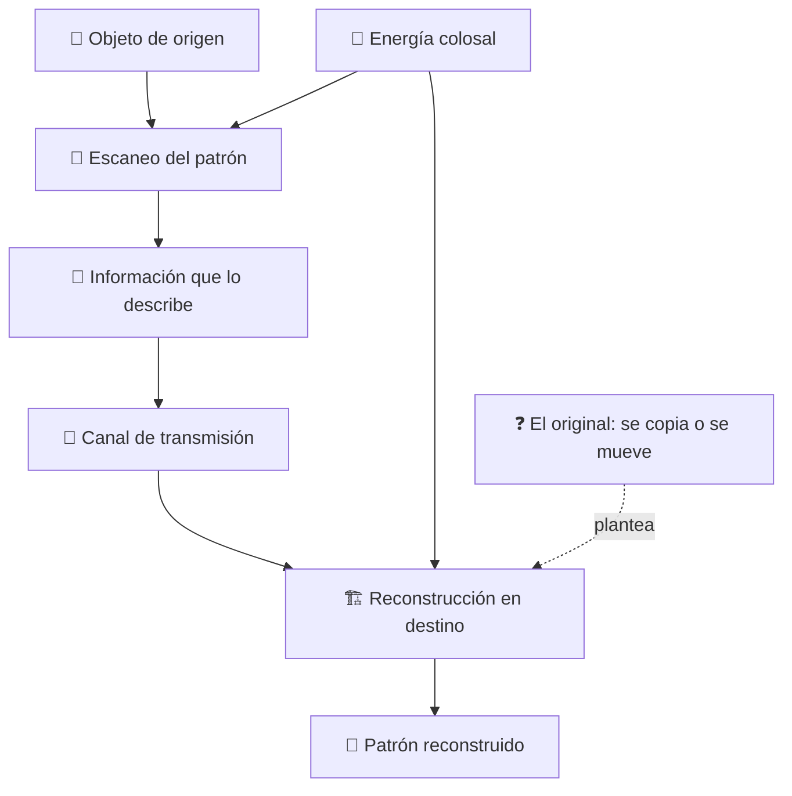

# 🌀 Curso: Teletransportador

[🏠 Inicio](../../README.md) · [🌌 Naves de ficción](../README.md) · [🎓 Guía de curso](../../docs/08-guia-de-estilo-y-curso.md)

> ⚖️ Material educativo original; los derechos de las obras pertenecen a sus titulares.

---

> Curso de análisis educativo de ciencia ficción sobre el teletransportador,
> ese aparato genérico que "desmaterializa" a alguien en un sitio y lo hace
> "aparecer" en otro. Lo usamos como excusa para estudiar la física real de la
> información, la energía y el estado cuántico: que sería posible, que no y por
> que la teletransportación de las historias no es transporte de materia.

---

## 🎯 Objetivos de aprendizaje

Al terminar este curso deberías poder:

- Distinguir entre mover materia y mover la información que describe un objeto.
- Estimar por qué reconstruir un cuerpo exigiría energía y datos astronómicos.
- Explicar el problema del duplicado: copiar un patrón deja dos, no uno.
- Entender que la teleportación cuántica real transfiere estados, no objetos.
- Razonar el teorema de no clonación y el límite de la velocidad de la luz.
- Traducir todo lo anterior a variables de un simulador educativo.

---

## 🗺️ Mapa del vehículo

---

## 📚 Módulos del curso

| # | Módulo | Contenido | Enlace |
| :-: | --- | --- | --- |
| 1 | 📜 Historia | Contexto del teletransportador y de la física cuántica real. | [Abrir](historia/historia-teletransportador.md) |
| 2 | 📋 Características | Que es un teletransportador genérico y para que sirve. | [Abrir](operacion/caracteristicas-teletransportador.md) |
| 3 | 🔧 Sistemas mecánicos | Tecnología imaginaria frente a la física real. | [Abrir](operacion/sistemas-mecanicos-teletransportador.md) |
| 4 | 🎛️ Mandos e instrumentos | Puesto de mando conceptual y controles. | [Abrir](mandos/manual-mandos-teletransportador.md) |
| 5 | 🧪 Principios y operación | Información, energía y estado: que si, que no y por qué. | [Abrir](operacion/principios-teletransportador.md) |
| 6 | 🌍 Entornos | Donde y cómo se usaría el teletransporte. | [Abrir](operacion/entornos-teletransportador.md) |
| 7 | ⚖️ Reglas del universo | Las leyes internas de la ficción frente a la física. | [Abrir](reglamentos/reglas-universo-teletransportador.md) |
| 8 | 🎮 Diseño de simulación | Variables, ciclo y modo ciencia o ficción. | [Abrir](simulacion/diseno-simulador-teletransportador.md) |
| 9 | 🧰 Recursos | Glosario, enlaces y diagramas. | [Abrir](recursos/recursos-teletransportador.md) |

---

## 🧩 Requisitos previos

Ninguno formal. Ayuda tener nociones básicas de energía y de información, pero
el curso las explica desde cero. La idea central es simple y potente: mover un
objeto por teletransporte no sería mover su materia, sino medir, transmitir y
reconstruir la enorme cantidad de información que lo describe, y eso choca con
límites reales de energía, de datos y de la física cuántica.

---

[➡️ Empezar por el Módulo 1: Historia](historia/historia-teletransportador.md)
