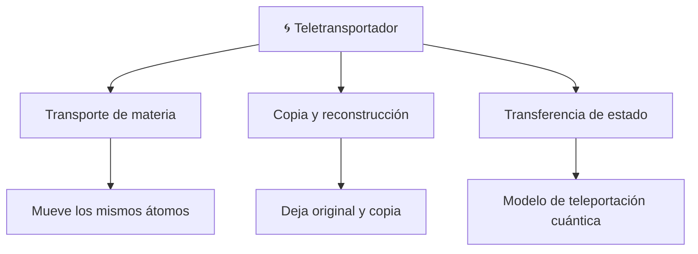

# 📋 Características del teletransportador

[🏠 Inicio](../../../README.md) · [🌀 Curso: Teletransportador](../README.md) · 📋 Características

> ⚖️ Material educativo original; los derechos de las obras pertenecen a sus titulares.

Que es un teletransportador genérico, que rasgos lo definen en la ficción y
cuales tendrían sentido físico real. Este módulo da el contexto antes de abrir
la tecnología por dentro en el Módulo 3.

---

## 🧭 Definición

Un teletransportador, en la ficción genérica, es un aparato que hace
desaparecer a un objeto o persona en un lugar y aparecer en otro casi al
instante. Lo imaginamos como un mover directo del cuerpo. En este curso lo
usamos como excusa para estudiar que significaría de verdad: medir el objeto,
transmitir la información que lo describe y reconstruirlo en el destino.

---

## 🧬 Características clave

| Característica | Como la muestra la ficción | Lectura física real |
| --- | --- | --- |
| Traslado instantáneo | El cuerpo aparece de inmediato lejos | Ningún dato puede ir más rápido que la luz. |
| Desaparición limpia | El original se esfuma sin resto | Habría que medir y desarmar átomo por átomo. |
| Reconstrucción perfecta | El cuerpo llega idéntico | Exige una cantidad astronómica de información. |
| Gasto de energía discreto | Un simple destello | La equivalencia masa-energia implica energía colosal. |
| Un solo tú al final | Solo aparece uno en el destino | Copiar el patrón dejaría dos: el problema del duplicado. |
| Continuidad de la persona | "Eres tu" quien llega | Filosofía abierta: original, copia o ambos. |

---

## 🗂️ Tipos conceptuales de teletransportador

| Tipo | Idea de diseño | Compromiso físico |
| --- | --- | --- |
| Transporte de materia | Mover los átomos mismos al destino | No hay mecanismo real para mover masa así. |
| Copia y reconstrucción | Escanear, transmitir y rearmar con materia local | Genera el problema del duplicado y datos enormes. |
| Transferencia de estado | Llevar solo el estado a un cuerpo destino | Es lo único real, pero mueve estado, no objetos. |

---

## 🎯 Para qué sirve en el relato

- Eliminar los tiempos muertos de viaje entre escenas.
- Dar sensación de tecnología avanzada y casi mágica.
- Resolver situaciones imposibles con una salida rápida.

En cambio, para este curso sirve como laboratorio: cada rasgo llamativo nos
deja preguntar si sería posible y por qué.

---

[⬅️ Anterior: Historia](../historia/historia-teletransportador.md) · [➡️ Siguiente: Sistemas mecánicos](sistemas-mecanicos-teletransportador.md)
