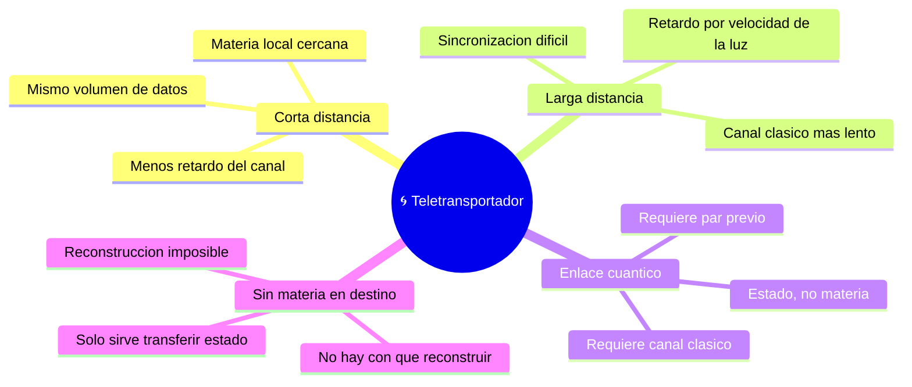

# 🌍 Entornos del teletransportador

[🏠 Inicio](../../../README.md) · [🌀 Curso: Teletransportador](../README.md) · 🌍 Entornos

> ⚖️ Material educativo original; los derechos de las obras pertenecen a sus titulares.

Dónde se usaría un teletransportador y cómo cambia su exigencia según el
entorno. Cada escenario implica límites físicos distintos, y en simulación se
traduce en condiciones diferentes de distancia, energía y materia disponible.

---

## 🗺️ Entornos principales

| Entorno | Características | Riesgos típicos | Ajuste del proceso |
| --- | --- | --- | --- |
| Corta distancia | Poco retardo en el canal. | Igual gasto de datos y energía. | Optimizar escaneo y reserva local. |
| Larga distancia | Retardo grande por la velocidad de la luz. | Pérdida de sincronización. | Planificar el tiempo del canal clásico. |
| Enlace cuántico | Solo transfiere estado, no objetos. | Confundirlo con mover materia. | Preparar el par y el canal clásico. |
| Sin materia en destino | No hay con que reconstruir. | Reconstrucción imposible. | Limitarse a transferir estado. |

---

## 🌡️ Factores del entorno

- **Distancia**: no cambia el volumen de datos, pero si el retardo del canal
  clásico, limitado por la velocidad de la luz.
- **Materia disponible**: sin una reserva de materia en el destino no hay con
  que ensamblar el patrón recibido.
- **Energía accesible**: manipular materia a nivel de partículas exige energía
  colosal; el entorno debe poder aportarla.
- **Ruido e interferencia**: cualquier error en los datos o en el enlace
  cuántico degrada el resultado y puede arruinar el patrón.

---

## 🎮 Traducción a simulación

Cada entorno es un escenario con su distancia, su reserva de materia y su
presupuesto de energía. El paso de transferir estado a intentar reconstruir un
cuerpo cambia por completo lo que es posible y es una gran lección de física.
Ver cómo se modela en el
[Módulo 8: Diseño de simulación](../simulacion/diseno-simulador-teletransportador.md).

---

[⬅️ Anterior: Principios y operación](principios-teletransportador.md) · [➡️ Siguiente: Reglas del universo](../reglamentos/reglas-universo-teletransportador.md)
