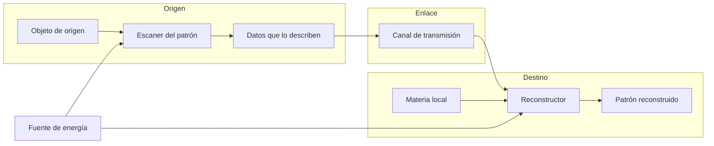
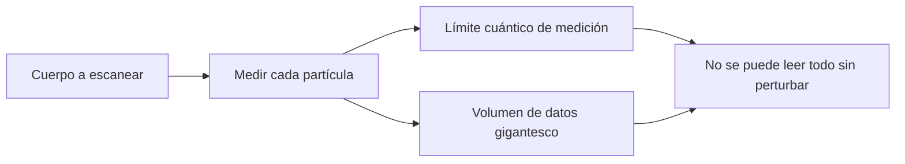
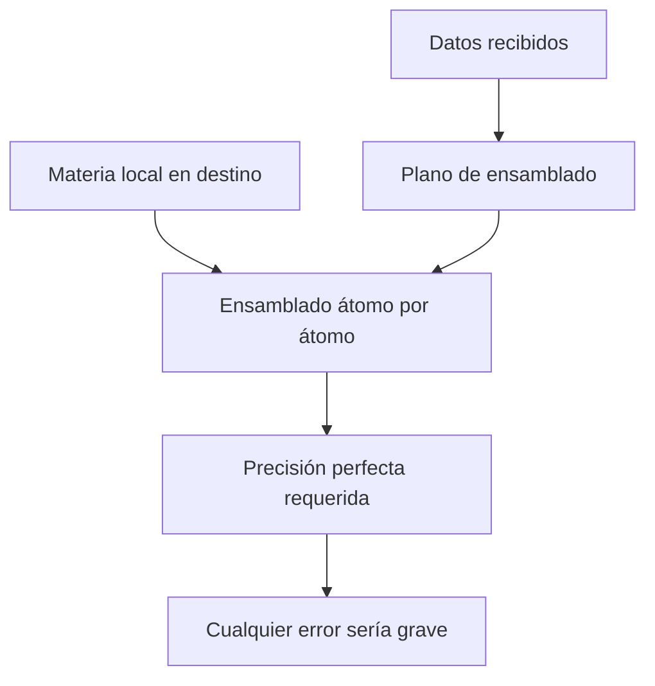

# 🔧 Sistemas mecánicos del teletransportador

[🏠 Inicio](../../../README.md) · [🌀 Curso: Teletransportador](../README.md) · 🔧 Sistemas mecánicos

> ⚖️ Material educativo original; los derechos de las obras pertenecen a sus titulares.

Este módulo abre el teletransportador por dentro. Compara la tecnología
imaginaria de la ficción con la física real que la haría funcionar (o que la
desmiente). La regla del curso es clara: describimos conceptos con nuestras
palabras, sin copiar planos ni especificaciones oficiales.

---

## 1. 🔬 Escaneo del patrón

En la ficción, un haz "lee" al cuerpo en un instante y guarda todo lo que es.
En la realidad, describir un cuerpo con detalle suficiente exigiría registrar
la posición y el estado de una cantidad de partículas descomunal. Además, medir
con precisión absoluta choca con límites cuánticos: no se puede conocer todo el
estado de una partícula sin perturbarlo.

| Concepto de ficción | Física real que evoca | Veredicto |
| --- | --- | --- |
| Lectura total e instantánea | Medición del estado del sistema | No físico: medir perturba y lleva tiempo. |
| Copia exacta de cada átomo | Registro de posiciones y estados | Datos astronómicos, imposibles de guardar hoy. |
| Escaner sin daño | Medición no destructiva | Parcial: leer al detalle altera lo medido. |

---

## 2. 🧾 Transmisión de la información

El aparato de ficción "envia" al cuerpo por un haz. Lo que en realidad se
enviaría es información: una descripción. Y toda información viaja sujeta a un
límite duro, la velocidad de la luz. Mover la descripción de un cuerpo humano
supondria transmitir una cantidad de datos tan enorme que ni con toda la red
del planeta se lograría en un tiempo razonable.

| Idea de la ficción | Que dice la física real |
| --- | --- |
| El cuerpo viaja por el haz | Viajaría información, no materia. |
| Llegada instantánea | Ningún dato supera la velocidad de la luz. |
| Envío ligero y rápido | El volumen de datos sería astronómico. |
| Sin canal visible | Siempre hace falta un canal físico de transmisión. |

---

## 3. 🏗️ Reconstrucción en destino

En la ficción, el cuerpo se rearma solo en el otro extremo. En la realidad,
para rearmar habría que colocar materia local átomo por átomo siguiendo la
descripción recibida. Eso plantea dos problemas: de donde sale la materia y
como se ensambla con precisión perfecta sin errores que serían fatales.

| Idea de la ficción | Que dice la física real |
| --- | --- |
| El cuerpo aparece formado | Habría que ensamblar cada partícula en su sitio. |
| Materia surgida de la nada | La materia no se crea; saldria de una reserva local. |
| Ensamblado sin error | La precisión exigida es extrema y sin margen. |
| Rearmado inmediato | El proceso de colocar tantas partículas sería lentisimo. |

---

## 4. 🔋 Energía colosal

La equivalencia entre masa y energía dice que en la materia hay una cantidad de
energía enorme. Desarmar y rearmar un cuerpo, o siquiera manipular su materia a
ese nivel, implicaría manejar cantidades de energía comparables a fenómenos
astronómicos, muy lejos de un destello discreto de la ficción.

| Concepto de ficción | Física real que evoca | Veredicto |
| --- | --- | --- |
| Un destello y listo | Energía para reordenar materia | No físico: la energía implicada sería colosal. |
| Aparato de mesa | Instalación de gran potencia | Improbable a esa escala energética. |
| Gasto despreciable | Equivalencia masa-energia | La masa esconde energía inmensa. |

---

## 5. 👥 El problema del duplicado y la no clonación

Si el método copia el patrón y lo reconstruye en destino sin destruir el
original, al final hay dos objetos iguales. Si se destruye el original, cabe
preguntar si "eres tú" quien llega o solo una copia. La física cuántica agrega
una barrera: el teorema de no clonación prohibe copiar un estado cuántico
desconocido, así que una copia perfecta e independiente no es posible.

| Situación | En la ficción | En la física real |
| --- | --- | --- |
| Copiar sin borrar | Aparece uno solo, sin explicar | Quedarían dos: original y copia. |
| Borrar el original | "Es la misma persona" | Pregunta abierta sobre identidad. |
| Clonar el estado exacto | Se da por hecho | Prohibido por el teorema de no clonación. |
| Transferir el estado | No se distingue del transporte | La teleportación cuántica destruye el estado de origen. |

---

## 🔁 Cómo se conecta todo

1. El **escaneo** intentaría leer el patrón completo del objeto.
2. La **información** obtenida se transmitiría por un canal físico.
3. La **reconstrucción** ensamblaría materia local según esa descripción.
4. La **energía** necesaria para todo el proceso sería colosal.
5. El **duplicado** y la **no clonación** limitan que sea copia o traslado.

Con esto claro, el [Módulo 4: Mandos](../mandos/manual-mandos-teletransportador.md)
muestra como el operador manejaría cada sistema.

---

[⬅️ Anterior: Características](caracteristicas-teletransportador.md) · [➡️ Siguiente: Mandos e instrumentos](../mandos/manual-mandos-teletransportador.md)
