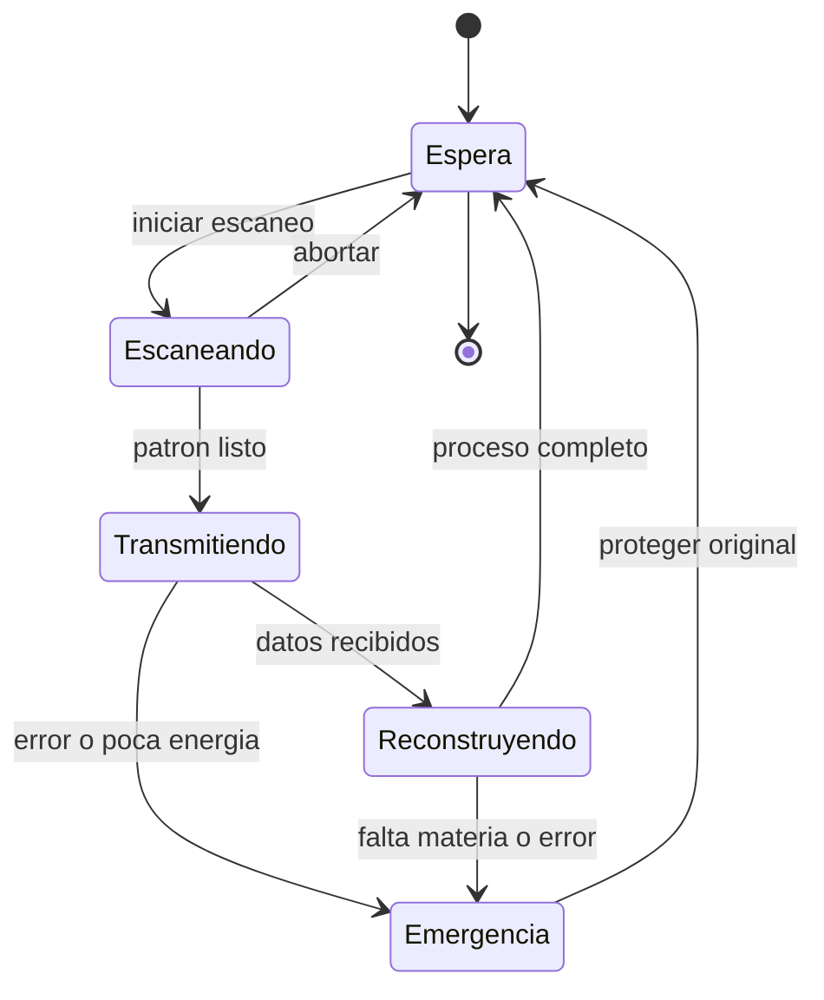

# 🎮 Diseño de simulación del teletransportador

[🏠 Inicio](../../../README.md) · [🌀 Curso: Teletransportador](../README.md) · 🎮 Simulación

> ⚖️ Material educativo original; los derechos de las obras pertenecen a sus titulares.

Como modelar de forma educativa y divertida un teletransportador. La idea
central es poder alternar entre la versión espectacular de la ficción y la
versión fiel a la física, para que el usuario compare ambas con el mismo aparato.

## Objetivo de la simulación

Que el usuario comprenda, jugando, que el teletransporte movería información y
no materia, que reconstruir un cuerpo exigiría energía y datos colosales, y que
copiar un patrón plantea el problema del duplicado. El modo ficción sirve para
engancharse; el modo ciencia, para aprender.

## Modo ciencia o ficción

La variable más importante del simulador es el **modo**:

- **Modo ficción**: el cuerpo llega al instante, el original se esfuma limpio y
  aparece un solo tú. Es cómodo y familiar.
- **Modo ciencia**: se aplican los límites reales de información, energía,
  velocidad de la luz y no clonación. Hay retardo, gasto colosal y dilema del
  duplicado.

Al cambiar de modo, la interfaz avisa que reglas se activan o desactivan, para
que la comparación sea explícita y educativa.

## Variables principales

| Variable | Tipo | Rango | Afecta a | Comentarios |
| --- | --- | --- | --- | --- |
| Modo | discreta | ciencia / ficción | Todas las reglas | Interruptor central del aprendizaje. |
| Volumen de datos | numérica | 0-enorme en bits | Tiempo del canal | En modo ficción puede ignorarse. |
| Distancia | numérica | 0-muy grande | Retardo del canal | En ciencia limita por la velocidad de la luz. |
| Energía disponible | numérica | 0-100% | Viabilidad del proceso | En ciencia la exigencia es colosal. |
| Materia local | numérica | 0-100% | Reconstrucción | Sin materia no hay rearmado. |
| Integridad del patrón | numérica | 0-100% | Éxito del resultado | Errores arruinan el destino. |
| Modo de proceso | discreta | copia / transferencia | Problema del duplicado | Decide si queda una o dos. |
| Estado del original | discreta | intacto / borrado | Identidad | Clave para el dilema del duplicado. |

## Ciclo básico

1. Leer entrada del usuario (origen, resolución, canal, modo de proceso).
2. Comprobar el modo activo (ciencia o ficción).
3. Calcular el volumen de datos según la resolución elegida.
4. Aplicar reglas del modo: en ciencia, retardo por distancia y gasto de energía.
5. Aplicar el entorno: materia local disponible y ruido del canal.
6. Actualizar integridad del patrón, estado del original y resultado en destino.
7. Refrescar instrumentos (datos, energía, integridad, estado del original).

## Modos de juego futuros

- Tutorial de información: ver que se transmite un patrón, no un cuerpo.
- Reto de energía: intentar un traslado y descubrir la escala colosal.
- Comparador lado a lado: mismo envío en modo ciencia y en modo ficción.
- Dilema del duplicado: elegir copiar o transferir y discutir la identidad.
- Escenario de teleportación cuántica con enlace y canal clásico.

## Elementos fuera de alcance

- Presentar la versión de ficción como si fuera física real sin avisarlo.
- Mostrar la teleportación cuántica como transporte de materia.
- Cualquier contenido que confunda espectáculo con ciencia sin distinguirlos.

## Pendientes

- [ ] Definir valores por defecto de cada variable por tipo de escenario.
- [ ] Prototipar el ciclo básico con retardo del canal clásico.
- [ ] Ajustar el modelo de energía colosal para que sea didáctico.
- [ ] Agregar fuentes de divulgación a [`manuales/fuentes.md`](../../../manuales/fuentes.md).

---

[⬅️ Anterior: Reglas del universo](../reglamentos/reglas-universo-teletransportador.md) · [➡️ Siguiente: Recursos](../recursos/recursos-teletransportador.md)
