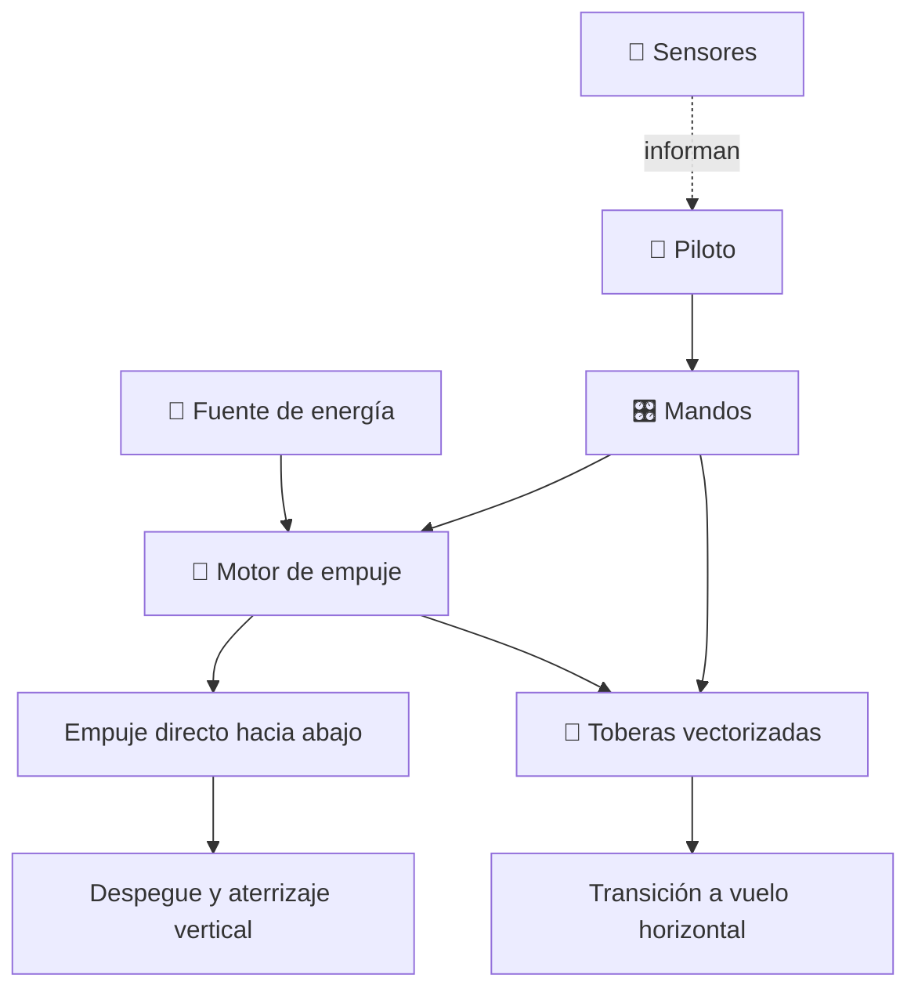

# ⚡ Curso: Thunderbird 1

[🏠 Inicio](../../README.md) · [🌌 Naves de ficción](../README.md) · [🎓 Guía de curso](../../docs/08-guia-de-estilo-y-curso.md)

> ⚖️ Material educativo original; los derechos de las obras pertenecen a sus titulares.

---

> Curso de análisis educativo de ciencia ficción inspirado en el estilo
> "Thunderbirds". Estudiamos un vehículo de respuesta rápida genérico para
> entender la física real del despegue y aterrizaje vertical (VTOL), el empuje
> vectorizado y el compromiso entre velocidad y autonomía.

---

## 🎯 Objetivos de aprendizaje

Al terminar este curso deberías poder:

- Explicar el despegue y aterrizaje vertical por empuje directo hacia abajo.
- Distinguir la sustentación por empuje directo de la sustentación aerodinámica.
- Describir el empuje vectorizado y la transición de vuelo vertical a horizontal.
- Razonar sobre la relación empuje/peso mayor que uno como condición del VTOL.
- Entender el compromiso entre velocidad, empuje, consumo y autonomía.
- Traducir todo lo anterior a variables de un simulador educativo.

---

## 🗺️ Mapa del vehículo

---

## 📚 Módulos del curso

| # | Módulo | Contenido | Enlace |
| :-: | --- | --- | --- |
| 1 | 📜 Historia | Contexto de la nave de ficción y su idea de vuelo. | [Abrir](historia/historia-thunderbird-1.md) |
| 2 | 📋 Características | Que es un vehículo de respuesta rápida y para que sirve. | [Abrir](operacion/caracteristicas-thunderbird-1.md) |
| 3 | 🔧 Sistemas mecánicos | Tecnología imaginaria frente a la física real. | [Abrir](operacion/sistemas-mecanicos-thunderbird-1.md) |
| 4 | 🎛️ Mandos e instrumentos | Puesto de mando conceptual y controles. | [Abrir](mandos/manual-mandos-thunderbird-1.md) |
| 5 | 🧪 Principios y operación | VTOL y empuje vectorizado: que si, que no y por qué. | [Abrir](operacion/principios-thunderbird-1.md) |
| 6 | 🌍 Entornos | Base, atmósfera y escenarios de respuesta rápida. | [Abrir](operacion/entornos-thunderbird-1.md) |
| 7 | ⚖️ Reglas del universo | Las leyes internas de la ficción frente a la física. | [Abrir](reglamentos/reglas-universo-thunderbird-1.md) |
| 8 | 🎮 Diseño de simulación | Variables, ciclo y modo ciencia o ficción. | [Abrir](simulacion/diseno-simulador-thunderbird-1.md) |
| 9 | 🧰 Recursos | Glosario, enlaces y diagramas. | [Abrir](recursos/recursos-thunderbird-1.md) |

---

## 🧩 Requisitos previos

Ninguno formal. Ayuda tener nociones básicas de fuerzas y peso, pero el curso
las explica desde cero. La idea central es simple y potente: para elevarse en
vertical una nave debe empujar hacia abajo con más fuerza que su propio peso, y
esa forma de volar es muy distinta de la de un avión que se apoya en sus alas.

---

[➡️ Empezar por el Módulo 1: Historia](historia/historia-thunderbird-1.md)
