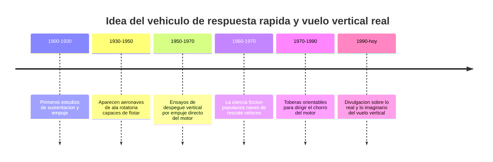

# 📜 Historia de Thunderbird 1

[🏠 Inicio](../../../README.md) · [⚡ Curso: Thunderbird 1](../README.md) · 📜 Historia

> ⚖️ Material educativo original; los derechos de las obras pertenecen a sus titulares.

Este módulo situa la idea de Thunderbird 1 dentro de la ciencia ficción y la
compara con la historia real del vuelo vertical y de los vehículos de respuesta
rápida. No describe una nave oficial: analiza el concepto genérico de vehículo
veloz "estilo Thunderbirds" y lo contrasta con lo que la ingeniería sabe hacer
de verdad.

## De donde viene la idea

El vehículo de respuesta rápida de la ficción toma prestada la fantasía de
llegar a cualquier sitio en minutos: despegar sin pista, subir recto hacia el
cielo y lanzarse a gran velocidad hacia la emergencia. Es una imagen atractiva
porque resuelve de golpe el problema de los aeropuertos y las carreteras. El
interés de este curso está en separar esa fantasía de lo que la física permite.

## Lo real frente a lo imaginado

La historia real del vuelo vertical siguió un camino más exigente. Elevarse sin
pista obliga a empujar el suelo con un chorro potente, y sostener ese empuje
gasta mucho combustible. Las máquinas que lo lograron tuvieron siempre que
equilibrar la fuerza para subir con el peso que podían cargar y la distancia que
podían recorrer después.

| Periodo | Hito de referencia | Importancia para el curso |
| --- | --- | --- |
| 1900-1930 | Estudio de sustentación y empuje | Base para entender cómo se sostiene un cuerpo en el aire. |
| 1930-1950 | Aeronaves capaces de flotar en el sitio | Muestra el vuelo estacionario sin avanzar. |
| 1950-1970 | Despegue vertical por empuje del motor | Confirma que hace falta empuje mayor que el peso. |
| 1960-1970 | Naves de rescate veloces en el cine | Fija la imagen popular de la respuesta rápida. |
| 1970-1990 | Toberas orientables del chorro | Base real del empuje vectorizado. |
| 1990-hoy | Divulgación de física del vuelo | Separa el espectáculo de la realidad. |

## Por qué la ficción eligió la respuesta rápida

Contar una historia de rescate con un vehículo que llega en minutos es emocionante:
hay urgencia, cuenta atrás y una máquina que parece capaz de todo. Un vehículo
real de despegue vertical sería más lento de preparar, cargaría menos y gastaría
mucho combustible en cada vuelo. La ficción prioriza la emoción sobre el balance
físico, y eso es una decisión artística legítima que este curso respeta y analiza.

## Que aprenderemos de todo esto

- Que conceptos de física real evoca la nave aunque los exagere.
- Que licencias creativas ignoran el consumo y el peso, y por qué.
- Cómo sería un vehículo de respuesta rápida si obedeciera la física de verdad.

## Fuentes

- Registrar aquí las fuentes públicas de divulgación consultadas.
- Enlazar cada fuente también en [`manuales/fuentes.md`](../../../manuales/fuentes.md).

---

[🎓 Portada del curso](../README.md) · [➡️ Siguiente: Características](../operacion/caracteristicas-thunderbird-1.md)
