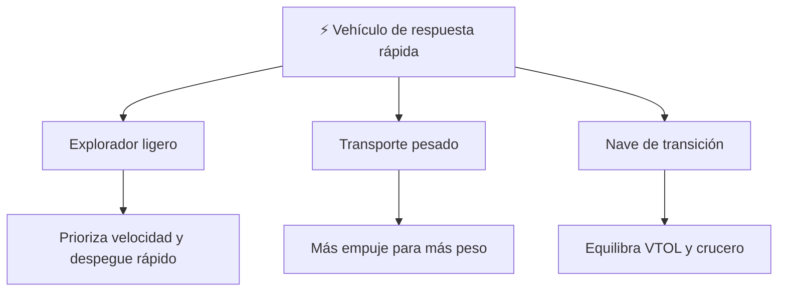

# 📋 Características de Thunderbird 1

[🏠 Inicio](../../../README.md) · [⚡ Curso: Thunderbird 1](../README.md) · 📋 Características

> ⚖️ Material educativo original; los derechos de las obras pertenecen a sus titulares.

Que es un vehículo de respuesta rápida genérico, que rasgos lo definen en la
ficción y cuales tendrían sentido físico real. Este módulo da el contexto antes
de abrir la tecnología por dentro en el Módulo 3.

---

## 🧭 Definición

Thunderbird 1, en la ficción estilo "Thunderbirds", es una nave veloz pensada
para llegar la primera a una emergencia. La imaginamos capaz de despegar en
vertical sin pista, subir recta y luego lanzarse a gran velocidad. En este curso
la usamos como excusa para estudiar cómo se movería de verdad un vehículo así.

---

## 🧬 Características clave

| Característica | Como la muestra la ficción | Lectura física real |
| --- | --- | --- |
| Despegue vertical | Sube recta sin necesidad de pista | Posible si el empuje supera al peso. |
| Velocidad extrema | Alcanza el destino en minutos | Real pero con enorme gasto de combustible. |
| Transición en el aire | Pasa de subir a volar hacia adelante | Real orientando el chorro del motor. |
| Autonomía ilimitada | Siempre llega y regresa sin repostar | Falso: más velocidad implica menos alcance. |
| Vuelo estacionario | Se queda quieta flotando en el aire | Real solo mientras dure el propelente. |
| Alas visibles | Grandes superficies para el vuelo rápido | Útiles solo en vuelo horizontal, no al subir. |

---

## 🗂️ Tipos conceptuales de vehículo de respuesta rápida

| Tipo | Idea de diseño | Compromiso físico |
| --- | --- | --- |
| Explorador ligero | Poca masa, mucho empuje disponible | Sube y acelera rápido pero lleva poco combustible. |
| Transporte pesado | Gran capacidad de carga | Más peso exige más empuje para despegar. |
| Nave de transición | Motor orientable y alas amplias | Cambia bien de vertical a crucero, gasta en cada modo. |

---

## 🎯 Para qué sirve en el relato

- Dar espectáculo con llegadas rápidas y despegues verticales.
- Representar la respuesta inmediata ante cualquier emergencia.
- Simplificar el vuelo a algo que parece no tener límites de combustible.

En cambio, para este curso sirve como laboratorio: cada rasgo llamativo nos
deja preguntar si sería posible y por qué.

---

[⬅️ Anterior: Historia](../historia/historia-thunderbird-1.md) · [➡️ Siguiente: Sistemas mecánicos](sistemas-mecanicos-thunderbird-1.md)
