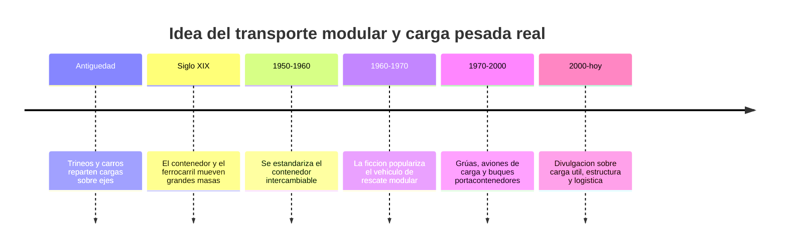

# 📜 Historia del Thunderbird 2

[🏠 Inicio](../../../README.md) · [📦 Curso: Thunderbird 2](../README.md) · 📜 Historia

> ⚖️ Material educativo original; los derechos de las obras pertenecen a sus titulares.

Este módulo situa la idea del transporte pesado modular dentro de la ciencia
ficción y la compara con la historia real del transporte de carga. No describe
una nave oficial: analiza el concepto genérico de "vehículo de carga modular"
que evoca el estilo "Thunderbirds" y lo contrasta con lo que la ingeniería
sabe hacer de verdad.

## De donde viene la idea

El transporte modular de la ficción toma prestada la estética de los grandes
vehículos de rescate: una máquina enorme que llega, suelta el equipo justo
para la misión y se marcha. Es una imagen atractiva porque entendemos muy bien
la idea de "traer la herramienta correcta". El problema es que mover masa
cuesta energía y estructura, y ahí empieza lo interesante de este curso.

## Lo real frente a lo imaginado

La historia real del transporte de carga siguió un camino muy práctico. El gran
avance no fue un vehículo mágico, sino el contenedor estandarizado: una caja
que cualquier vehículo puede cargar, cambiar y apilar. Esa idea de módulo
intercambiable es exactamente lo que hace útil a un transporte polivalente, y
es real, aunque sin las cifras exageradas de la ficción.

| Periodo | Hito de referencia | Importancia para el curso |
| --- | --- | --- |
| Antiguedad | Carros y trineos reparten el peso | Introduce la idea de reparto de carga. |
| Siglo XIX | Ferrocarril y primeros contenedores | Muestra el transporte de grandes masas. |
| 1950-1960 | Contenedor estandar intercambiable | Base real del módulo polivalente. |
| 1960-1970 | Vehículo de rescate modular en la ficción | Fija la imagen popular del transporte. |
| 1970-2000 | Aviones de carga y portacontenedores | Ejemplos reales de carga útil enorme. |
| 2000-hoy | Divulgación de logística y estructura | Separa el espectáculo de la realidad. |

## Por qué la ficción eligió el vehículo modular

Contar una historia con un vehículo que trae "justo lo necesario" es fácil de
seguir: hay preparación, llegada y solución. Un transporte real necesitaría
horas de carga, cálculo de peso y permisos, lo que resulta menos vistoso en
pantalla. La ficción prioriza la acción sobre la logística, y eso es una
decisión artística legítima que este curso respeta y analiza.

## Que aprenderemos de todo esto

- Que conceptos de carga real evoca la nave aunque los exagere.
- Que licencias creativas ignoran el peso y la estructura, y por qué.
- Cómo sería un transporte modular si tuviera que obedecer la física de verdad.

## Fuentes

- Registrar aquí las fuentes públicas de divulgación consultadas.
- Enlazar cada fuente también en [`manuales/fuentes.md`](../../../manuales/fuentes.md).

---

[🎓 Portada del curso](../README.md) · [➡️ Siguiente: Características](../operacion/caracteristicas-thunderbird-2.md)
