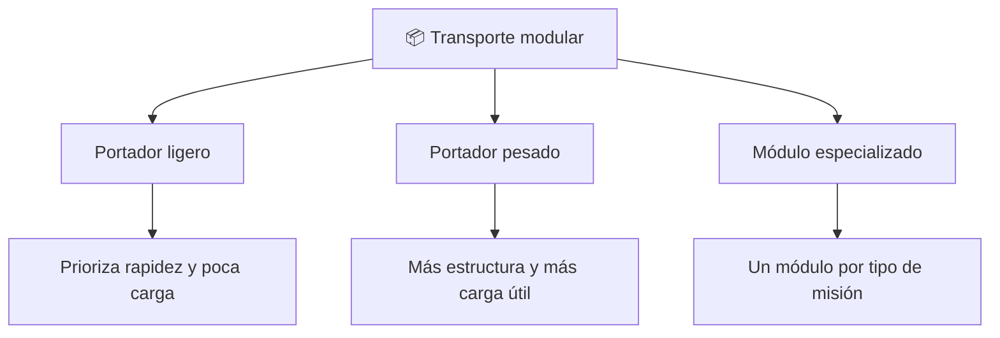

# 📋 Características del Thunderbird 2

[🏠 Inicio](../../../README.md) · [📦 Curso: Thunderbird 2](../README.md) · 📋 Características

> ⚖️ Material educativo original; los derechos de las obras pertenecen a sus titulares.

Que es un transporte pesado modular genérico, que rasgos lo definen en la
ficción y cuales tendrían sentido físico real. Este módulo da el contexto antes
de abrir la tecnología por dentro en el Módulo 3.

---

## 🧭 Definición

Un transporte pesado modular, en la ficción estilo "Thunderbirds", es un
vehículo grande pensado para llevar equipo variado a donde haga falta. Lo
imaginamos capaz de cargar y soltar contenedores completos según la misión. En
este curso lo usamos como excusa para estudiar cómo se movería de verdad un
vehículo así cuando lleva mucha masa útil.

---

## 🧬 Características clave

| Característica | Como la muestra la ficción | Lectura física real |
| --- | --- | --- |
| Módulo intercambiable | Cambia el contenedor en segundos | Razonable: el contenedor estandar existe y es muy útil. |
| Carga enorme | Levanta pesos gigantes sin esfuerzo | Todo peso exige empuje y estructura proporcionales. |
| Cambio instantáneo | Suelta y toma módulos al instante | Anclar y soltar carga segura lleva tiempo. |
| Estructura ligera | Fuselaje esbelto pese a la carga | Sostener mucho peso obliga a más estructura. |
| Despegue vertical | Sube cargado sin pista | Exige un empuje enorme frente al peso total. |
| Autonomía amplia | Llega lejos siempre lleno | Más carga y combustible reducen el alcance. |

---

## 🗂️ Tipos conceptuales de transporte modular

| Tipo | Idea de diseño | Compromiso físico |
| --- | --- | --- |
| Portador ligero | Poca masa, módulos pequeños | Rápido pero lleva poca carga útil. |
| Portador pesado | Bastidor reforzado, gran módulo | Lleva mucho pero necesita más empuje. |
| Módulo especializado | Un contenedor por misión | Versátil, pero cada módulo pesa y ocupa. |

---

## 🎯 Para qué sirve en el relato

- Dar espectáculo con llegadas y despliegues rápidos de equipo.
- Representar la idea de "traer la solución" a cualquier lugar.
- Simplificar la logística compleja a un gesto: soltar el módulo.

En cambio, para este curso sirve como laboratorio: cada rasgo llamativo nos
deja preguntar si sería posible y por qué.

---

[⬅️ Anterior: Historia](../historia/historia-thunderbird-2.md) · [➡️ Siguiente: Sistemas mecánicos](sistemas-mecanicos-thunderbird-2.md)
