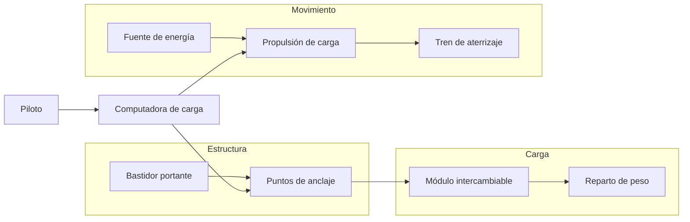

# 🔧 Sistemas mecánicos del Thunderbird 2

[🏠 Inicio](../../../README.md) · [📦 Curso: Thunderbird 2](../README.md) · 🔧 Sistemas mecánicos

> ⚖️ Material educativo original; los derechos de las obras pertenecen a sus titulares.

Este módulo abre el transporte pesado modular por dentro. Compara la tecnología
imaginaria de la ficción con la física real que la haría funcionar (o que la
desmiente). La regla del curso es clara: describimos conceptos con nuestras
palabras, sin copiar planos ni especificaciones oficiales.

---

## 1. 🏗️ Estructura y bastidor

En la ficción, el fuselaje parece esbelto y aun así carga pesos enormes. En la
realidad, sostener mucha masa obliga a un bastidor resistente: vigas, refuerzos
y anclajes que ellos mismos pesan. Cuanto más grande y cargado es el vehículo,
más estructura necesita, y esa estructura resta capacidad de carga útil.

| Concepto de ficción | Física real que evoca | Veredicto |
| --- | --- | --- |
| Fuselaje ligero que carga todo | Bastidor resistente al peso | No físico: más carga exige más estructura. |
| Refuerzos invisibles | Vigas y largueros internos | Plausible como idea, pero pesan. |
| Estructura que nunca se deforma | Límite elástico de los materiales | Parcial: todo material tiene un límite. |

---

## 2. 🔗 Sistema de anclaje de módulos

El gran atractivo es el módulo intercambiable: el vehículo suelta un contenedor
y toma otro. Esto si tiene base real en el contenedor estandar. Lo que no es
real es que el cambio sea instantáneo: anclar y soltar una carga pesada de forma
segura exige cierres firmes, alineación y verificación, y eso lleva tiempo.

| Idea de la ficción | Que dice la física real |
| --- | --- |
| Cambio de módulo instantáneo | Anclar carga segura lleva tiempo. |
| Un solo enganche sostiene todo | Se reparten varios anclajes por el peso. |
| El módulo nunca se suelta solo | Sin cierres firmes el peso puede desplazarse. |
| Cualquier módulo encaja igual | Necesita un estandar de medidas y anclaje. |

---

## 3. 🚀 Propulsión para carga pesada

Para mover o elevar mucha masa se necesita un empuje proporcional. En la ficción
el vehículo sube cargado sin esfuerzo aparente; en la realidad, el empuje debe
superar el peso total (vehículo más estructura más carga más combustible). Si la
carga crece, o crece el empuje, o el vehículo no despega.

| Idea de la ficción | Que dice la física real |
| --- | --- |
| Sube cargado sin esfuerzo | El empuje debe superar el peso total. |
| Mismo motor para cualquier carga | Más masa exige más empuje o menos carga. |
| Combustible que no pesa | El combustible es masa que también hay que mover. |
| Ascenso vertical siempre fácil | Subir recto gasta mucho más que rodar. |

---

## 4. ⚖️ Reparto de peso y centro de masa

Dónde se coloca la carga importa tanto como cuánta carga hay. Un módulo mal
centrado desplaza el centro de masa y desequilibra el vehículo. En la realidad,
la carga se distribuye para que el centro de masa quede en un punto seguro; en
la ficción, el vehículo siempre parece equilibrado sin importar el módulo.

| Sistema | En la ficción | En la realidad |
| --- | --- | --- |
| Colocación de la carga | Da igual donde va | Debe centrarse para no desequilibrar. |
| Centro de masa | Siempre estable | Se mueve según el módulo y su peso. |
| Reacción al viento o giro | Nula | Un centro alto o desviado vuelca más fácil. |

---

## 5. 🛬 Tren de aterrizaje y apoyo

Al posarse cargado, todo el peso pasa al tren de aterrizaje o a los apoyos. En
la ficción aguantan cualquier masa sin ceder; en la realidad, el tren debe
dimensionarse para el peso máximo, repartir la carga en el suelo y absorber el
impacto del contacto. Un apoyo insuficiente se hunde o se rompe.

| Elemento | Función en la ficción | Función útil real |
| --- | --- | --- |
| Patas o ruedas | Aguantan cualquier peso | Dimensionadas al peso máximo del conjunto. |
| Amortiguación | Contacto siempre suave | Absorbe la energía del aterrizaje cargado. |
| Reparto en el suelo | Ninguno visible | Distribuye el peso para no hundirse. |

---

## 🔁 Cómo se conecta todo

1. El **bastidor** sostiene el peso y ofrece los puntos de anclaje.
2. El **anclaje** fija el módulo intercambiable de forma segura.
3. La **propulsión** debe generar empuje mayor que el peso total.
4. El **reparto de peso** mantiene el centro de masa en un punto estable.
5. El **tren de aterrizaje** recibe toda la carga al posarse.

Con esto claro, el [Módulo 4: Mandos](../mandos/manual-mandos-thunderbird-2.md)
muestra como el piloto operaría cada sistema.

---

[⬅️ Anterior: Características](caracteristicas-thunderbird-2.md) · [➡️ Siguiente: Mandos e instrumentos](../mandos/manual-mandos-thunderbird-2.md)
